## Laporan Praktikum Sistem Operasi Jobsheet

<h4>Nama : Rafif Rizdan Prastana<h4>
<h4>NIM  : 254107020052<h4>
<h4>Kelas : TI 1H<h4>

### Dasar Input/Output (I/O)

### 1.1 Filosofi I/O Unix: “Everything is a File”
#### Informasi CPU dapat dibaca seperti file biasa
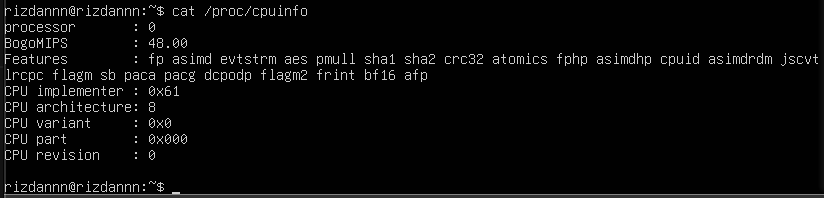

#### Informasi memory
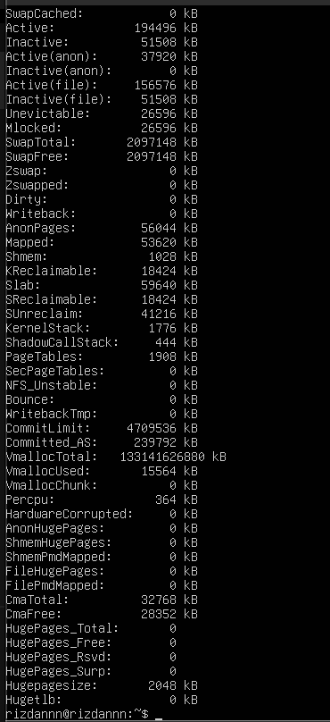

### 1.2 File Descriptor di Linux

#### Melihat file descriptor dari proses bash saat ini
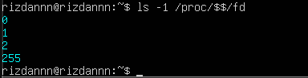

### 1.3 Pengalihan I/O Standar

#### Membaca input dari file.txt alih-alih keyboard
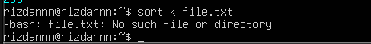

### Menghitung jumlah baris dari file
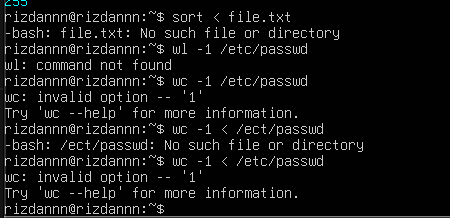

### 1.4 Pipa dan Operator |

#### Menampilkan 10 file terbesar
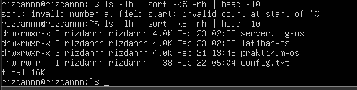

#### Menghitung jumlah user di sistem
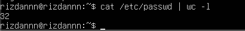

#### Mencari proses tertentu
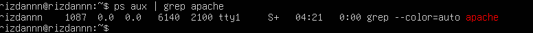

### 1.6 Penggunaan tee untuk Output Ganda

#### Tampilkan di layar DAN simpan ke file
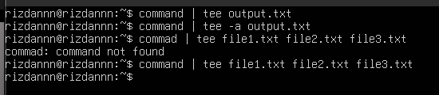

#### Append ke file dengan -a

#### Menulis ke beberapa file sekaligus

### 1.7 Teknik Lanjutan I/O

#### Membandingkan output dua perintah
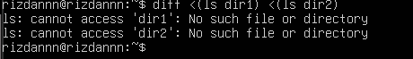

#### Menggunakan output sebagai input
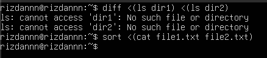

#### Menggabungkan hasil beberapa perintah
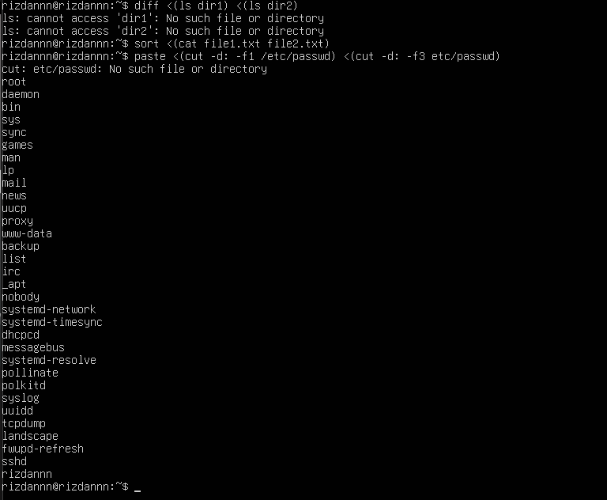

### 1.8 Kapan Menggunakan Teknik I/O Tertentu?

#### Menggunakan pipe (lebih efisien)
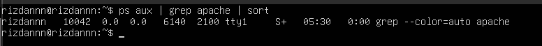

### 1.9 Best Practices I/O Redirection

### 1.11 Latihan

#### Latihan 3.1

#### 1. Menampilkan daftar 10 file terbesar di direktori 
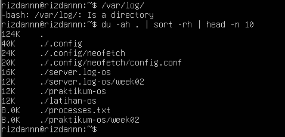

#### 2. Menyimpan hasilnya ke file large-logs.txt
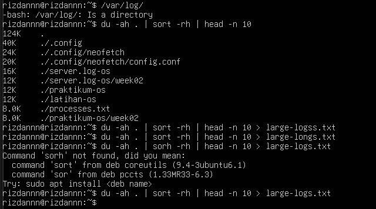

#### 3. Menampilkan output juga di terminal menggunakan tee
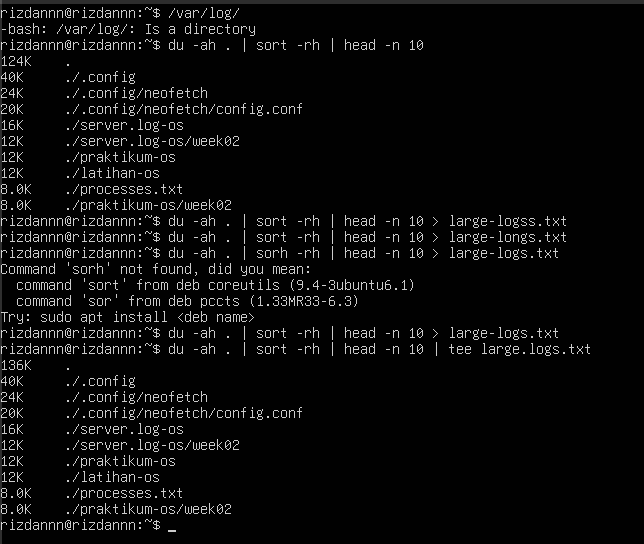

#### 4. Menangani error dengan redirect ke error.log
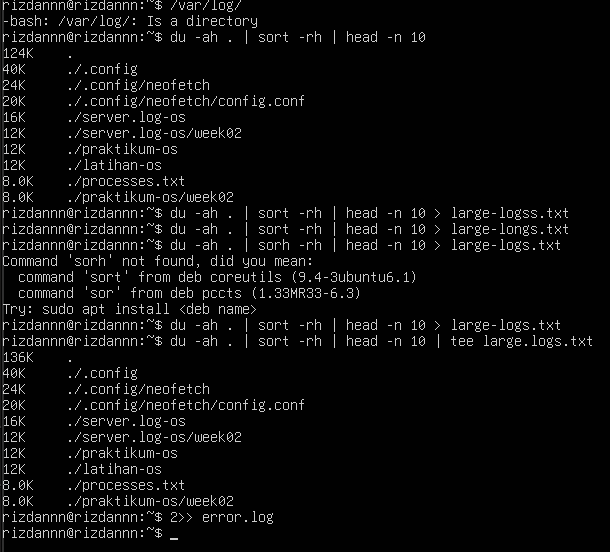

### Latihan 3.2

#### 1. Membaca /etc/passwd
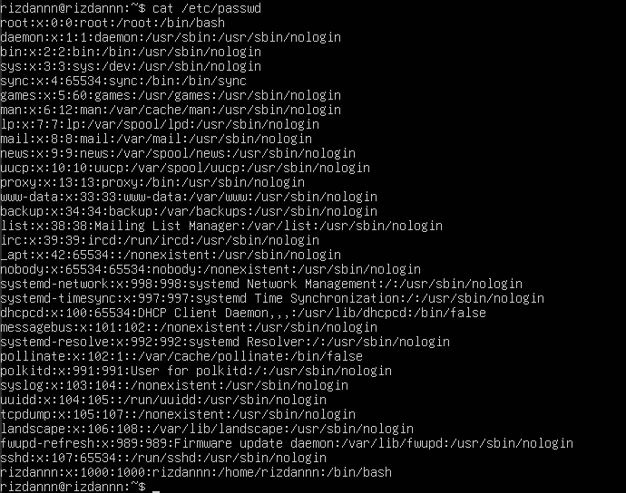

#### 2. Mengekstrak username (kolom pertama)
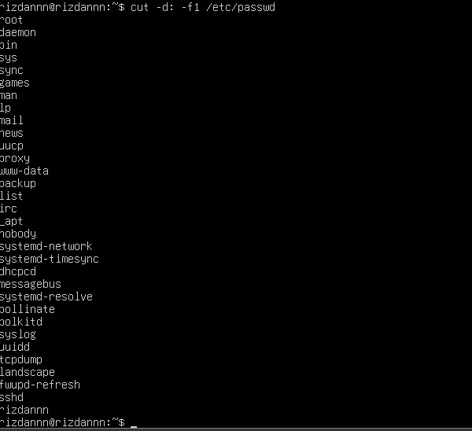

#### 3. Mengurutkan alfabetis
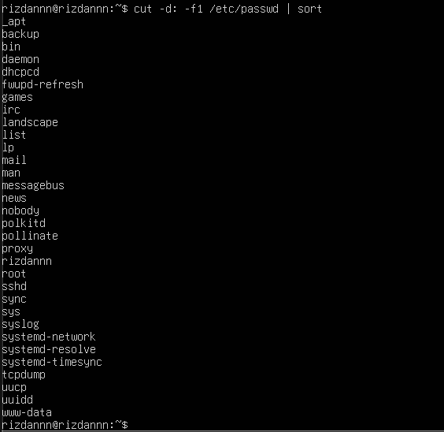

#### 4. Menyimpan ke file sorted-users.txt
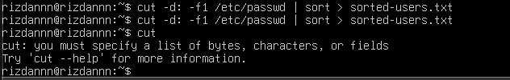

### Latihan 3.3

#### 1. Mencatat penggunaan CPU dan memory setiap 5 detik
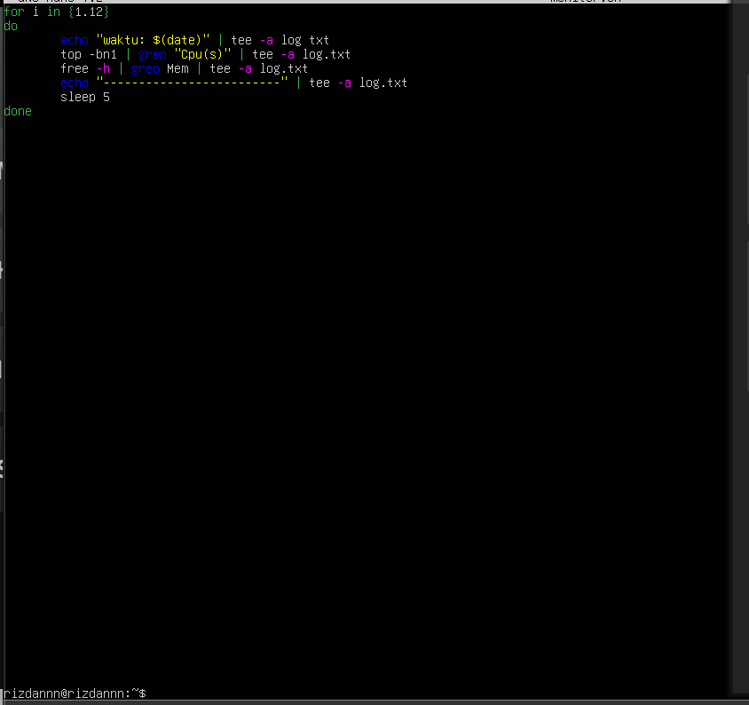

#### 2. Menyimpan log dengan timestamp
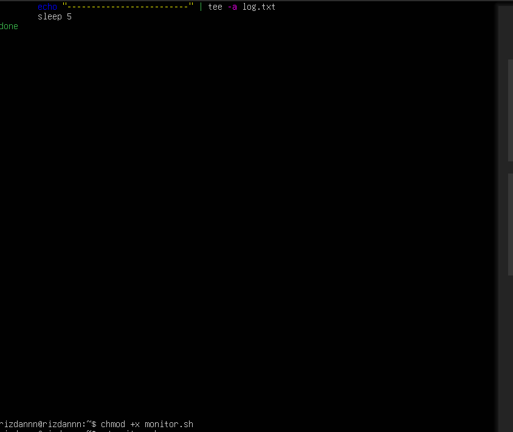

#### 3. Berjalan selama 1 menit (12 iterasi)
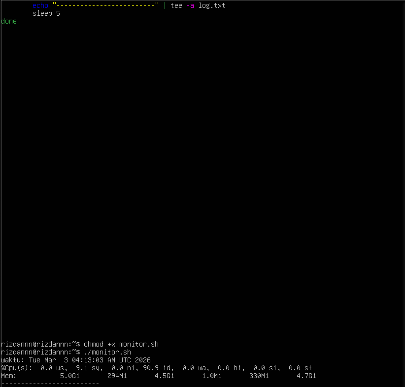

#### 4. Output ditampilkan di terminal DAN disimpan ke file
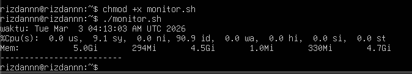

### Latihan 3.4

#### 1. Mencari semua file .conf di sistem
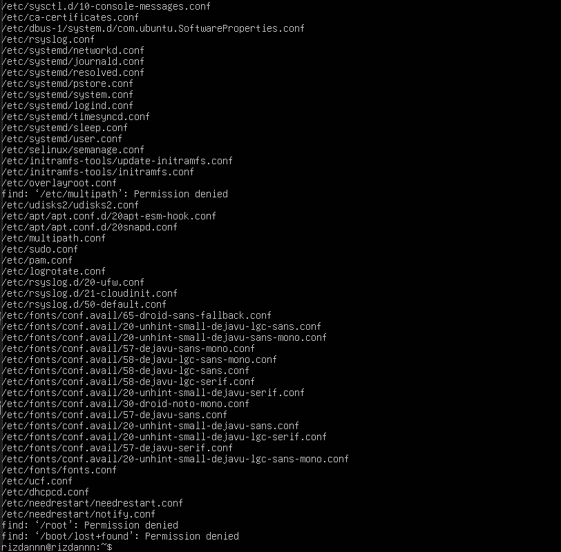

#### 2. Membuang pesan "Permission denied"
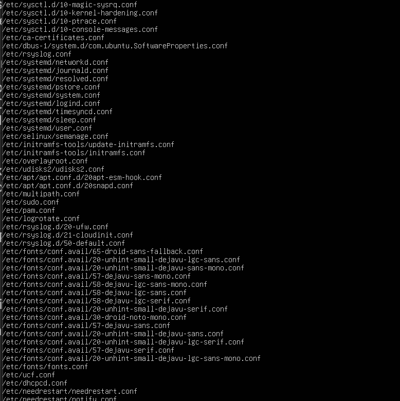

#### 3. Menghitung jumlah file yang ditemukan
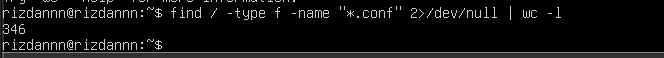

#### 4. Menyimpan daftar path lengkap ke file
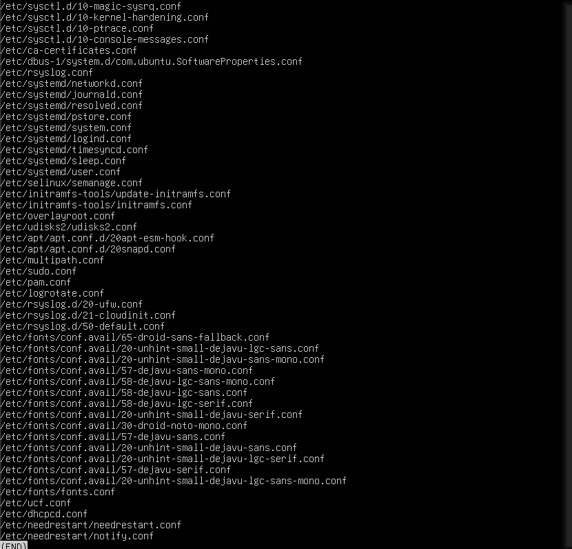

### Latihan 3.5

#### 1. Menggunakan tar untuk backup direktori
#### 2. Menampilkan progress dengan tee
#### 3. Mencatat stdout ke backup-success.log
#### 4. Mencatat stderr ke backup-error.log
#### 5. Menambahkan timestamp di setiap log entry

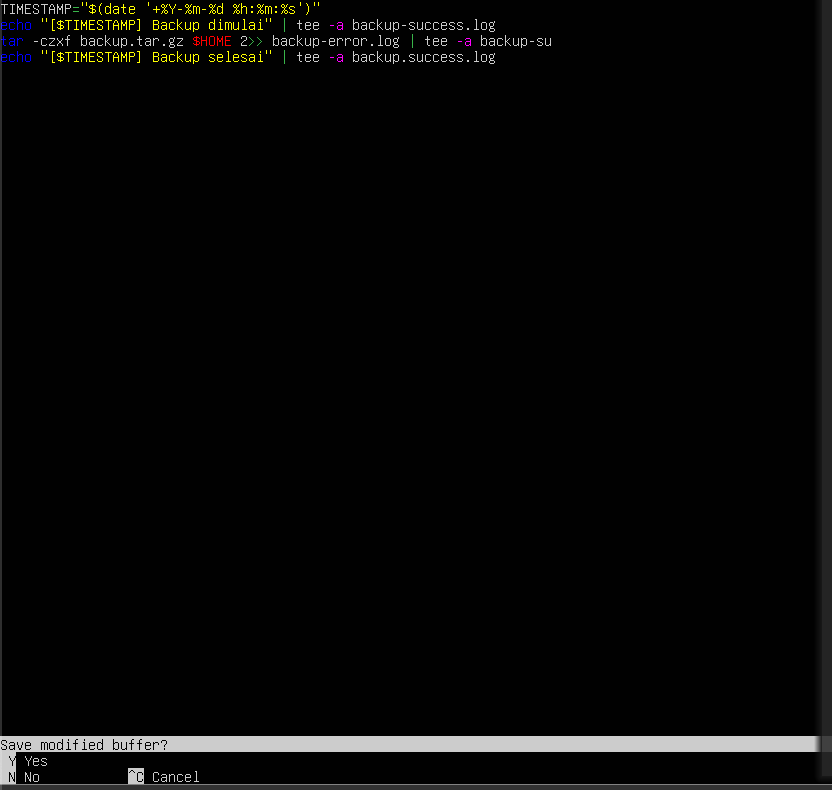
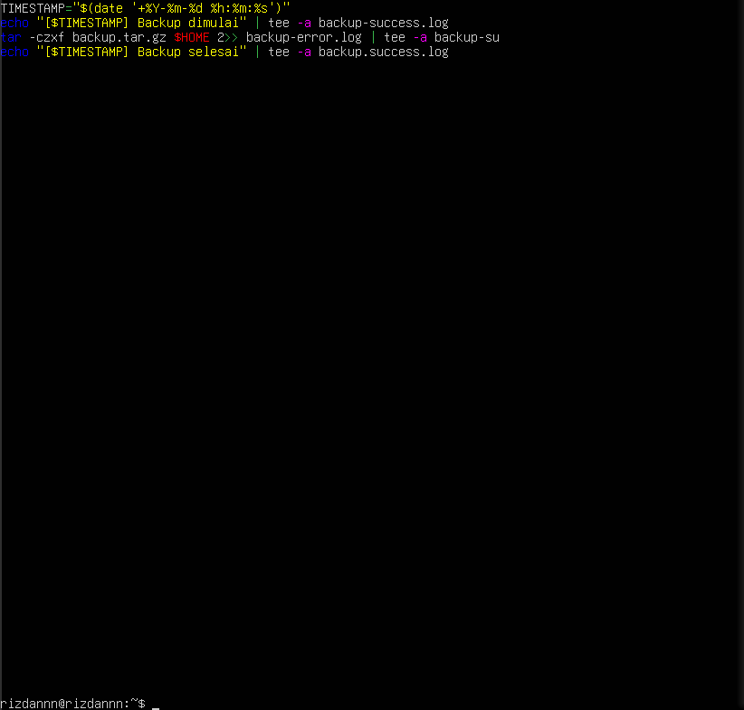
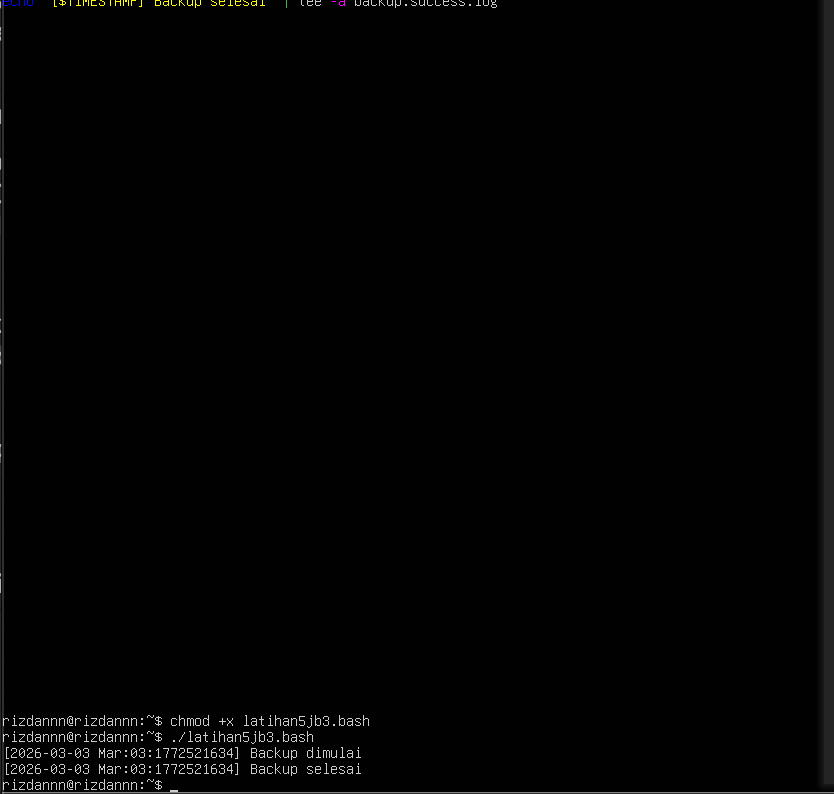

