## Laporan Praktikum Sistem Operasi Jobsheet

<h4>Nama : Rafif Rizdan Prastana<h4>
<h4>NIM  : 254107020052<h4>
<h4>Kelas : TI 1H<h4>

### Percobaan 1 : Direktory

#### 1. Melihat direktori HOME
Perintah :
```
$ pwd
$ echo $HOME
```
Hasil Perintah :

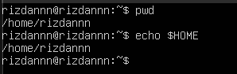

#### 2. Melihat direktori aktual dan parent direktori
Perintah :
```
$ pwd
$ cd .
$ pwd
$ cd ..
$ pwd
$ cd
```
Hasil Perintah :

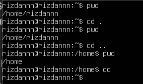

#### 3. Membuat satu direktori, lebih dari satu direktori atau sub direktori
Perintah :
```
$ pwd
$ mkdir A B C A/D A/E B/F A/D/A
$ ls -l
$ ls -l A
$ ls -l A/D
```
Hasil Perintah :

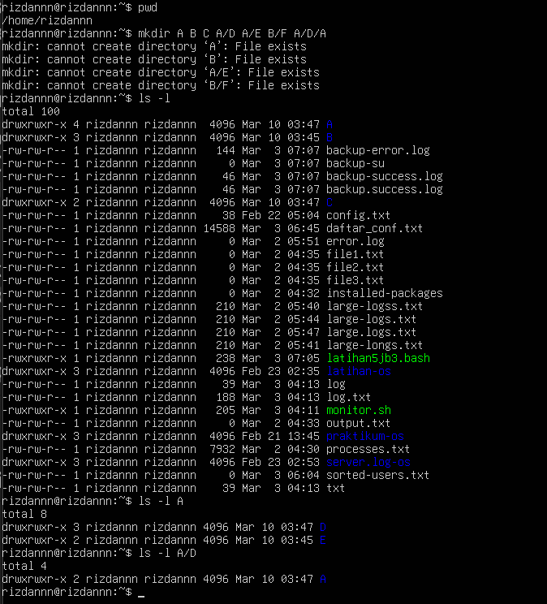

#### 4. Menghapus satu atau lebih direktori
Perintah :
```
$ rmdir B
$ ls -l B
$ rmdir B/F B
$ ls -l B
```
Hasil Perintah :

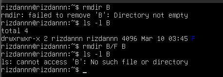

#### 5. Navigasi direktori dengan instruksi cd
Perintah :
```
$ pwd
$ ls -l
$ cd A
$ pwd
$ cd ..
$ pwd
$ cd /home/<user>/C
$ pwd
$ cd /<user>/C
$ pwd
```
Hasil Perintah :

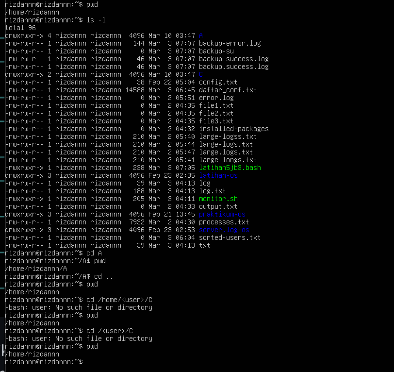

### Percobaan 2 : Manipulasi File

#### 1. Perintah cp untuk mengkopi file atau seluruh direktori
Perintah :
```
$ cat > contoh
Membuat sebuah file
[Ctrl-d]
$ cp contoh contoh1
$ ls -l
$ cp contoh A
$ ls -l A
$ cp contoh contoh1 A/D
$ ls -l A/D
```
Hasil Perintah :

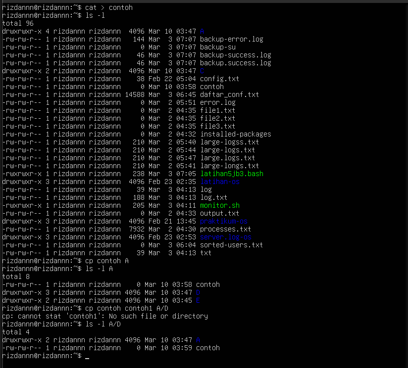

#### 2. Perintah mv untuk memindah file
Perintah :
```
$ mv contoh contoh2
$ ls -l
$ mv contoh1 contoh2 A/D
$ ls -l A/D
$ mv contoh contoh1 C
$ ls -l C
```
Hasil Perintah :


#### 3. Perintah rm untuk menghapus file
Perintah :
```
$ rm contoh2
$ ls -l
$ rm -i contoh
$ rm -rf A C
$ ls -l
```
Hasil Perintah :

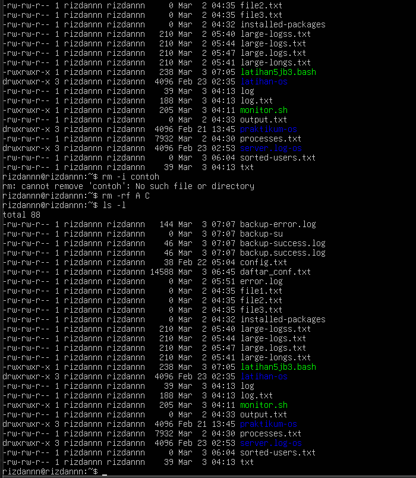

### Percobaan 3 : Symbolic Link

#### 1. Membuat shortcut (file link)
Perintah :
```
$ echo "Hallo apa khabar" > halo.txt
$ ls -l
$ ln halo.txt z
$ ls -l
$ cat z
$ mkdir mydir
$ ln z mydir/halo.juga
$ cat mydir/halo.juga
$ ln -s z bye.txt
$ ls -l bye.txt
$ cat bye.txt
```
Hasil Perintah :

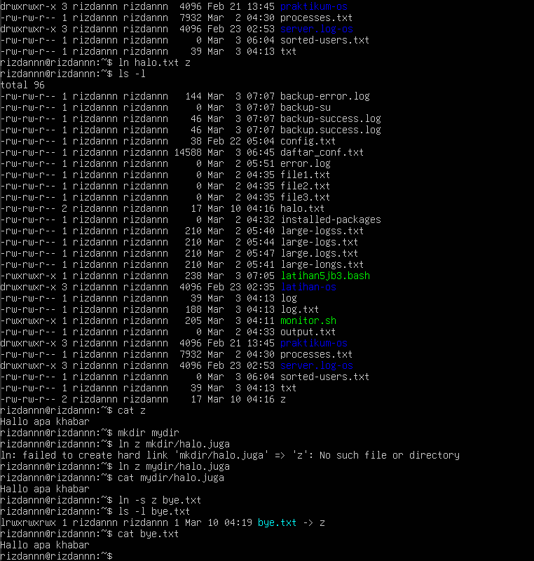

### Percobaan 4 : Melihat Isi File
Perintah :
```
$ ls -l
$ file halo.txt
$ file bye.txt
```
Hasil Perintah :

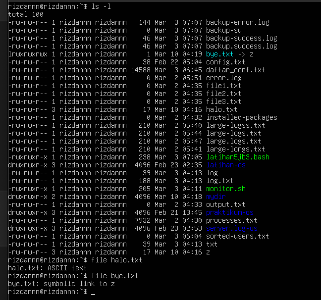

### Percobaan 5 : Mencari File

#### 1. Perintah find
Perintah :
```
$ find /home -name "*.txt" -print > myerror.txt
$ cat myerror.txt
$ find . -name "*.txt" -exec wc -l '{}' ';'
```
Hasil Perintah :

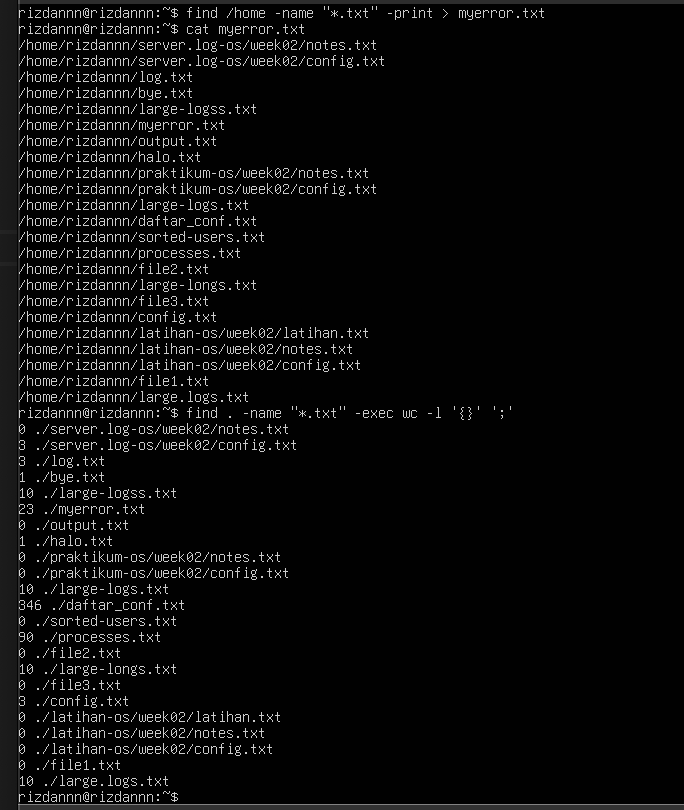

#### 2. Perintah which
Perintah :
```
$ which ls
```
Hasil Perintah :


#### 3. Perintah locate
Perintah :
```
$ locate "*.txt"
```
Hasil Perintah :

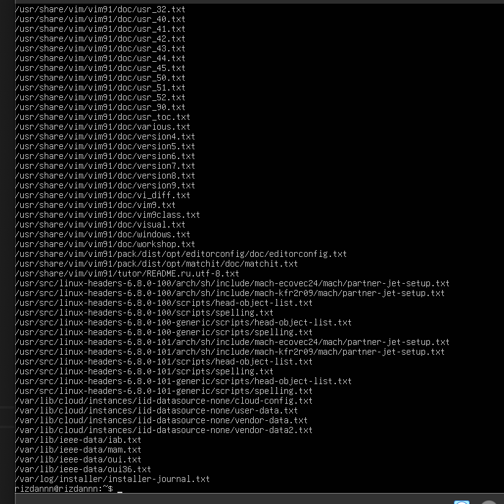

### Percobaan 6 : Mencari Text pada File
Perintah :
```
$ grep Hallo *.txt
```
Hasil Perintah :

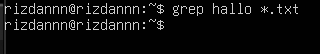

### Latihan

#### 1. Cobalaha urutan perintah berikut
Perintah :
```
$ cd
$ pwd
$ ls –al
$ cd .
$ pwd
$ cd ..
$ pwd
$ ls -al
$ cd ..
$ pwd
$ ls -al
$ cd /etc
$ ls –al | more
$ cat passwd
$ cd –
$ pwd

$ ls –l
$ file halo.txt
$ file bye.txt
```
Hasil Perintah :

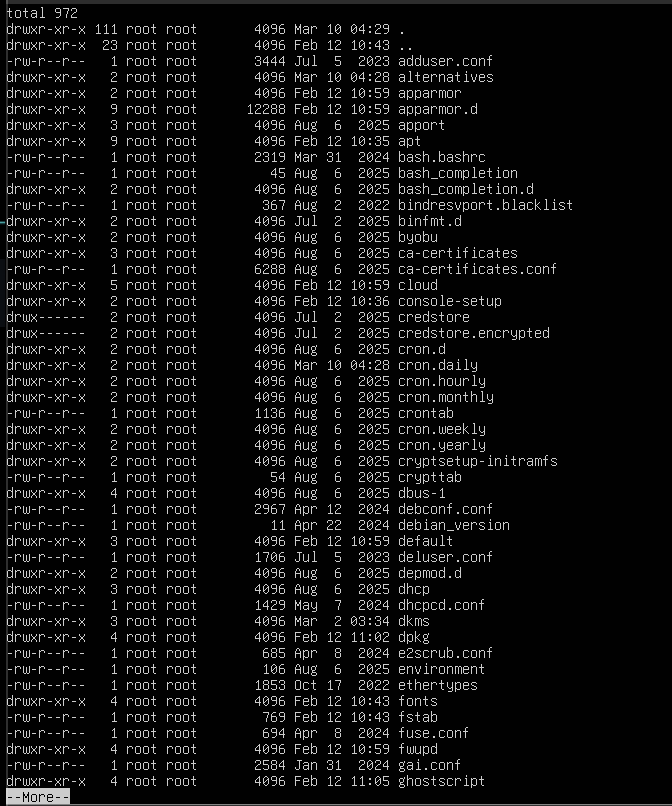
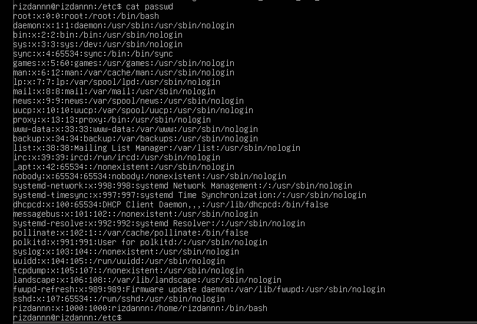
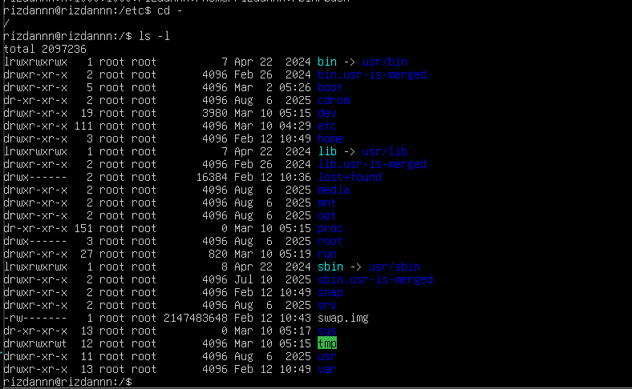

#### 2. Lanjutkan penelusuran pohon pada sistem file menggunakan cd, ls, pwd dan cat. Telusuri direktory /bin, /usr/bin, /sbin, /tmp dan /boot.
Perintah :
```
$ cd /bin
$ ls
$ cd /usr/bin
$ ls
$ cd /sbin
$ ls
$ cd /tmp
$ ls
$ cd /boot
$ ls
```
Hasil Perintah :

#### /bin

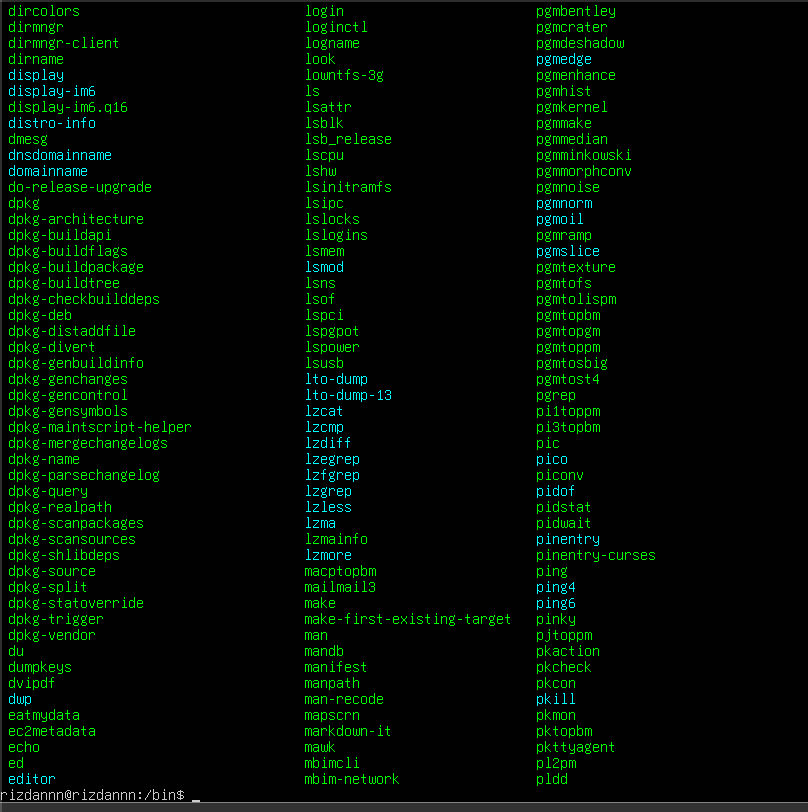

#### /usr/bin

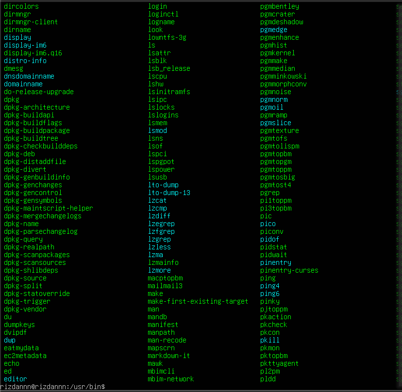

#### /sbin

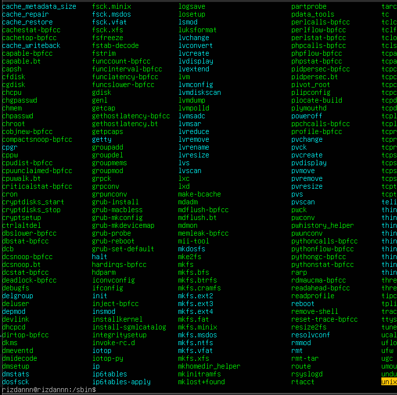

#### /tmp

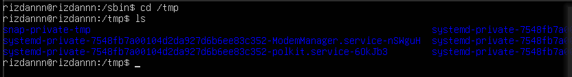

#### /boot

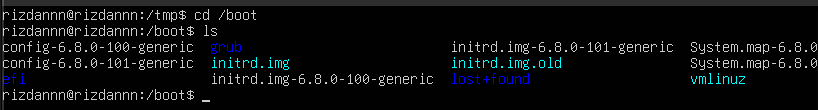

#### 3. Telusuri direktory /dev. Identifikasi perangkat yang tersedia. Identifikasi tty (terminal) Anda (ketik who am i); siapa pemilih tty Anda (gunakan ls –l).
Perintah :
```
$ cd /dev
$ ls
$ who am i
$ ls -l
```
Hasil Perintah :

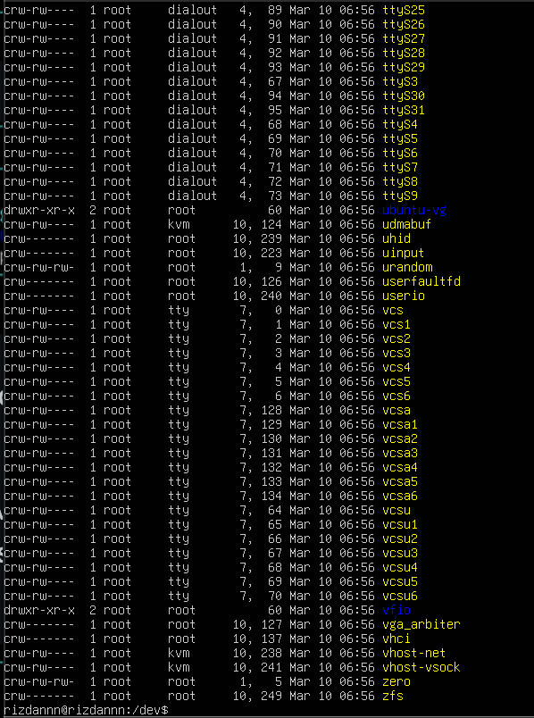


#### 4. Telusuri derectory /proc. Tampilkan isi file interrupts, devices, cpuinfo, meminfo dan uptime menggunakan perintah cat. Dapatkah Anda melihat mengapa directory /proc disebut pseudo-filesystem yang memungkinkan akses ke struktur data kernel ?
Perintah :
```
$ cd /proc
$ cat interrupts
$ cat devices
$ cat cpuinfo
$ cat meminfo
$ cat uptime
```
Hasil Perintah :

interrupts

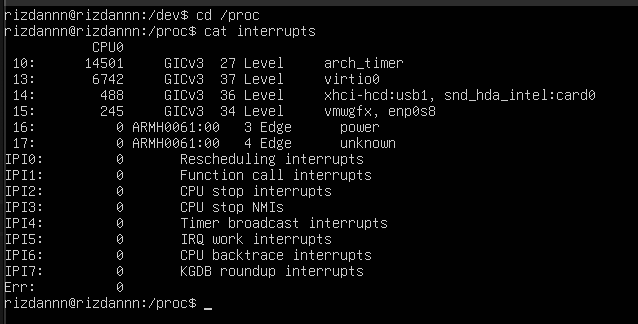

devices

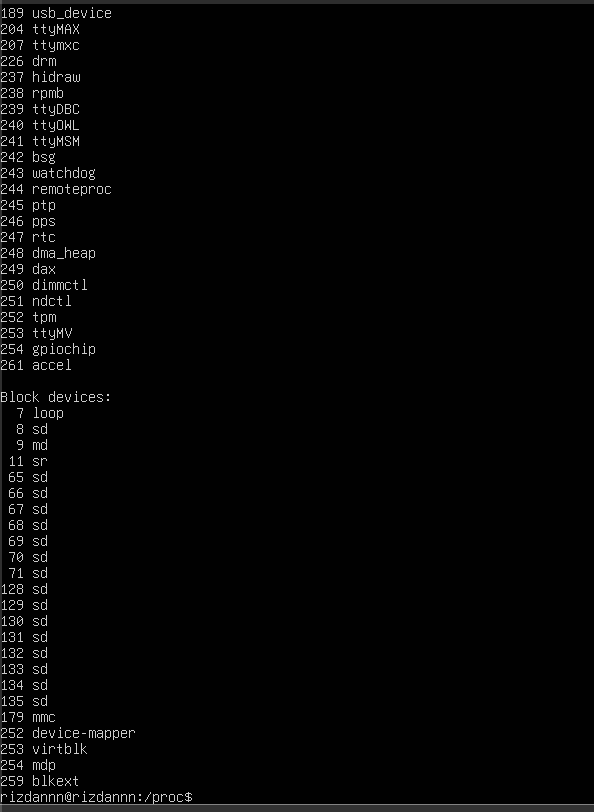

cpuinfo

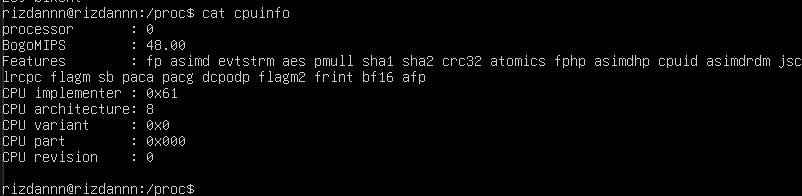

meminfo

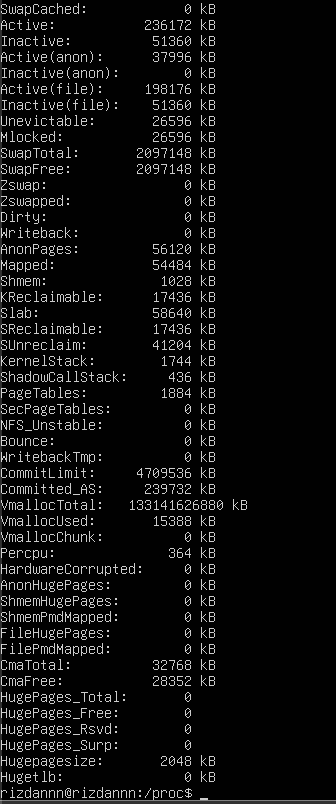

uptime


#### 5. Ubahlah direktory home ke user lain secara langsung menggunakan cd ~username.
Perintah :
```
$ cd ~username
```
Hasil Perintah :


#### 6. Ubah kembali ke direktory home Anda.
Perintah :
```
$ cd ~
```
Hasil Perintah :

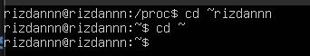

#### 7. Buat subdirektory work dan play.
Perintah :
```
$ mkdir work
$ mkdir play
```
Hasil Perintah :

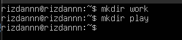

#### 8. Hapus subdirektory work.
Perintah :
```
$ rmdir work
```
Hasil Perintah :

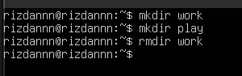

#### 9. Copy file /etc/passwd ke direktory home Anda.
Perintah :
```
$ cp /etc/passwd ~
```
Hasil Perintah :

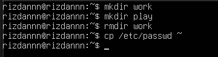

#### 10. Pindahkan ke subirectory play.
Perintah :
```
$ mv passwd play
```
Hasil Perintah :


#### 11. Ubahlah ke subdirektory play dan buat symbolic link dengan nama terminal yang menunjuk ke perangkat tty. Apa yang terjadi jika melakukan hard link ke perangkat tty ?
Perintah :
```
$ cd play
$ ln -s /dev/tty terminal
```
Hasil Perintah :

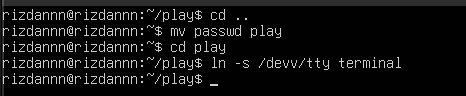

#### 12. Buatlah file bernama hello.txt yang berisi kata “hello word”. Dapatkah Anda gunakan “cp” menggunakan “terminal” sebagai file asal untuk menghasilkan efek yang sama ?
Perintah :
```
$ echo "hello word" > hello.txt
```
Hasil Perintah :


#### 13. Copy hello.txt ke terminal. Apa yang terjadi ?
Perintah :
```
$ cp hello.txt /dev/tty
```
Hasil Perintah :

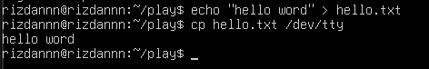

#### 14. Masih direktory home, copy keseluruhan direktory play ke direktory bernama work menggunakan symbolic link.
Perintah :
```
$ ln -s play work
```
Hasil Perintah :


#### 15. Hapus direktory work dan isinya dengan satu perintah.
Perintah :
```
$ rm -rf work
```
Hasil Perintah :

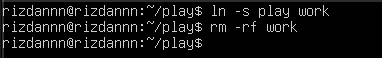


