## Laporan Praktikum Sistem Operasi Jobsheet 

<h4>Nama : Rafif Rizdan Prastana<h4>
<h4>NIM  : 254107020052<h4>
<h4>Kelas : TI 1H<h4>

### 1.1 Konsep Proses dan Thread

#### Praktikum 6.1 : Melihat Proses dan Thread
```
1. Tampilkan semua proses yang berjalan:
$ ps aux
```
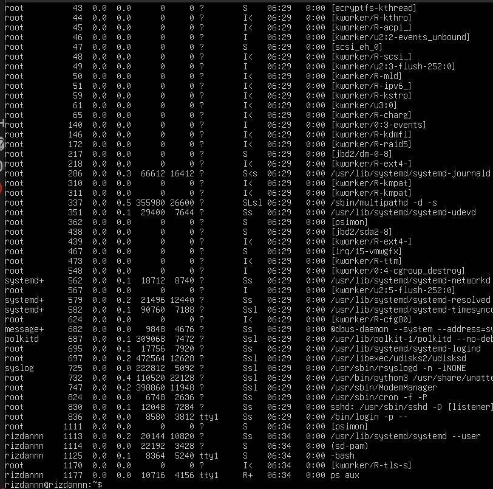

2. Tampilkan proses beserta thread-nya:
```
$ ps aux -L
```
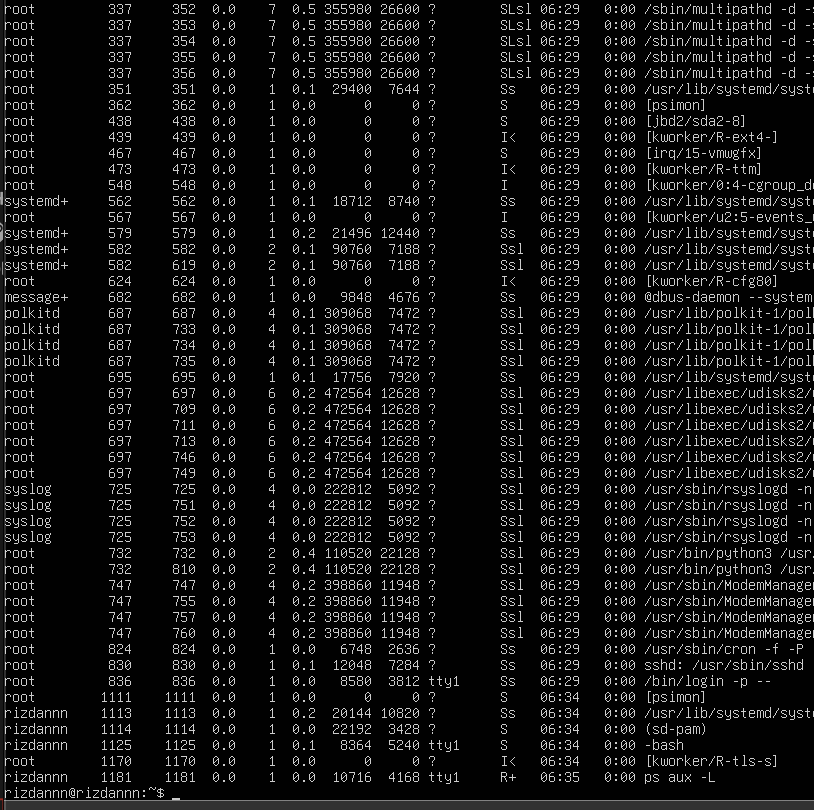

3. Lihat PID shell aktif dan detail prosesnya:
```
$ echo $$
$ ps -p $$ -f
```
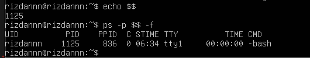

4. Lihat hierarki proses secara visual:
```
$ pstree -p
```
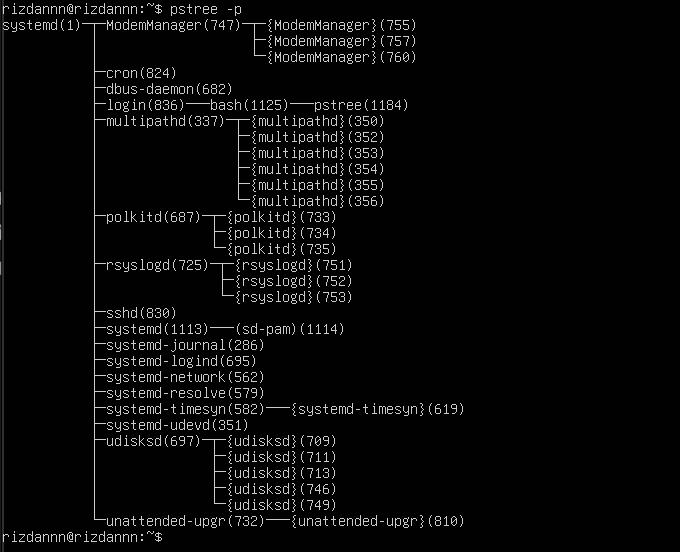


#### Latihan 6.1

Jalankan ps aux dan amati outputnya:

1. Berapa total proses yang berjalan? Proses apa yang memiliki PID terkecil?

2. Jalankan pstree -p dan temukan proses bash Anda. Proses apa yang menjadi induk (PPID) dari bash tersebut?

3. Bandingkan output ps aux dan ps aux -L. Apa perbedaan yang Anda lihat?

#### Jawaban 6.1

1. 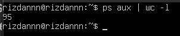

Proses dengan PID terkecil adalah PID 1

2. 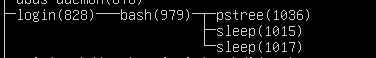

3. ps aux 


ps aux -L


ps aux Menampilkan satu baris per proses, sedangkan ps aux -L Menampilkan satu baris per thread


### 1.2 Siklus Hidup Proses

#### Praktikum 6.2 : Mengamati Siklus Hidup Proses

#### 1. Buat proses di background dan amati kondisinya:
```
$ sleep 60 &
$ ps aux | grep sleep
```
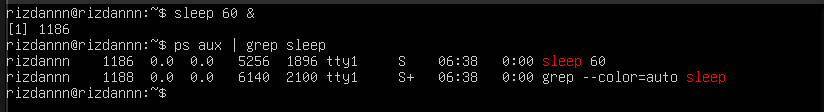

#### 2. Amati perubahan exit code dari perintah yang berhasil dan gagal:
```
$ ls /tmp
$ echo "Sukses: $?"

$ ls /direktori-tidak-ada
$ echo "Gagal: $?"
```
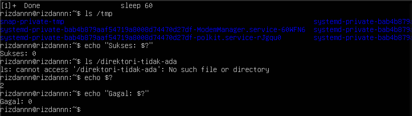


#### Latihan 6.2

1. Jalankan sleep 120 & dan amati kolom STAT pada ps aux. Kondisi apa yang ditampilkan? Mengapa proses sleep berada di kondisi tersebut?

2. Jalankan beberapa perintah yang berhasil dan yang gagal, lalu catat exit code masing-masing. Pola apa yang Anda temukan?

### Jawaban 6.2

1. 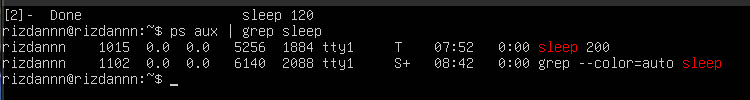

Karena proses sleep tidak melakukan komputasi apapun — tugasnya hanya menunggu timer 120 detik habis.

2. 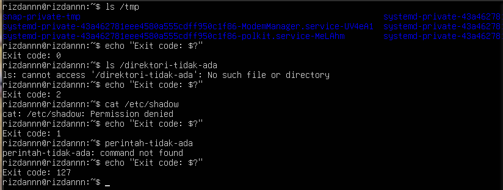

### 1.3 Penjadwalan Proses dan Prioritas

#### Praktikum 6.3 : Mengatur Prioritas Proses

#### 1. Jalankan proses dengan prioritas rendah:
```
$ nice -n 10 sleep 300 &
$ ps aux | grep sleep
```
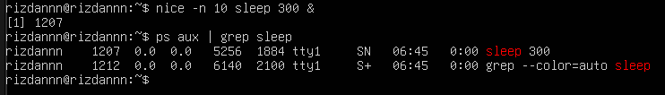

#### 2. Verifikasi nilai nice pada kolom NI:
```
$ ps aux | grep sleep
```
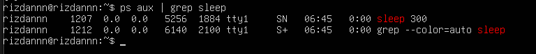

#### 3. Ubah nilai nice proses yang sudah berjalan:
```
$ renice -n 15 -p <PID>
$ ps -p <PID> -o pid,ni,cmd
```
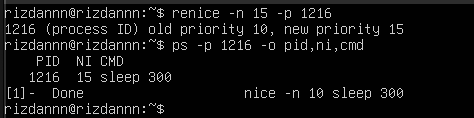

#### 4. Bersihkan proses percobaan:
```
$ kill %1
```
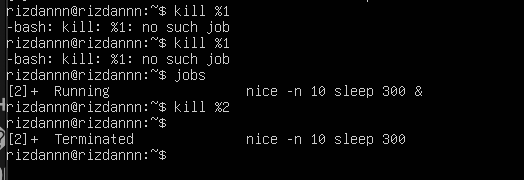


#### Latihan 6.3

1. Jalankan nice -n 5 sleep 200 & dan verifikasi nilai NI-nya dengan ps.

2. Ubah nilai nice menjadi 10 menggunakan renice, lalu verifikasi kembali.

3. Coba ubah nilai nice menjadi -5 tanpa sudo. Apa yang terjadi? Mengapa Linux membatasi hal ini untuk user biasa?

#### Jawaban 6.3

1. 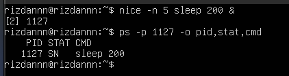

2. 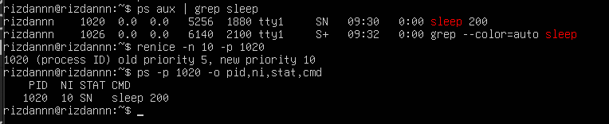

3. 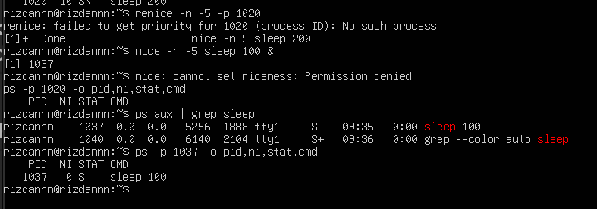

Untuk Mencegah penyalahgunaan antar user di server Linux yang digunakan banyak orang

### 1.4 Sinyal Proses

#### Praktikum 6.4 : Mengirim Sinyal ke Proses

#### 1. Buat proses percobaan:
```
$ sleep 500 &
$ sleep 600 &
$ sleep 700 &
$ ps aux | grep sleep
```
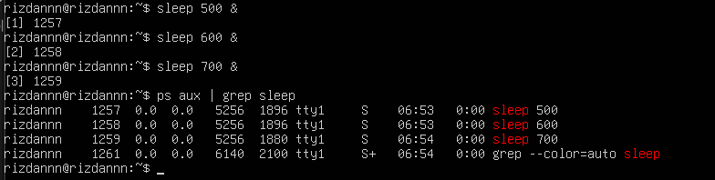

#### 2. Hentikan satu proses dengan SIGTERM dan verifikasi:
```
$ kill <PID>
$ ps aux | grep sleep
```
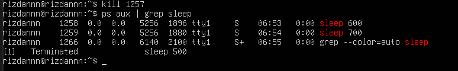

#### 3. Jeda dan lanjutkan proses dengan SIGSTOP/SIGCONT:
```
$ kill -SIGSTOP <PID>
$ ps aux | grep sleep

$ kill -SIGCONT <PID>
$ ps aux | grep sleep
```
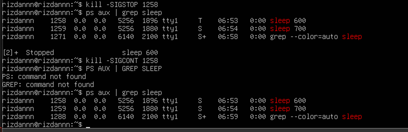

#### 4. Hentikan semua proses sleep sekaligus:
```
$ pkill sleep
```
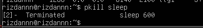


#### Latihan 6.4

1. Jalankan sleep 400 &, kirim SIGSTOP, dan amati perubahan kolom STAT. Kondisi apa yang muncul?

2. Kirim SIGCONT dan verifikasi proses kembali berjalan.

3. Hentikan proses dengan SIGTERM lalu verifikasi sudah tidak ada. Kapan Anda memilih SIGKILL daripada SIGTERM?

#### Jawaban 6.4

### 1.5 Manajemen Job

1. 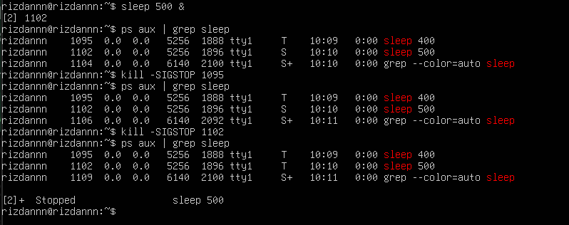

S menjadi T

2. 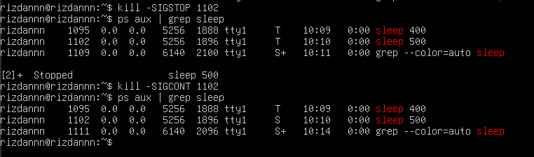

3. 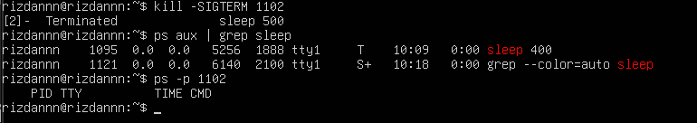

Ketika proses tidak merespons SIGTERM


#### Praktikum 6.5 : Manajemen Job Foreground dan Background

#### 1. Jalankan tiga job di background:
```
$ sleep 200 &
$ sleep 300 &
$ sleep 400 &
$ jobs
```
![namafile](images

#### 2. Bawa job pertama ke foreground, jeda, lalu kembalikan ke background:
```
$ fg %1
[Ctrl+Z]
$ bg %1
$ jobs
```
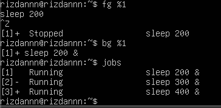

#### 3. Hentikan semua job:
```
$ kill %1 %2 %3
$ jobs
```
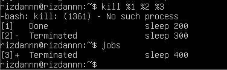


#### Latihan 6.5

1. Jalankan top di foreground. Apa yang terjadi di terminal?

2. Tekan Ctrl+Z dan cek statusnya dengan jobs. Kondisi apa yang ditampilkan?

3. Pindahkan ke background dengan bg. Apakah top dapat berjalan dengan baik di background? Mengapa?

4. Kembalikan ke foreground dengan fg, lalu keluar dengan q.

#### Jawaban 6.5

1. 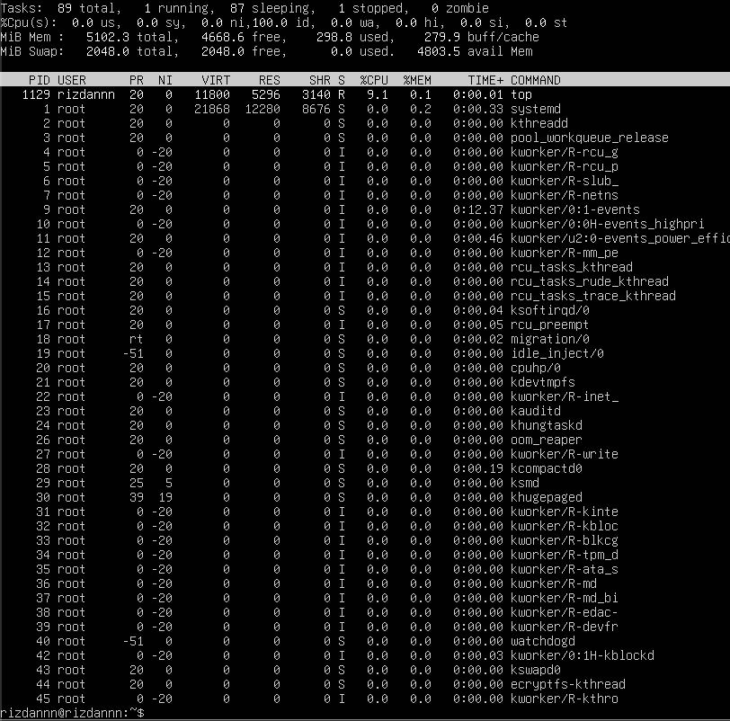

Terminal tidak bisa diketik, dan tampilan diperbarui otomatis setiap 3 detik

2. 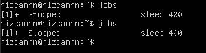

3. 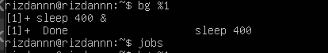

Sistem mengirim SIGTTOU secara otomatis Ketika proses background mencoba menulis ke terminal

4. 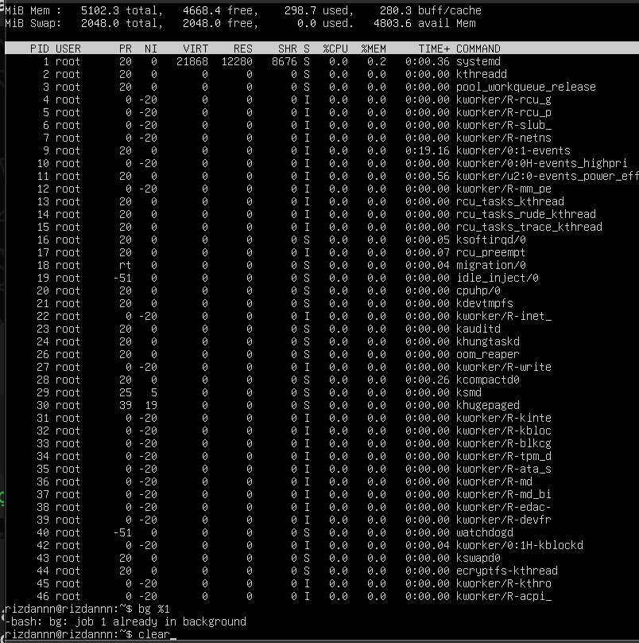


### 1.6 Pemantauan Proses

#### Praktikum 6.6 : Pemantauan Proses

#### 1. Temukan proses dengan penggunaan CPU dan memori tertinggi:
```
$ ps aux --sort=-%cpu | head -10
$ ps aux --sort=-%mem | head -10
```
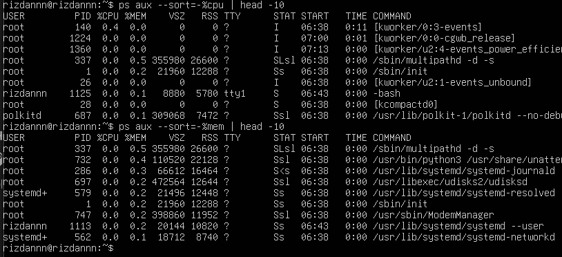

#### 2. Jalankan top dan eksplorasi shortcut-nya:
```
$ top
```
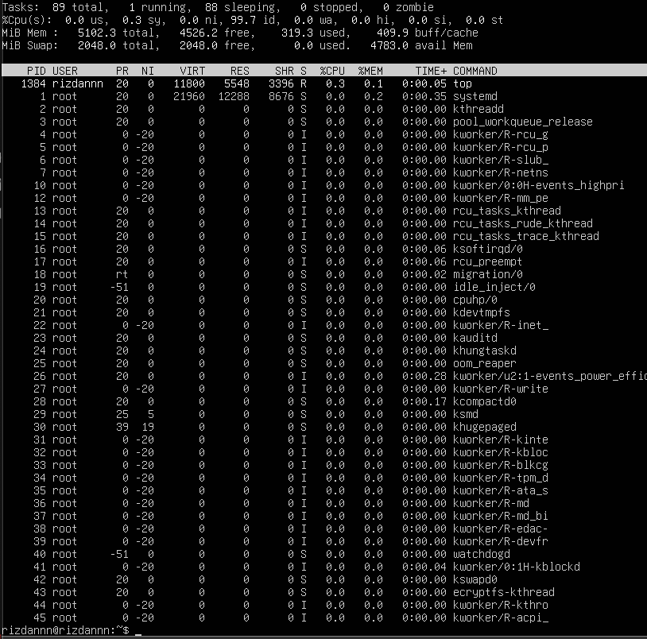

#### 3. Instal dan jalankan htop:
```
$ sudo apt install -y htop
$ htop
```
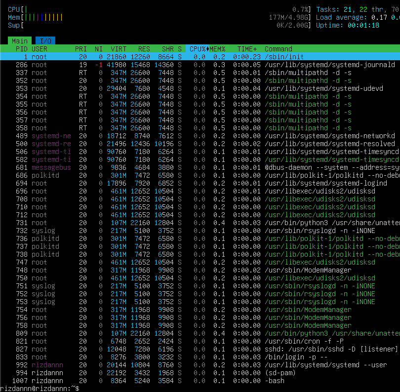


#### Latihan 6.6

1. Gunakan ps aux --sort=%mem untuk menemukan proses yang menggunakan memori paling banyak di VM Anda. Proses apa itu?

2. Di dalam top, tekan 1. Apa yang berubah pada tampilan? Mengapa informasi ini berguna?

3. Di dalam htop, navigasikan ke proses sshd menggunakan tombol panah. Tekan F9 dan amati opsi sinyal yang tersedia.

#### Jawaban 6.6

1. 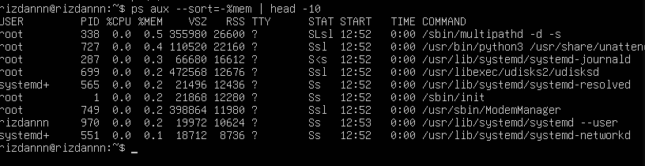

2. 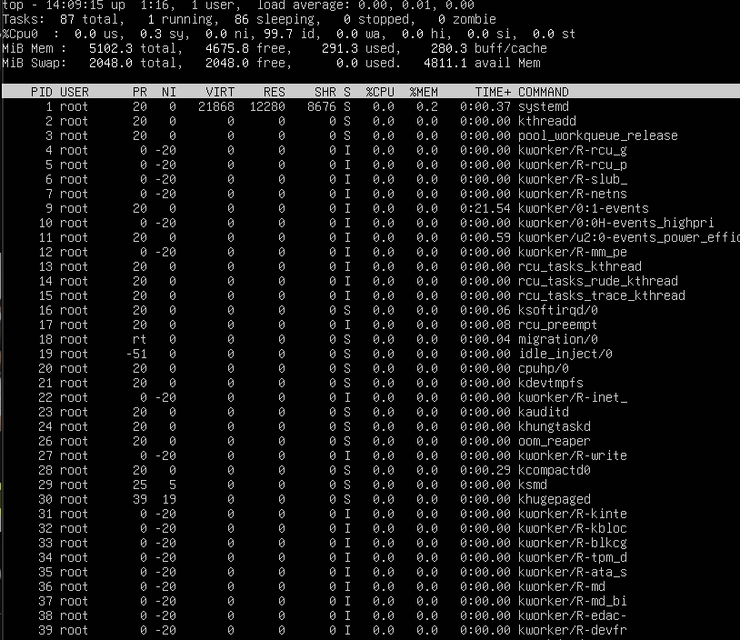

Karena rata-rata gabungan bisa menyembunyikan masalah yang sebenarnya sedang terjadi

3. 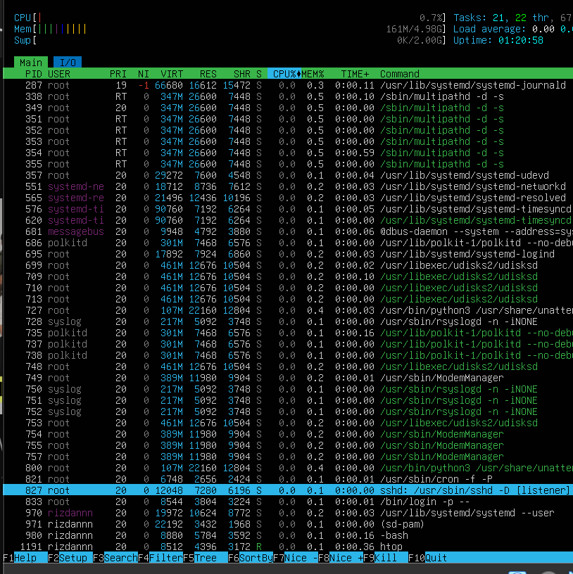

### 1.8 Latihan

#### Latihan 6.A

Eksplorasi Proses Sistem

1. Jalankan ps aux –forest dan temukan proses dengan PID 1. Apa
nama dan fungsi proses tersebut dalam sistem Linux modern?

2. Hitung berapa proses yang dimiliki oleh user root dan berapa yang
dimiliki oleh user Anda. Mengapa root memiliki lebih banyak proses?

3. Temukan semua proses yang berada dalam kondisi S. Mengapa sebagian
besar proses di sistem berada dalam kondisi ini?

#### Jawaban 6.A

1. 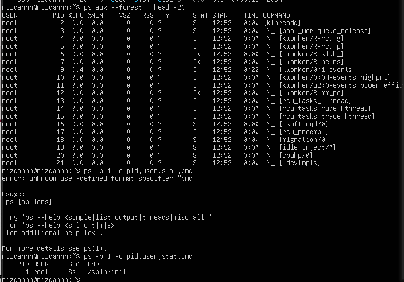

Nama proses: systemd

2. 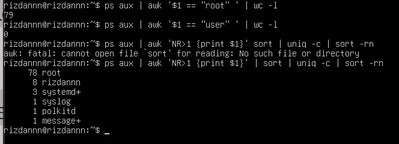

Untuk menjalankan semua layanan sistem Seluruh daemon 

3. 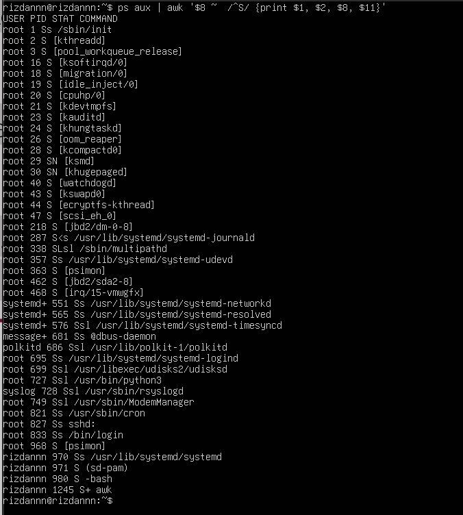

Karena proses lebih banyak menunggu daripada bekerja

#### Latihan 6.B

Simulasi Manajemen Job

1. Jalankan tiga perintah sleep dengan durasi 100, 200, dan 300 detik di
background. Verifikasi ketiganya dengan jobs.

2. Bawa job kedua ke foreground, jeda dengan Ctrl+Z , lalu kembalikan
ke background dengan bg.

3. Hentikan job pertama dengan kill %1. Tampilkan kembali daftar job.
Berapa job yang tersisa?

#### Jawaban 6.B

1. 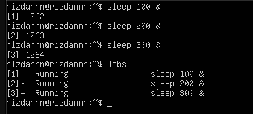

2. 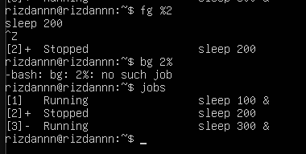

3. 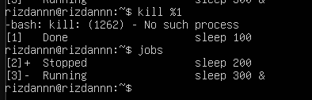

#### Latihan 6.C

Prioritas dan Sinyal

1. Jalankan dua proses sleep: satu dengan nice +5 dan satu dengan nice
+15. Verifikasi nilai NI keduanya dengan ps.

2. Gunakan renice untuk mengubah nice proses pertama menjadi +10.
Proses mana yang kini lebih diprioritaskan scheduler?

3. Kirim SIGSTOP ke salah satu proses, verifikasi kondisi T-nya, lalu kirim
SIGCONT. Akhiri semua proses percobaan dengan pkill sleep.

#### Jawaban 6.C

1. 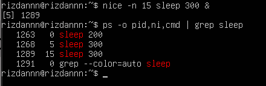

2. 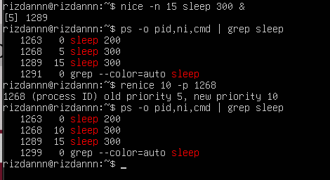

3. ![namafile](images