## Laporan Praktikum Sistem Operasi Jobsheet 

<h4>Nama : Rafif Rizdan Prastana<h4>
<h4>NIM  : 254107020052<h4>
<h4>Kelas : TI 1H<h4>

### Tugas Praktikum 1 — Toolkit Bash Administrator Pribadi
Instruksi:

1. Tambahkan konfigurasi pada .bashrc untuk:

a. menambahkan direktori bin pribadi ke PATH

b. membuat minimal 2 alias yang membantu kerja harian

c. membuat minimal 1 fungsi shell yang berguna untuk administrasi
```
cat <<'EOF' >> ~/.bashrc

# --- Toolkit Bash Praktikum ---

# Tambah PATH
export PATH="$HOME/praktikum-os/week07-bash/bin:$PATH"

# Alias
alias ll='ls -lah --color=auto'
alias gs='git status'

# Fungsi
cekdisk() {
    df -h /
}

# --- End Toolkit Bash Praktikum ---

EOF

source ~/.bashrc
```

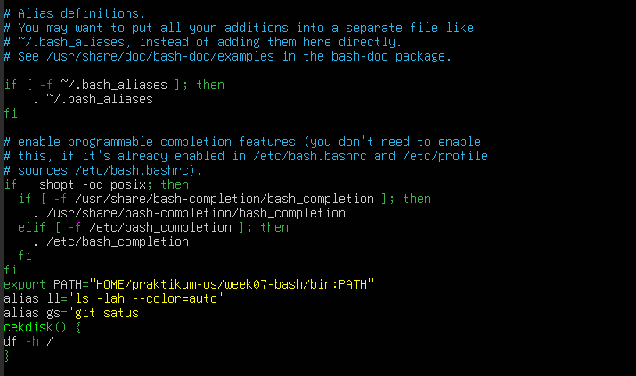


2. Pastikan konfigurasi tersebut aktif kembali saat membuka shell login.
```
mkdir -p ~/praktikum-os/week07-bash/bin

cat <<'EOF' > ~/praktikum-os/week07-bash/bin/ringkasan
#!/usr/bin/env bash
echo "=== RINGKASAN SISTEM ==="
echo "Hostname : $(hostname)"
echo "User     : $(whoami)"
echo "Uptime   : $(uptime -p)"
EOF

chmod +x ~/praktikum-os/week07-bash/bin/ringkasan
```
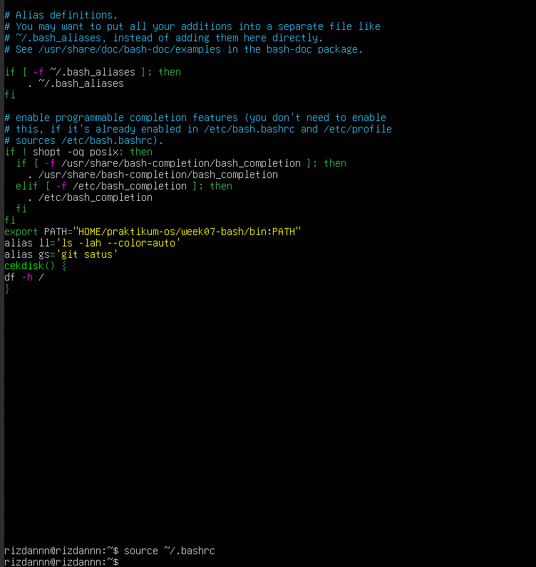

3. Buat satu script sederhana di direktori bin pribadi, misalnya script untuk menampilkan ringkasan sistem.
4. Uji dari direktori yang berbeda untuk memastikan script dapat dipanggil tanpa menuliskan path lengkap.
5. Simpan bukti pengujian ke file toolkit-bash-report.txt.
```
{
echo "PATH:"
echo "$PATH"

echo "Alias:"
type ll
type gs

echo "Fungsi:"
type cekdisk

echo "Script:"
type ringkasan

} > toolkit-bash-report.txt
```
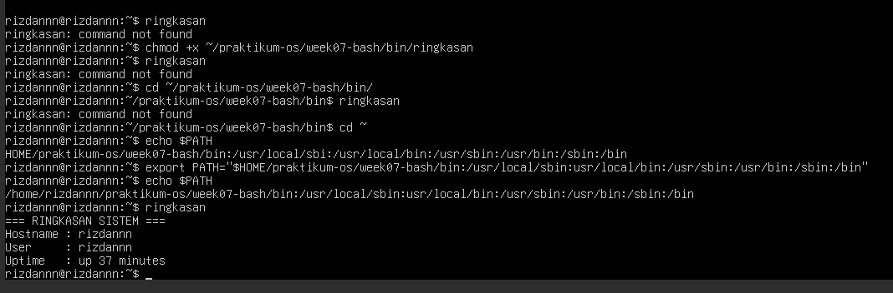

### Tugas Praktikum 2 — Audit File Konfigurasi dan Logging AmanKonteks: Saat troubleshooting, administrator sering perlu menginventarisasi file konfigurasi dan memisahkan output normal dari pesan error.Instruksi:

1. Buat file laporan bernama audit-konfigurasi-$(date +%F).txt
```
FILE="audit-konfigurasi-$(date +%F).txt"

find /etc -type f -name "*.conf" > $FILE 2> audit-error.log
```

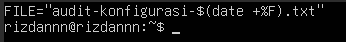

2. Cari file *.conf di dalam /etc dan simpan hasilnya ke file laporan
```
JUMLAH=$(wc -l < $FILE)
echo "Total file konfigurasi: $JUMLAH" >> $FILE
```

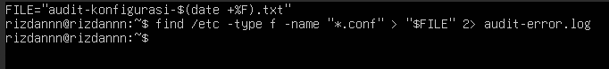

3. Catat jumlah total file konfigurasi yang ditemukan
```
cat $FILE | tee hasil-audit.txt
```


4. Jika ada pesan error, simpan ke file terpisah audit-error.log

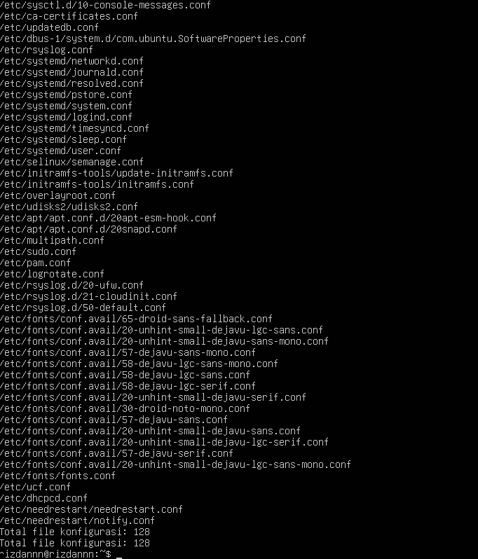

5. Tampilkan isi laporan ke terminal dan sekaligus simpan menggunakan tee
```
echo "Pemisahan stdout dan stderr penting agar output utama tidak tercampur dengan error. Hal ini memudahkan analisis dan troubleshooting sistem." >> "$FILE"
```
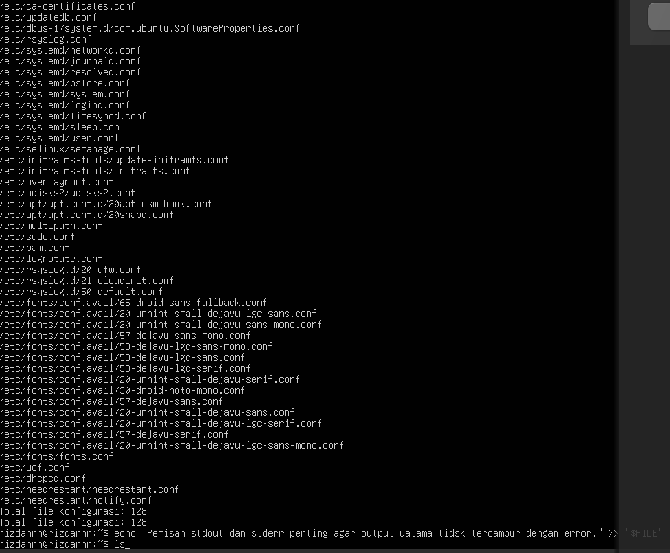

6. Tambahkan ringkasan singkat 3–5 baris yang menjelaskan mengapa pemisahan stdout dan stderr penting dalam audit sistem

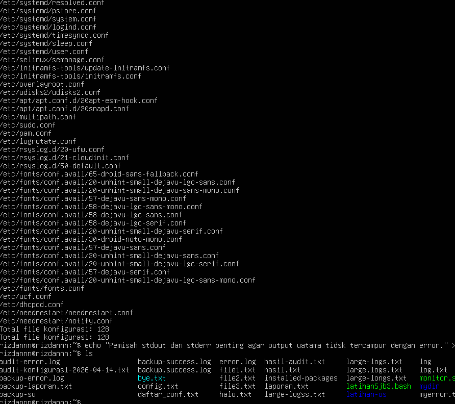

Tugas Praktikum 3 — Mini Health Check Harian Server
Konteks: Administrator perlu membuat pemeriksaan cepat (health check) untuk mengetahui kondisi dasar server sebelum dan sesudah maintenance.
Instruksi:

1. Buat script Bash bernama daily-healthcheck pada direktori bin pribadi
```
cd ~/praktikum-os/week07-bash/bin
```
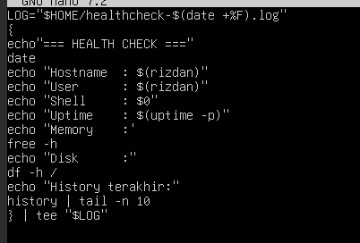

2. Script minimal harus menampilkan:

- Tanggal dan waktu
- Hostname
- User aktif
- Shell aktif
- Uptime
- Penggunaan memori
- Penggunaan filesystem root
- 10 baris terakhir history command yang relevan dengan pengecekan
```
nano daily-healthcheck
```
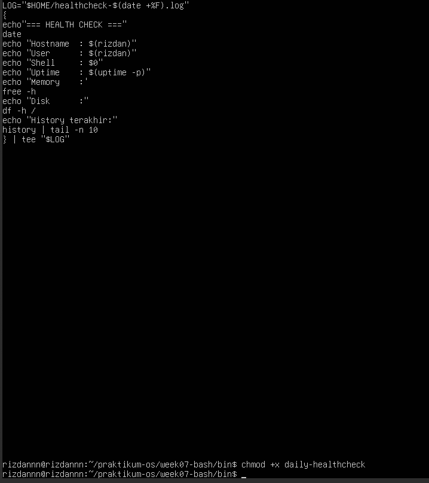


3. Simpan hasil ke file log harian, misalnya healthcheck-$(date +%F).log
LOG="$HOME/healthcheck-$(date +%F).log"
```
{
echo "=== HEALTH CHECK ==="
date
echo "Hostname : $(hostname)"
echo "User     : $(whoami)"
echo "Shell    : $0"
echo "Uptime   : $(uptime -p)"
echo "Memory   :"
free -h
echo "Disk     :"
df -h /
echo "History terakhir:"
history | tail -n 10
} | tee "$LOG"
```


4. Tampilkan hasil ke terminal dan ke file secara bersamaan
5. Jika menggunakan pipeline dengan tee, cek juga status exit command utama

```
cat ~/healthcheck-$(date +%F).log
```

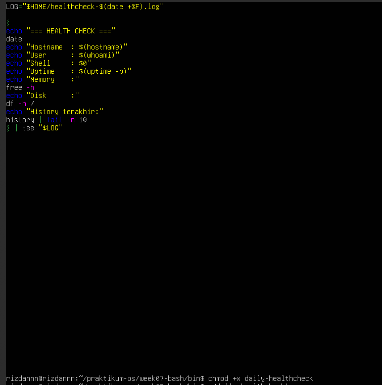


### Tugas Praktikum 4 — Penanganan File dengan Nama Kompleks dan Arsip Aman


1. Buat minimal 4 file contoh dengan nama yang bervariasi, termasuk:

- Nama file yang mengandung spasi
- Nama file yang mengandung tanda kurung siku atau karakter khusus
- File dengan pola nama serupa untuk diuji dengan wildcard

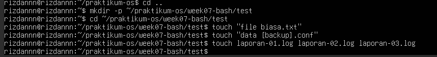

2. Tunjukkan perbedaan hasil jika file diakses tanpa quoting dan dengan quoting yang benar

![namafile](images/2tiga.png

3. Lakukan preview wildcard dengan echo sebelum dipakai untuk operasi nyata

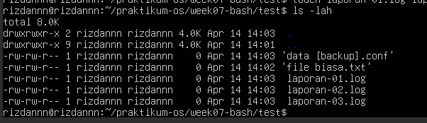

4. Salin file-file tersebut ke direktori backup dengan nama yang aman

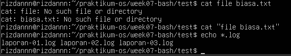

5. Buat arsip tar.gz dari hasil backup

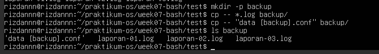

6. Simpan riwayat perintah yang digunakan ke file riwayat-arsip.txt


