## Laporan Praktikum Sistem Operasi Jobsheet 

<h4>Nama  : Rafif Rizdan Prastana<h4>
<h4>NIM   : 254107020052<h4>
<h4>Kelas : TI 1H<h4>

### 1.1 Dasar-dasar Scripting Bash

### Praktikum 7.1 Script Pertama: Laporan Sistem

#### 1. Buat workspace praktikum:
```
mkdir -p ~/praktikum-os/week09/{scripts,logs,data}
cd ~/praktikum-os/week09/scripts
```

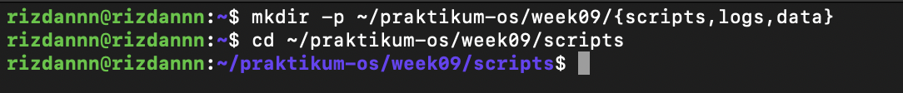

#### 2. Buat script dengan nano:
```
nano laporan-sistem.sh
```


#### 3. Ketik isi berikut, simpan (Ctrl+O Enter), lalu keluar (Ctrl+X):
```
#!/bin/bash
# Script: laporan-sistem.sh
echo "================================"
echo "         LAPORAN SISTEM         "
echo "================================"
echo "Tanggal : $(date '+%A, %d %B %Y')"
echo "Jam     : $(date '+%H:%M:%S')"
echo "Hostname: $(hostname)"
echo "User    : $(whoami)"
echo "CPU core: $(nproc)"
echo "RAM bebas: $(free -h | awk '/^Mem/ { print $4 }')"
echo "Disk /  : $(df -h / | awk 'NR==2 { print $5 }') terpakai"
echo "================================"
```

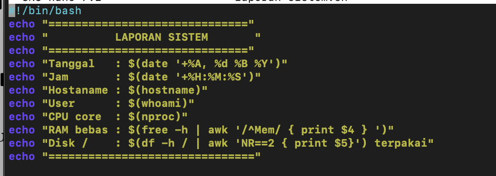

#### 4. Beri izin eksekusi dan jalankan:
```
chmod +x laporan-sistem.sh
./laporan-sistem.sh
```

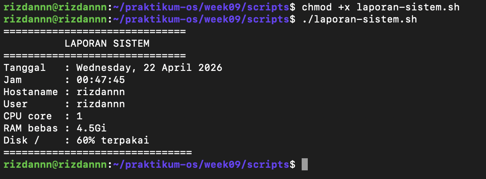

### Latihan 9.1
#### Soal: Modifikasi laporan-sistem.sh agar menyimpan output ke file laporan-YYYY-MM-DD.txt sekaligus menampilkannya di terminal menggunakan tee.
```
#!/bin/bash
# Script: laporan-sistem.sh (dengan tee)

NAMA_FILE="laporan-$(date '+%Y-%m-%d').txt"

{
  echo "================================"
  echo "         LAPORAN SISTEM         "
  echo "================================"
  echo "Tanggal : $(date '+%A, %d %B %Y')"
  echo "Jam     : $(date '+%H:%M:%S')"
  echo "Hostname: $(hostname)"
  echo "User    : $(whoami)"
  echo "CPU core: $(nproc)"
  echo "RAM bebas: $(free -h | awk '/^Mem/ { print $4 }')"
  echo "Disk /  : $(df -h / | awk 'NR==2 { print $5 }') terpakai"
  echo "================================"
} | tee "$NAMA_FILE"
```

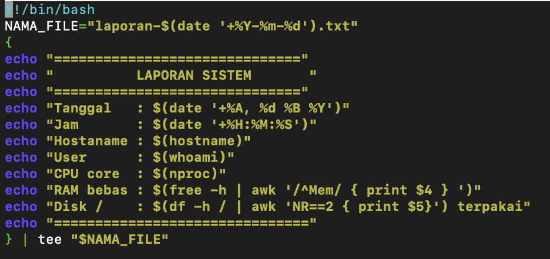

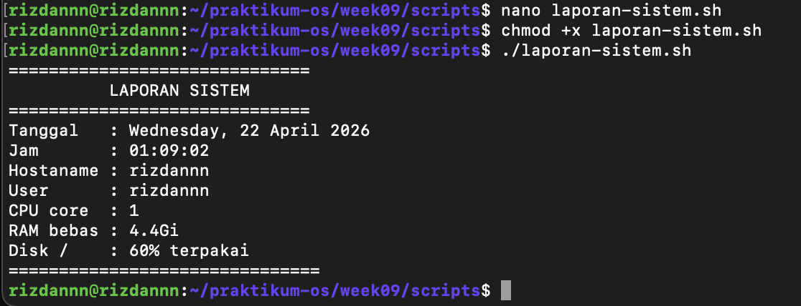

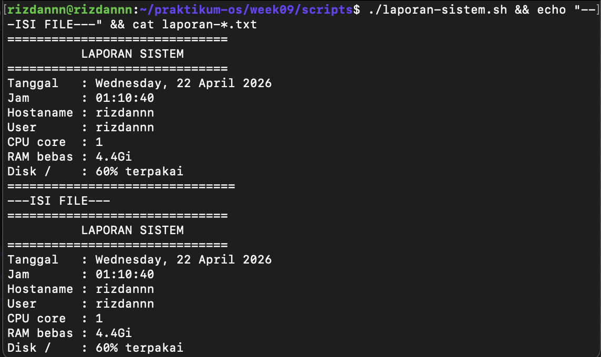

### Praktikum 7.2 — Script Info Sistem dengan Argumen

#### 1. Buat script:
```
nano ~/praktikum-os/week09/scripts/info-sistem.sh
```

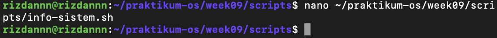

#### 2. Ketik isi berikut:
```
#!/bin/bash
# Penggunaan: ./info-sistem.sh [nama-admin] [batas-disk-persen]

ADMIN=${1:-"Tidak dikenal"}
BATAS=${2:-80}
TANGGAL=$(date '+%F %T')
DISK_PERSEN=$(df / | awk 'NR==2 { print $5}' | tr -d '%')

echo "Admin   : $ADMIN"
echo "Tanggal : $TANGGAL"
echo "Disk /  : ${DISK_PERSEN}% terpakai"
echo "Batas   : ${BATAS}%"

if [ "$DISK_PERSEN" -gt "$BATAS" ]; then
    echo "STATUS  : PERINGATAN - disk melebihi batas!"
else
    SISA=$(( BATAS - DISK_PERSEN ))
    echo "STATUS  : Normal (sisa toleransi ${SISA}%)"
fi
```

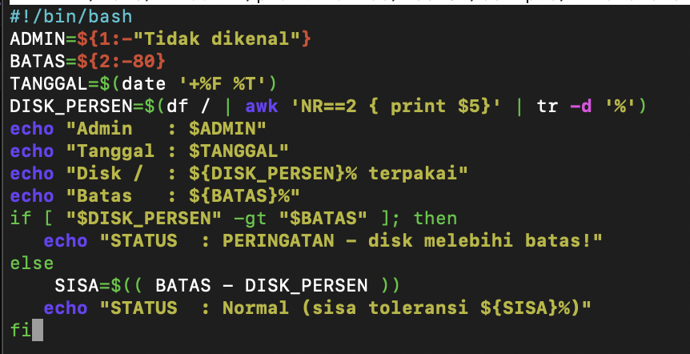

#### 3. Simpan, beri izin, uji dengan berbagai kombinasi argumen:
```
chmod +x ~/praktikum-os/week09/scripts/info-sistem.sh
./info-sistem.sh
./info-sistem.sh "Dian" 50
./info-sistem.sh "Dian" 10
```

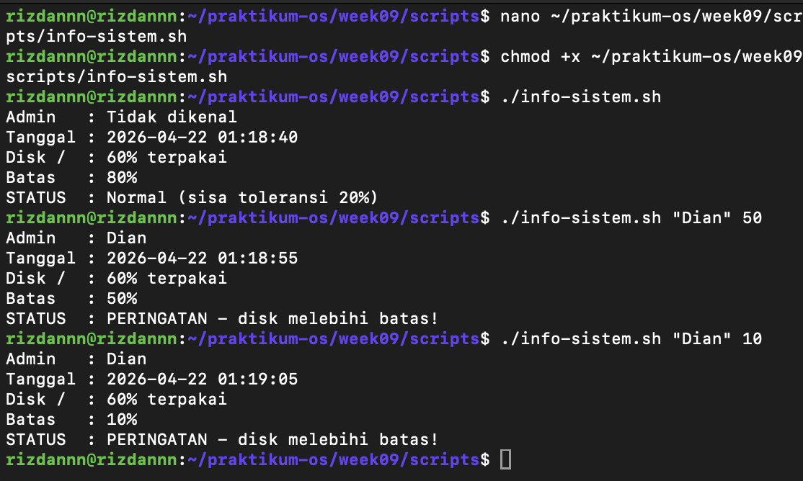

### Latihan 9.2

#### Soal: Buat script kalkulator.sh yang menerima tiga argumen <angka1> <operator> <angka2> dengan operator +, -, *, atau /. Gunakan case untuk memilih operasi, dan validasi jika argumen tidak lengkap.
```
#!/bin/bash
# Penggunaan: ./kalkulator.sh <angka1> <operator> <angka2>

if [ $# -ne 3 ]; then
    echo "ERROR: Argumen tidak lengkap."
    echo "Penggunaan: $0 <angka1> <operator> <angka2>"
    echo "Operator yang tersedia: + - * /"
    exit 1
fi

ANGKA1=$1
OPERATOR=$2
ANGKA2=$3

# Validasi apakah input adalah angka
if ! [[ "$ANGKA1" =~ ^-?[0-9]+$ ]] || ! [[ "$ANGKA2" =~ ^-?[0-9]+$ ]]; then
    echo "ERROR: '$ANGKA1' atau '$ANGKA2' bukan angka valid."
    exit 1
fi

case "$OPERATOR" in
    +) echo "Hasil: $(( ANGKA1 + ANGKA2 ))" ;;
    -) echo "Hasil: $(( ANGKA1 - ANGKA2 ))" ;;
    \*) echo "Hasil: $(( ANGKA1 * ANGKA2 ))" ;;
    /)
        if [ "$ANGKA2" -eq 0 ]; then
            echo "ERROR: Pembagi tidak boleh nol."
            exit 1
        fi
        echo "Hasil: $(( ANGKA1 / ANGKA2 ))"
        ;;
    *)
        echo "ERROR: Operator '$OPERATOR' tidak dikenal. Gunakan +, -, *, atau /."
        exit 1
        ;;
esac
```

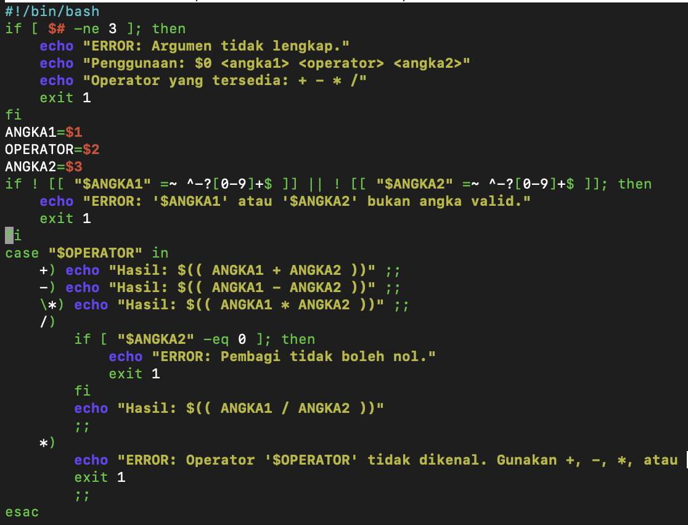

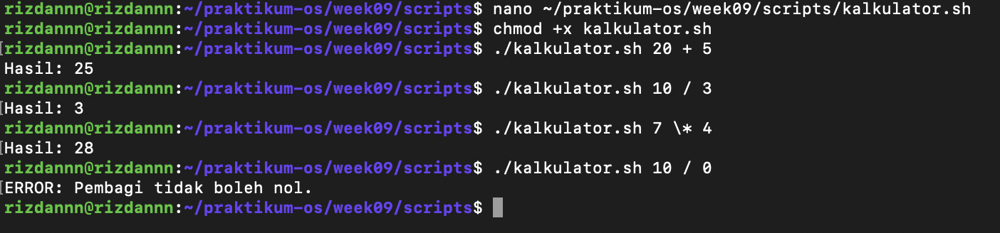


### Praktikum 7.3 — Script Grading dan Menu Interaktif

#### 1. Buat script grading:
```
nano ~/praktikum-os/week09/scripts/grading-batch.sh
```

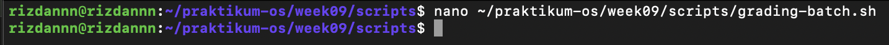

#### 2. Ketik isi berikut:
```
#!/bin/bash
# Script: grading-batch.sh

MAHASISWA=("Andi:92" "Budi:73" "Citra:55" "Deni:80" "Eka:45")

echo "=== HASIL GRADING ==="
for ENTRI in "${MAHASISWA[@]}"; do
    NAMA=$(echo "$ENTRI" | cut -d: -f1)
    NILAI=$(echo "$ENTRI" | cut -d: -f2)

    if [ "$NILAI" -ge 85 ]; then
        GRADE="A"
    elif [ "$NILAI" -ge 75 ]; then
        GRADE="B"
    elif [ "$NILAI" -ge 65 ]; then
        GRADE="C"
    elif [ "$NILAI" -ge 55 ]; then
        GRADE="D"
    else
        GRADE="E"
    fi

    printf "%-10s %3d %s\n" "$NAMA" "$NILAI" "$GRADE"
done
echo "====================="
```

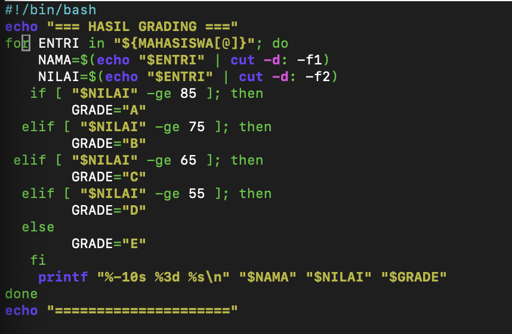


#### 3. Simpan, beri izin, dan jalankan:
```

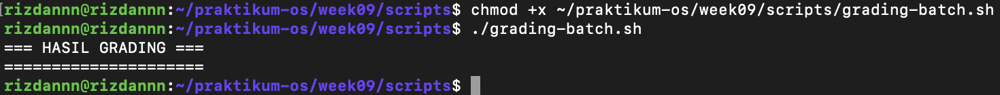

chmod +x ~/praktikum-os/week09/scripts/grading-batch.sh
./grading-batch.sh
```


#### 4. Buat script menu interaktif:
```
nano ~/praktikum-os/week09/scripts/menu-sistem.sh
```

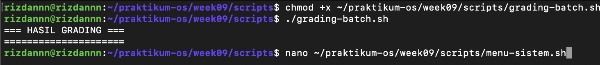

#### 5. Ketik isi berikut:
```
#!/bin/bash
# Menu interaktif pemantauan sistem

while true; do
    echo ""
    echo "===== MENU MONITOR ====="
    echo "1) Info disk"
    echo "2) Info memori"
    echo "3) Proses teratas"
    echo "4) Keluar"
    echo -n "Pilih [1-4]: "
    read PILIHAN

    case $PILIHAN in
        1) df -h ;;
        2) free -h ;;
        3) ps aux --sort=-%cpu | head -6 ;;
        4) echo "Sampai jumpa!"; exit 0 ;;
        *) echo "Pilihan tidak valid." ;;
    esac
done
```

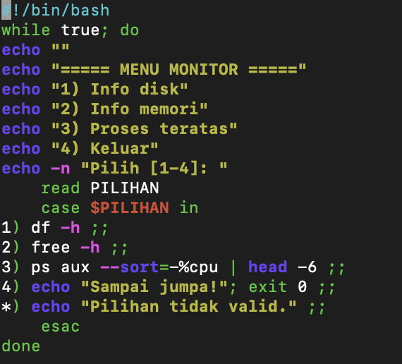

#### 6. Beri izin dan jalankan, coba setiap opsi:
```
chmod +x ~/praktikum-os/week09/scripts/menu-sistem.sh
./menu-sistem.sh
```

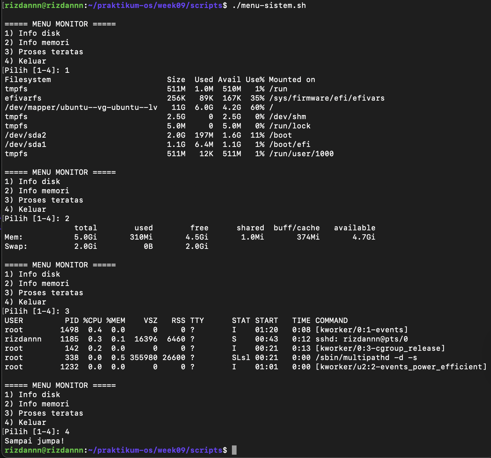


### Latihan 9.3

#### Soal: Tambahkan ringkasan di bagian bawah grading-batch.sh yang menampilkan jumlah mahasiswa per grade (A, B, C, D, E).
```
#!/bin/bash
# Script: grading-batch.sh (dengan ringkasan per grade)

MAHASISWA=("Andi:92" "Budi:73" "Citra:55" "Deni:80" "Eka:45")

# Array untuk menampung grade tiap mahasiswa
GRADES=()

echo "=== HASIL GRADING ==="
for ENTRI in "${MAHASISWA[@]}"; do
    NAMA=$(echo "$ENTRI" | cut -d: -f1)
    NILAI=$(echo "$ENTRI" | cut -d: -f2)

    if [ "$NILAI" -ge 85 ]; then
        GRADE="A"
    elif [ "$NILAI" -ge 75 ]; then
        GRADE="B"
    elif [ "$NILAI" -ge 65 ]; then
        GRADE="C"
    elif [ "$NILAI" -ge 55 ]; then
        GRADE="D"
    else
        GRADE="E"
    fi

    GRADES+=("$GRADE")
    printf "%-10s %3d %s\n" "$NAMA" "$NILAI" "$GRADE"
done
echo "====================="

# Ringkasan jumlah per grade
echo ""
echo "=== RINGKASAN GRADE ==="
for HURUF in A B C D E; do
    JUMLAH=0
    for G in "${GRADES[@]}"; do
        [ "$G" = "$HURUF" ] && JUMLAH=$(( JUMLAH + 1 ))
    done
    echo "Grade $HURUF : $JUMLAH mahasiswa"
done
echo "======================="
```

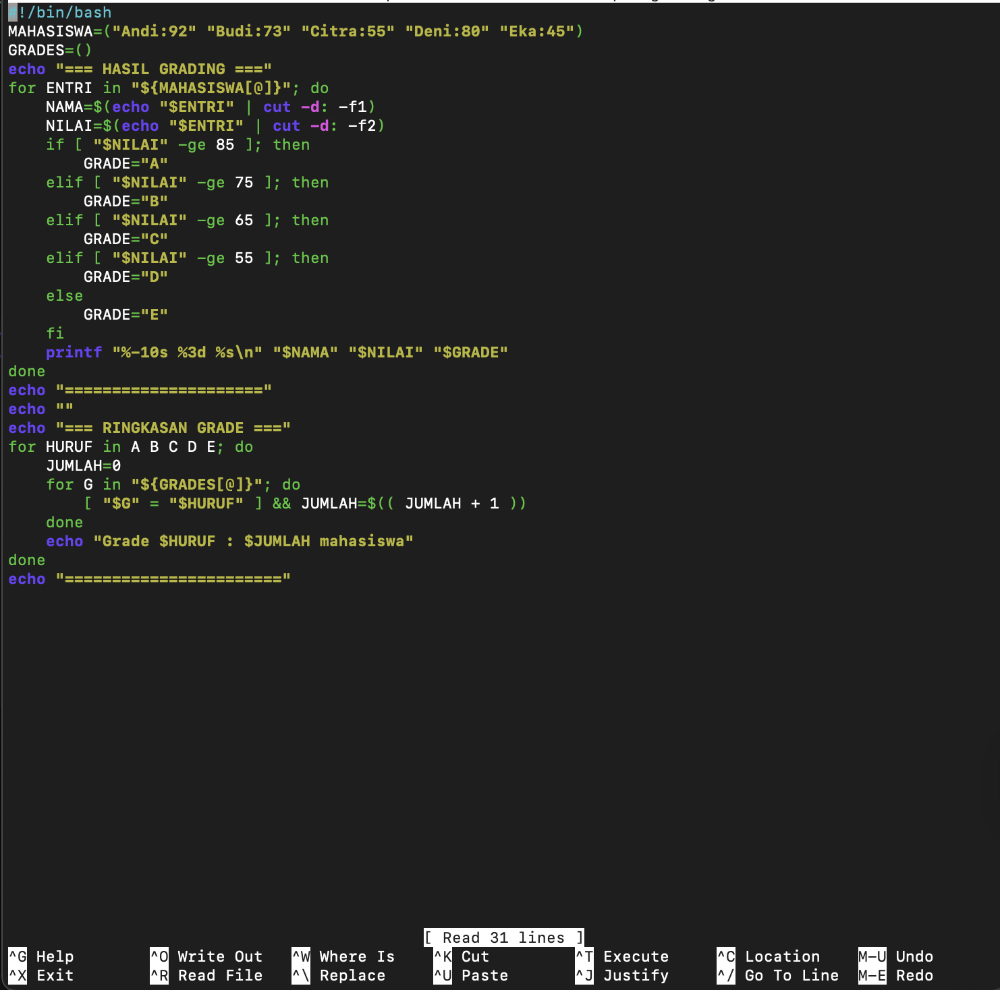

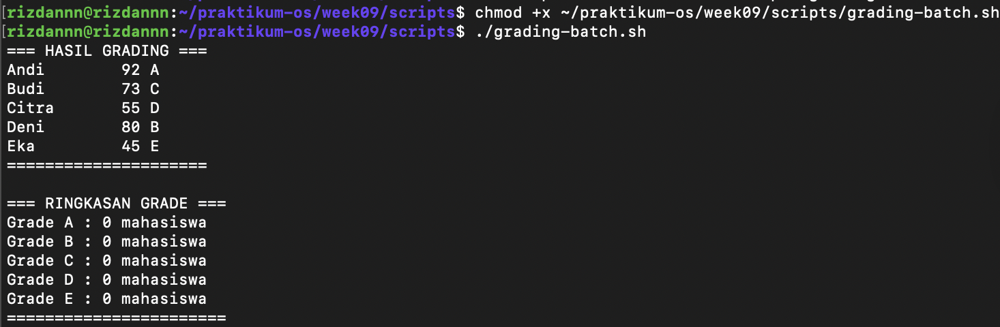

### Praktikum 7.4 — Library Fungsi Validasi

#### 1. Buat file library:
```
nano ~/praktikum-os/week09/scripts/lib-validasi.sh
```

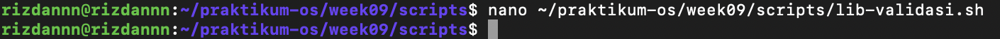


#### 2. Ketik isi berikut:
```
#!/bin/bash
# lib-validasi.sh - Library fungsi validasi

adalah_angka() {
    [[ "$1" =~ ^[0-9]+$ ]]
}

file_bisa_dibaca() {
    [ -f "$1" ] && [ -r "$1" ]
}

error_exit() {
    echo "ERROR: $1" >&2
    exit 1
}

info()   { echo "[INFO] $1"; }
sukses() { echo "[OK]   $1"; }
```

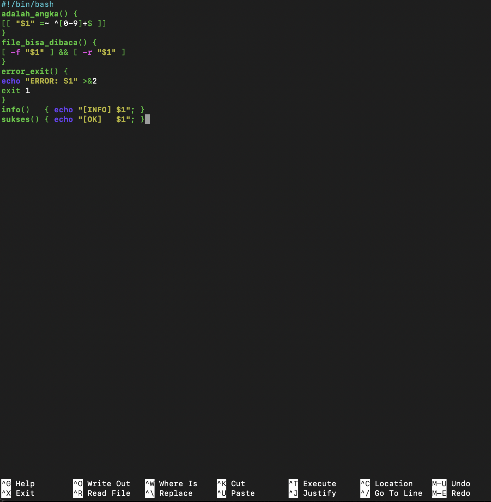

#### 3. Buat script yang menggunakan library:
```
nano ~/praktikum-os/week09/scripts/pakai-library.sh
```

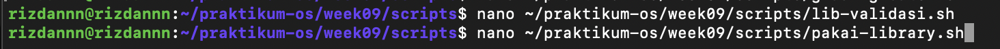

#### 4. Ketik isi berikut:
```
#!/bin/bash
# Muat library (seperti import di Java)
source ~/praktikum-os/week09/scripts/lib-validasi.sh

ANGKA=$1
FILE=$2

[ -z "$ANGKA" ] || [ -z "$FILE" ] && \
    error_exit "Penggunaan: $0 <angka> <path-file>"

if adalah_angka "$ANGKA"; then
    sukses "Input '$ANGKA' adalah angka valid"
else
    error_exit "'$ANGKA' bukan angka"
fi

if file_bisa_dibaca "$FILE"; then
    sukses "File '$FILE' bisa dibaca"
    info "Jumlah baris: $(wc -l < "$FILE")"
else
    error_exit "File '$FILE' tidak ada atau tidak bisa dibaca"
fi
```

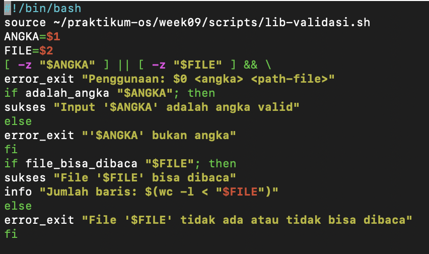

### Latihan 9.4

#### Soal: Tambahkan fungsi konfirmasi() ke lib-validasi.sh yang menampilkan pertanyaan Y/N, mengembalikan 0 jika Y dan 1 jika N. Buat script demo yang memanggilnya sebelum menghapus file.

#### lib-validasi.sh:
```
konfirmasi() {
    local PERTANYAAN="${1:-Apakah Anda yakin?}"
    echo -n "$PERTANYAAN [Y/N]: "
    read JAWABAN
    case "$JAWABAN" in
        Y|y) return 0 ;;
        N|n) return 1 ;;
        *)   echo "Input tidak valid, dianggap tidak (N)."
             return 1 ;;
    esac
}
```

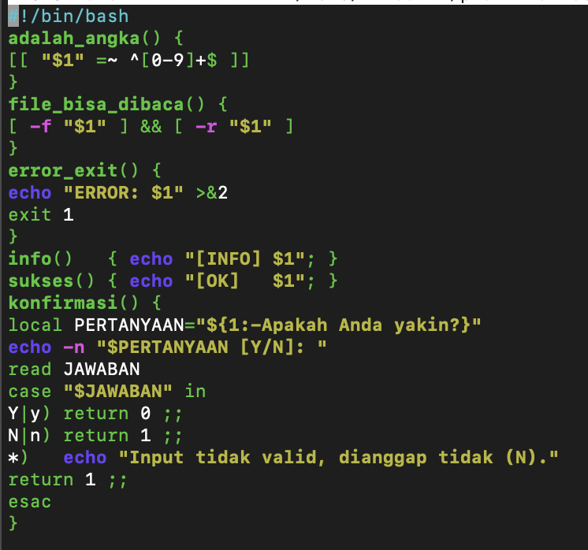


#### script demo demo-konfirmasi.sh:
```
#!/bin/bash
source ~/praktikum-os/week09/scripts/lib-validasi.sh

FILE_TARGET=$1

[ -z "$FILE_TARGET" ] && error_exit "Penggunaan: $0 <path-file>"

if [ ! -f "$FILE_TARGET" ]; then
    error_exit "File '$FILE_TARGET' tidak ditemukan."
fi

info "File yang akan dihapus: $FILE_TARGET"

if konfirmasi "Apakah Anda yakin ingin menghapus file ini?"; then
    rm "$FILE_TARGET"
    sukses "File '$FILE_TARGET' berhasil dihapus."
else
    info "Penghapusan dibatalkan."
fi
```

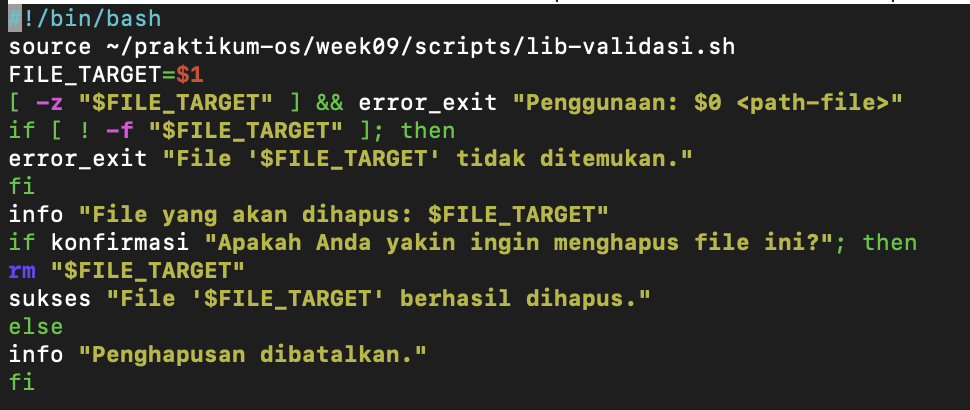

#### Menggunakan
```
chmod +x demo-konfirmasi.sh
touch /tmp/uji-hapus.txt
./demo-konfirmasi.sh /tmp/uji-hapus.txt
```

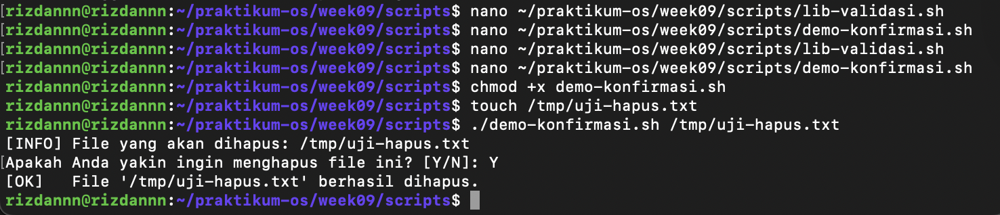

### Praktikum 7.5 — Script Backup dengan Opsi

#### 1. Buat script:
```
nano ~/praktikum-os/week09/scripts/backup-data.sh
```

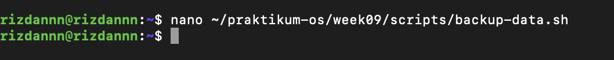

#### 2. Ketik isi berikut:
```
#!/bin/bash
# Penggunaan: ./backup-data.sh [-v] [-c] [-l logfile] <sumber> <tujuan>

VERBOSE=false
COMPRESS=false
LOG_FILE=""

while getopts "vcl:" OPSI; do
    case $OPSI in
        v) VERBOSE=true ;;
        c) COMPRESS=true ;;
        l) LOG_FILE="$OPTARG" ;;
        *)
            echo "Penggunaan: $0 [-v] [-c] [-l logfile] <sumber> <tujuan>"
            exit 1 ;;
    esac
done

shift $(( OPTIND - 1 ))

SUMBER=$1
TUJUAN=$2

log() {
    local MSG="[$(date '+%T')] $1"
    echo "$MSG"
    [ -n "$LOG_FILE" ] && echo "$MSG" >> "$LOG_FILE"
}

[ -z "$SUMBER" ] || [ -z "$TUJUAN" ] && {
    echo "ERROR: sumber dan tujuan wajib diisi"; exit 1; }

[ ! -d "$SUMBER" ] && { log "ERROR: $SUMBER tidak ada"; exit 2; }

mkdir -p "$TUJUAN"
TANGGAL=$(date '+%F-%H%M%S')

[ "$VERBOSE" = true ] && log "Sumber: $SUMBER | Tujuan: $TUJUAN"

if [ "$COMPRESS" = true ]; then
    ARSIP="$TUJUAN/backup-$(basename "$SUMBER")-$TANGGAL.tar.gz"
    tar -czf "$ARSIP" -C "$(dirname "$SUMBER")" "$(basename "$SUMBER")"
    log "Arsip: $ARSIP ($(du -sh "$ARSIP" | cut -f1))"
else
    cp -r "$SUMBER" "$TUJUAN/backup-$(basename "$SUMBER")-$TANGGAL"
    log "Backup selesai."
fi
```

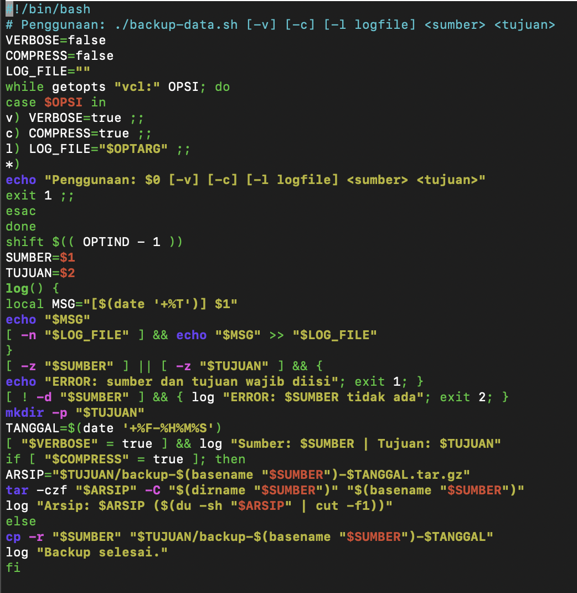

#### 3. Beri izin dan uji:
```
chmod +x ~/praktikum-os/week09/scripts/backup-data.sh
cd ~/praktikum-os/week09/scripts

# Tanpa opsi
./backup-data.sh ~/praktikum-os/week09/data ~/praktikum-os/week09/logs

# Dengan verbose, kompresi, dan log ke file
./backup-data.sh -v -c -l ../logs/backup.log \
    ~/praktikum-os/week09/data ~/praktikum-os/week09/logs

cat ../logs/backup.log
```

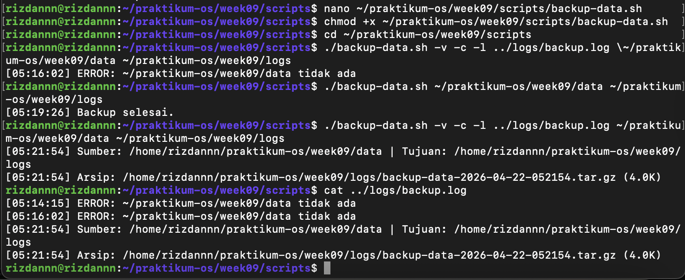

### Latihan 9.5
#### Soal: Perbaiki debug-latihan.sh agar menangani direktori yang tidak ada, dengan menambahkan set -e, pengecekan -d, dan pesan error yang informatif.
```
#!/bin/bash
# Script: debug-latihan.sh (versi diperbaiki)
set -e

DIREKTORI=$1
BATAS=$2

if [ $# -ne 2 ]; then
    echo "Penggunaan: $0 <direktori> <batas-MB>"
    exit 1
fi

# Pengecekan direktori sebelum memanggil du
if [ ! -d "$DIREKTORI" ]; then
    echo "ERROR: Direktori '$DIREKTORI' tidak ditemukan atau bukan direktori."
    exit 2
fi

UKURAN=$(du -sm "$DIREKTORI" | cut -f1)

echo "Direktori : $DIREKTORI"
echo "Ukuran    : ${UKURAN} MB"
echo "Batas     : ${BATAS} MB"

if [ "$UKURAN" -gt "$BATAS" ]; then
    echo "PERINGATAN: Ukuran melebihi batas!"
    echo "Kelebihan : $(( UKURAN - BATAS )) MB"
else
    echo "Status    : Normal (sisa: $(( BATAS - UKURAN )) MB)"
fi
```

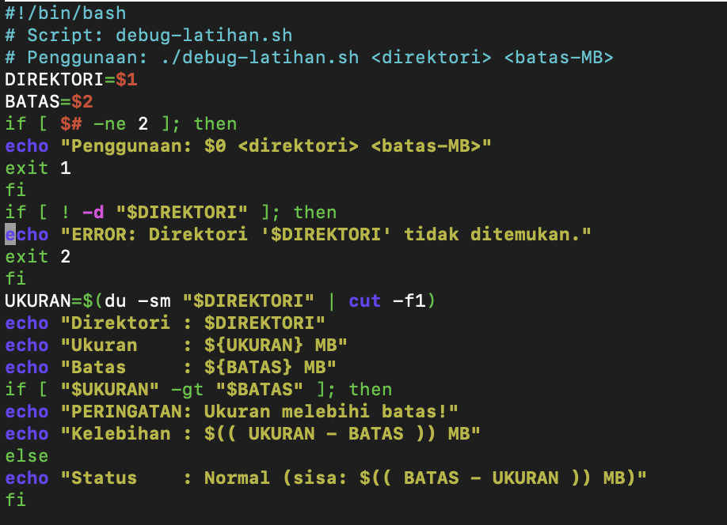

#### Menguji dengan direktori yang tidak ada:
```
chmod +x debug-latihan.sh
bash -n debug-latihan.sh && echo "Sintaks OK"

./debug-latihan.sh /etc 10          # direktori valid
./debug-latihan.sh /var 50          # direktori valid
./debug-latihan.sh /direktori-palsu 100   # → ERROR: direktori tidak ditemukan
```

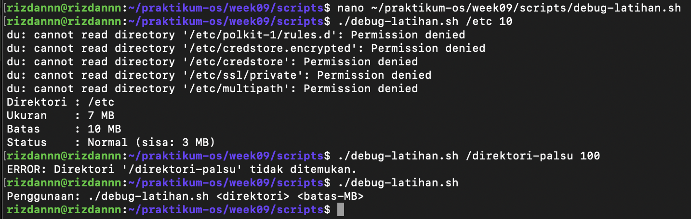

### Praktikum 7.6 — Debugging Script

#### Langkah 1 — Buat script:
```
nano ~/praktikum-os/week09/scripts/debug-latihan.sh
```

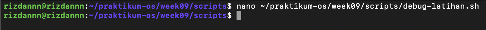

#### Langkah 2 — Ketik isi berikut:
```
#!/bin/bash
# Script: debug-latihan.sh
# Penggunaan: ./debug-latihan.sh <direktori> <batas-MB>

DIREKTORI=$1
BATAS=$2

if [ $# -ne 2 ]; then
    echo "Penggunaan: $0 <direktori> <batas-MB>"
    exit 1
fi

UKURAN=$(du -sm "$DIREKTORI" | cut -f1)

echo "Direktori : $DIREKTORI"
echo "Ukuran    : ${UKURAN} MB"
echo "Batas     : ${BATAS} MB"

if [ "$UKURAN" -gt "$BATAS" ]; then
    echo "PERINGATAN: Ukuran melebihi batas!"
    echo "Kelebihan : $(( UKURAN - BATAS )) MB"
else
    echo "Status    : Normal (sisa: $(( BATAS - UKURAN )) MB)"
fi
```

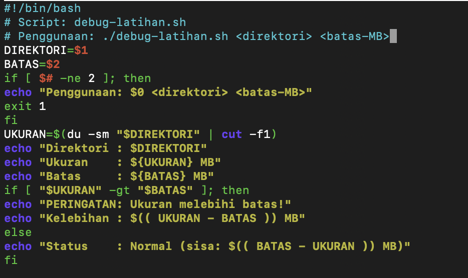

#### Langkah 3 — Simpan, beri izin, lalu jalankan dengan debugging:
```
chmod +x ~/praktikum-os/week09/scripts/debug-latihan.sh
```

#### Cek sintaks dulu (tanpa menjalankan):
```
bash -n debug-latihan.sh && echo "Sintaks OK"
```
#### Jalankan dengan tracing (-x) agar tiap baris terlihat:
```
bash -x debug-latihan.sh /etc 10
```
#### Jalankan normal:
```
./debug-latihan.sh /var 50
```
#### Jalankan tanpa argumen (uji validasi):
```
./debug-latihan.sh
```
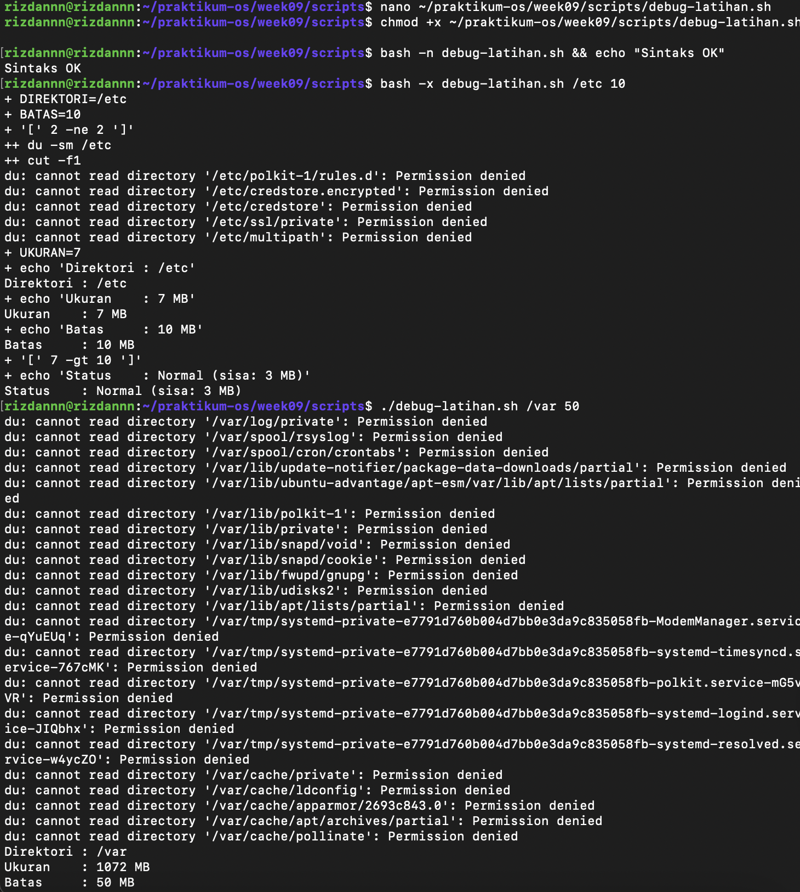

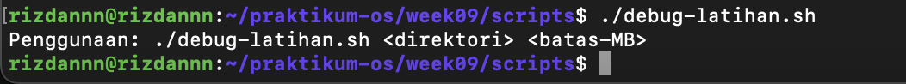

### Latihan 9.5 — Perbaiki debug-latihan.sh

#### Soal: Tambahkan set -e, pengecekan -d, dan pesan error jika direktori tidak ada.
```
#!/bin/bash
# Script: debug-latihan.sh (versi diperbaiki)
set -e

DIREKTORI=$1
BATAS=$2

if [ $# -ne 2 ]; then
    echo "Penggunaan: $0 <direktori> <batas-MB>"
    exit 1
fi

# ✅ Pengecekan direktori sebelum memanggil du
if [ ! -d "$DIREKTORI" ]; then
    echo "ERROR: Direktori '$DIREKTORI' tidak ditemukan."
    exit 2
fi

UKURAN=$(du -sm "$DIREKTORI" | cut -f1)

echo "Direktori : $DIREKTORI"
echo "Ukuran    : ${UKURAN} MB"
echo "Batas     : ${BATAS} MB"

if [ "$UKURAN" -gt "$BATAS" ]; then
    echo "PERINGATAN: Ukuran melebihi batas!"
    echo "Kelebihan : $(( UKURAN - BATAS )) MB"
else
    echo "Status    : Normal (sisa: $(( BATAS - UKURAN )) MB)"
fi
```


### Tugas 1 — Script Absensi Kelas
```
#!/bin/bash
# Script: absensi.sh
# Penggunaan: ./absensi.sh [-r] [-h] <nama> <status>

set -euo pipefail

SCRIPT_NAME=$(basename "$0")
FILE_ABSENSI="absensi-$(date '+%Y-%m-%d').txt"

# ── Fungsi ──────────────────────────────────────
usage() {
    echo "Penggunaan: $SCRIPT_NAME [-r] [-h] <nama> <status>"
    echo "  status   : hadir / izin / alpha"
    echo "  -r       : tampilkan rekapitulasi"
    echo "  -h       : tampilkan bantuan"
    exit 0
}

catat_absensi() {
    local NAMA=$1
    local STATUS=$2
    echo "[$(date '+%H:%M')] $NAMA - $STATUS" >> "$FILE_ABSENSI"
    echo "[OK] Absensi dicatat: $NAMA - $STATUS"
}

rekap() {
    if [ ! -f "$FILE_ABSENSI" ]; then
        echo "Belum ada data absensi hari ini."
        exit 0
    fi

    echo ""
    echo "=== REKAPITULASI ABSENSI ==="
    echo "File: $FILE_ABSENSI"
    echo "----------------------------"

    for STATUS in hadir izin alpha; do
        JUMLAH=$(grep -i "$STATUS" "$FILE_ABSENSI" | wc -l)
        echo "$(echo $STATUS | tr 'a-z' 'A-Z')  : $JUMLAH orang"
    done

    TOTAL=$(wc -l < "$FILE_ABSENSI")
    echo "----------------------------"
    echo "TOTAL : $TOTAL orang"
    echo "============================"
}

# ── Proses opsi ─────────────────────────────────
SHOW_REKAP=false

while getopts "rh" OPSI; do
    case $OPSI in
        r) SHOW_REKAP=true ;;
        h) usage ;;
        *) usage ;;
    esac
done

shift $(( OPTIND - 1 ))

# ── Logika utama ─────────────────────────────────
if [ "$SHOW_REKAP" = true ]; then
    rekap
    exit 0
fi

# Validasi argumen
if [ $# -ne 2 ]; then
    echo "ERROR: Argumen tidak lengkap."
    usage
fi

NAMA=$1
STATUS=$2

# Validasi status
case "$STATUS" in
    hadir|izin|alpha) ;;
    *)
        echo "ERROR: Status '$STATUS' tidak valid. Gunakan: hadir / izin / alpha"
        exit 1 ;;
esac

catat_absensi "$NAMA" "$STATUS"
```

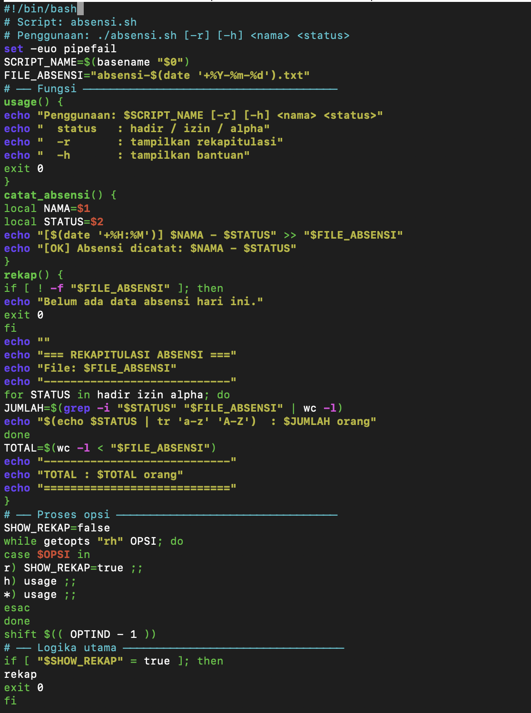

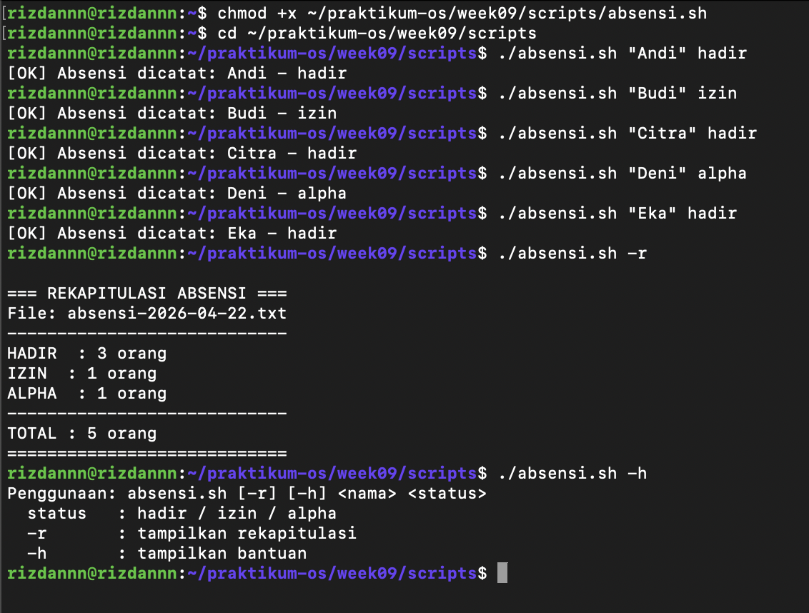

### Tugas 2 — Script Health Check Sistem
```
#!/bin/bash
# ================================================
# Script     : healthcheck.sh
# Deskripsi  : Pemeriksaan kondisi server
# Penggunaan : ./healthcheck.sh [-v] [-h] [-t persen]
# ================================================

set -euo pipefail

SCRIPT_NAME=$(basename "$0")
VERBOSE=false
BATAS_DISK=80
LOG_FILE="healthcheck-$(date '+%Y-%m-%d').log"
ADA_PERINGATAN=false

# ── Fungsi ──────────────────────────────────────
usage() {
    echo "Penggunaan: $SCRIPT_NAME [-v] [-h] [-t persen]"
    echo "  -v          : verbose mode"
    echo "  -t <persen> : batas peringatan disk (default: 80)"
    echo "  -h          : tampilkan bantuan"
    exit 0
}

log()         { echo "$*"; }
log_verbose() { [ "$VERBOSE" = true ] && echo "[VERBOSE] $*"; }
error_exit()  { echo "ERROR: $*" >&2; exit 1; }

cleanup() { log_verbose "Cleanup selesai."; }
trap cleanup EXIT

cek_disk() {
    echo ""
    echo "--- PENGGUNAAN DISK ---"
    df -h | awk 'NR==1 || NR>1' | while read -r LINE; do
        # ambil baris filesystem (skip header)
        PERSEN=$(echo "$LINE" | awk '{print $5}' | tr -d '%')
        MOUNT=$(echo "$LINE" | awk '{print $6}')

        # skip header
        if ! [[ "$PERSEN" =~ ^[0-9]+$ ]]; then
            echo "$LINE"
            continue
        fi

        echo "$LINE"

        if [ "$PERSEN" -gt "$BATAS_DISK" ]; then
            echo "  ⚠️  PERINGATAN: $MOUNT sudah ${PERSEN}% (batas: ${BATAS_DISK}%)"
            ADA_PERINGATAN=true
        fi
    done
}

# ── Proses opsi ─────────────────────────────────
while getopts "vht:" OPSI; do
    case $OPSI in
        v) VERBOSE=true ;;
        h) usage ;;
        t) BATAS_DISK="$OPTARG" ;;
        *) error_exit "Opsi tidak dikenal. Gunakan -h." ;;
    esac
done

shift $(( OPTIND - 1 ))

# ── Jalankan health check & simpan ke log + terminal ──
{
    echo "================================================"
    echo "         SERVER HEALTH CHECK REPORT             "
    echo "================================================"
    echo "Tanggal  : $(date '+%A, %d %B %Y')"
    echo "Waktu    : $(date '+%H:%M:%S')"
    echo "Hostname : $(hostname)"
    echo "Batas disk yang dipakai: ${BATAS_DISK}%"
    echo ""

    echo "--- UPTIME ---"
    uptime
    echo ""

    echo "--- CPU ---"
    echo "Jumlah core : $(nproc)"
    echo "Load average: $(uptime | awk -F'load average:' '{print $2}')"
    echo ""

    echo "--- MEMORI ---"
    free -h
    echo ""

    echo "--- DISK ---"
    df -h | while read -r LINE; do
        PERSEN=$(echo "$LINE" | awk '{print $5}' | tr -d '%')
        MOUNT=$(echo "$LINE" | awk '{print $6}')
        echo "$LINE"
        if [[ "$PERSEN" =~ ^[0-9]+$ ]] && [ "$PERSEN" -gt "$BATAS_DISK" ]; then
            echo "  ⚠️  PERINGATAN: $MOUNT sudah ${PERSEN}% (batas: ${BATAS_DISK}%)"
        fi
    done

    echo ""
    echo "================================================"
    echo "Log disimpan di: $LOG_FILE"
    echo "================================================"

} | tee "$LOG_FILE"
```

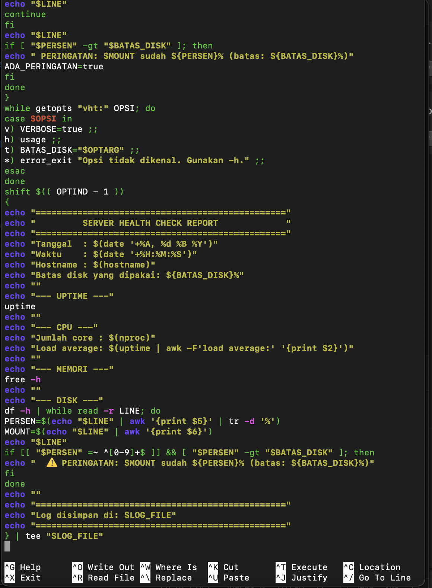

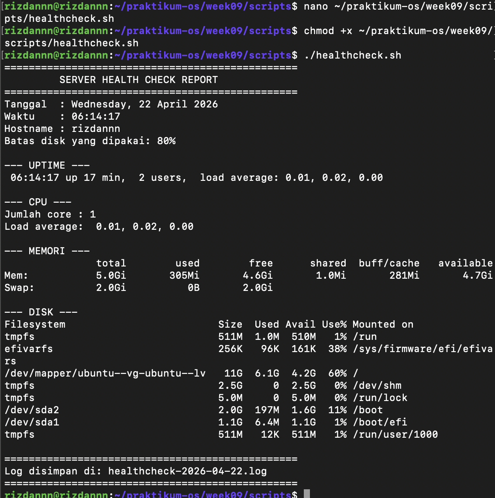

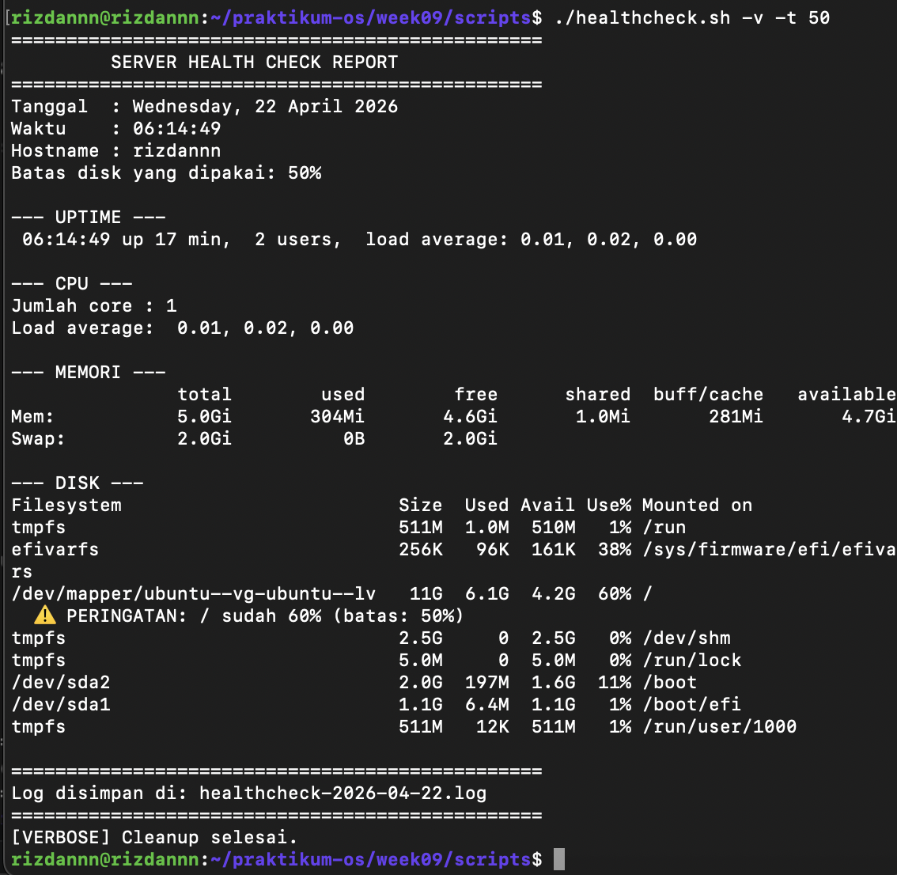

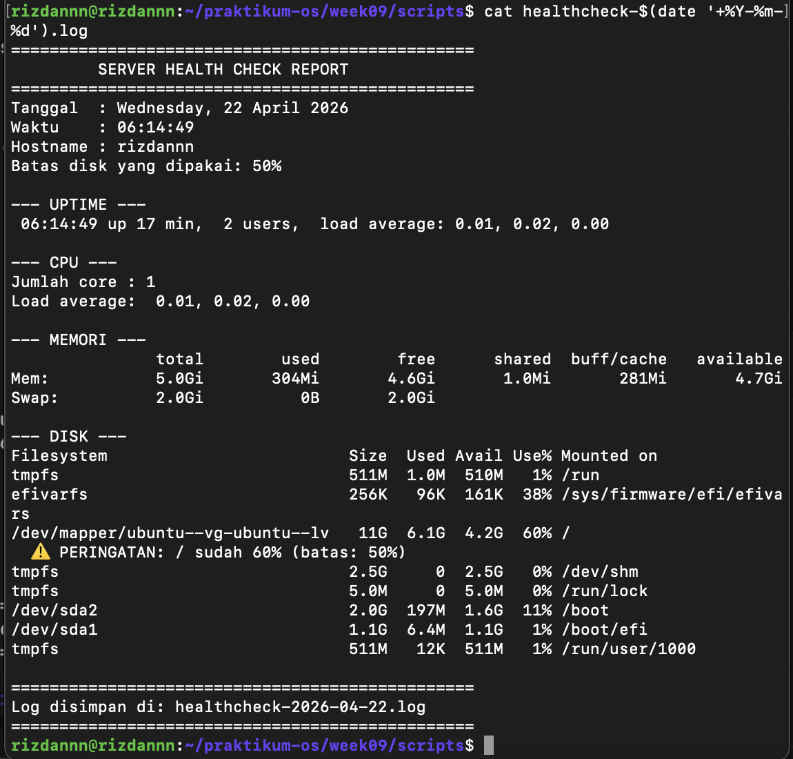

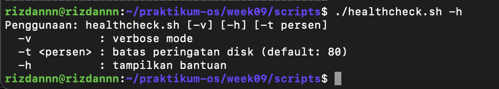