## Laporan Praktikum Sistem Operasi Jobsheet 

<h4>Nama  : Rafif Rizdan Prastana<h4>
<h4>NIM   : 254107020052<h4>
<h4>Kelas : TI 1H<h4>


## Praktikum & Tugas Week 10 — Manajemen Memori & System Call

### Praktikum 10.1 — Melihat Penggunaan Memori


#### Langkah 1 — Lihat ringkasan RAM dan swap:
```
free -h
```
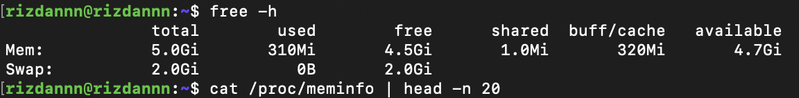

#### Langkah 2 — Lihat detail memori dari kernel:
```
cat /proc/meminfo | head -n 20
```
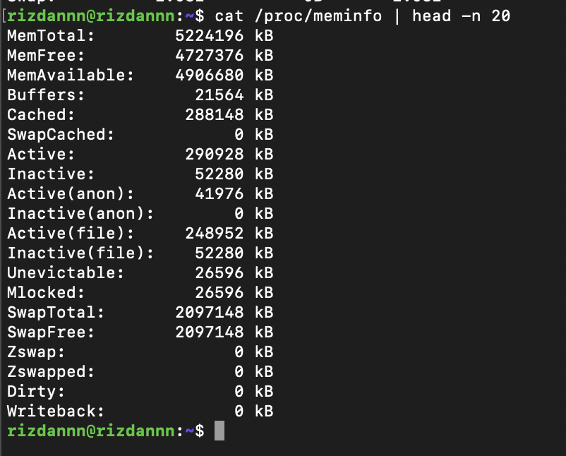

#### Analisis:
```
1. Hitung persentase memori tersedia: available / total × 100%. Jika hasilnya
di bawah 10%, sistem mulai kekurangan memori.
2. Pada baris Swap, apakah kolom used bernilai 0? Jika lebih dari 0, kernel sudah
pernah memindahkan data ke disk karena RAM tidak cukup.
3. Perhatikan field Cached dan Buffers di /proc/meminfo. Nilai ini sesuai
dengan kolom buff/cache pada free -h.
```
#### Jawaban:

1. Persentase memori tersedia = available / total × 100%. Jika hasilnya di atas 10% maka kondisi normal.
2. Jika kolom used pada baris Swap bernilai 0 = RAM masih cukup, kernel belum pernah pakai swap.
3.  dan Buffers di /proc/meminfo = sama dengan kolom buff/cache di free -h.

## Studi Kasus 10.1 Server Lambat karena Memori

### Langkah 1: Periksa kondisi memori secara keseluruhan.
```
free -h
```
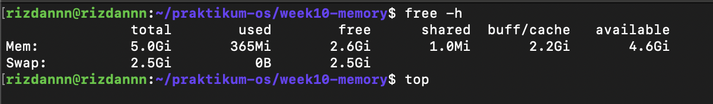

#### Langkah 2: Pantau proses secara real-time.
```
top
```
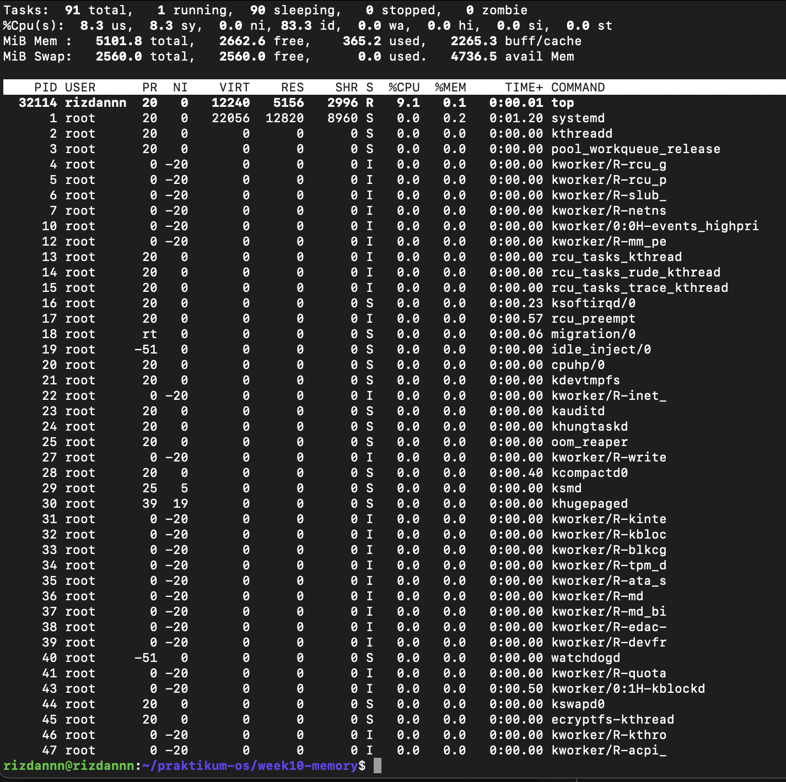
```
Analisis:
1. Apakah nilai available sangat kecil (misalnya di bawah 200 MB pada server
dengan RAM 2 GB)? Jika ya, server kemungkinan kekurangan memori.
2. Apakah kolom used pada baris Swap lebih dari 0? Jika ya, kernel sedang
menggunakan swap, yang berarti performa menurun.
3. Di tampilan top, proses apa yang memiliki %MEM terbesar? Proses tersebut
menjadi kandidat utama penyebab lambatnya server.
```

#### Jawaban:
1. Jika available sangat kecil (< 200MB pada RAM 2GB) → server kekurangan memori.
2. Jika used pada Swap > 0 → kernel pakai swap → performa menurun.
3. Proses dengan %MEM terbesar di top = kandidat utama penyebab server lambat.

### Praktikum 10.2 — Mengamati Aktivitas Paging
```
vmstat 1 5
```
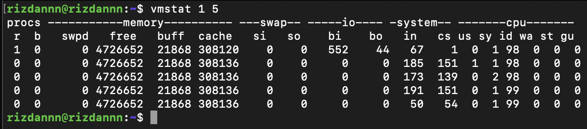
```
Analisis:
1. Amati nilai si dan so pada kelima baris. Pada sistem normal dengan RAM
cukup, kedua nilai ini selalu 0.
2. Jika nilai si atau so sesekali muncul lebih dari 0, artinya pernah ada aktivitas
swap. Ini masih wajar jika tidak terus-menerus.
3. Jika si dan so terus-menerus lebih dari 0, sistem dalam kondisi memory
pressure serius — performa turun drastis karena akses disk jauh lebih lambat
dari RAM.
4. Perhatikanjugakolom free(RAMkosong)dan buff(buffer)untukmemahami
kondisi keseluruhan RAM saat itu.
```

### Nilai si dan so selalu 0 = sistem normal, RAM cukup.
1. Nilai si dan so selalu 0 = sistem normal, RAM cukup.
2. Sesekali > 0 = pernah ada aktivitas swap, masih wajar.
3. Terus-menerus > 0 = memory pressure serius, performa turun drastis.
4. Kolom free besar + buff besar = kondisi RAM masih sehat.

### Praktikum 10.3 — Membuat dan Mengonfigurasi Swap File
```
sudo fallocate -l 512M /swapfile-week10
sudo chmod 600 /swapfile-week10
sudo mkswap /swapfile-week10
sudo swapon /swapfile-week10
```
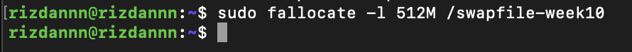

#### Verifikasi:

```
swapon --show
free -h
```
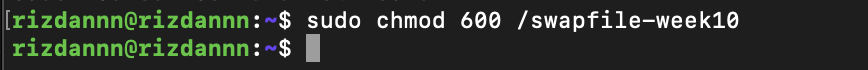

#### Cek dan ubah swappiness:
```
cat /proc/sys/vm/swappiness
sudo sysctl vm.swappiness=10
cat /proc/sys/vm/swappiness
```
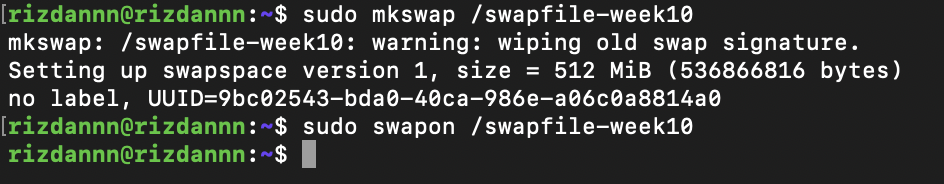

#### Bersihkan setelah selesai:
```
sudo swapoff /swapfile-week10
sudo rm /swapfile-week10
```
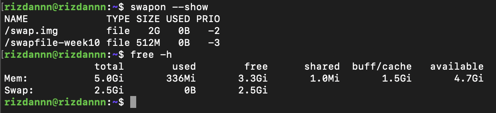
```
Analisis:
1. Berapa nilai swappiness default? Apa artinya bagi perilaku kernel dalam
menggunakan swap?
2. Setelah diubah ke 10, konfirmasi nilai berubah pada output cat kedua. Apa
dampak nilai 10 terhadap penggunaan swap dibanding nilai 60?
3. Apakah entri /swapfile-week10 muncul di swapon –show? Jika tidak,
pastikan Langkah 2 (chmod 600) sudah dijalankan sebelum Langkah 3.
```

### Jawaban:

1. Nilai swappiness default = 60, artinya kernel cukup agresif memindahkan data ke swap meski RAM masih tersedia.
2. Setelah diubah ke 10, kernel lebih mengutamakan RAM dan hanya pakai swap jika terpaksa → performa lebih baik untuk server.
3. Jika /swapfile-week10 muncul di swapon --show = swap berhasil aktif.

### Praktikum 10.4 — Monitoring Memory

#### Langkah 1 — Snapshot proses memori terbesar:
```
ps aux --sort=-%mem | head
```
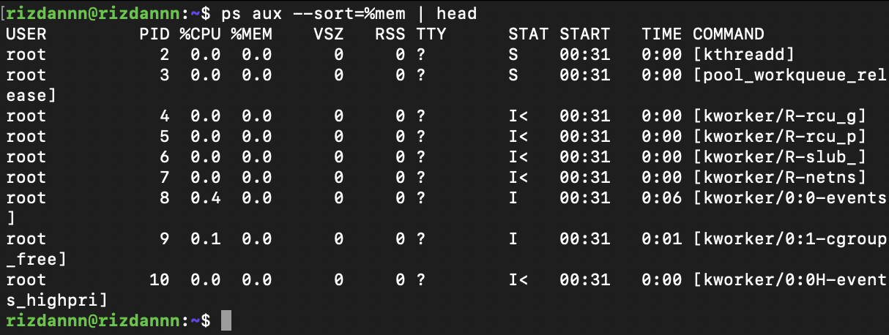

#### Langkah 2 — Monitor real-time:
```
top
```
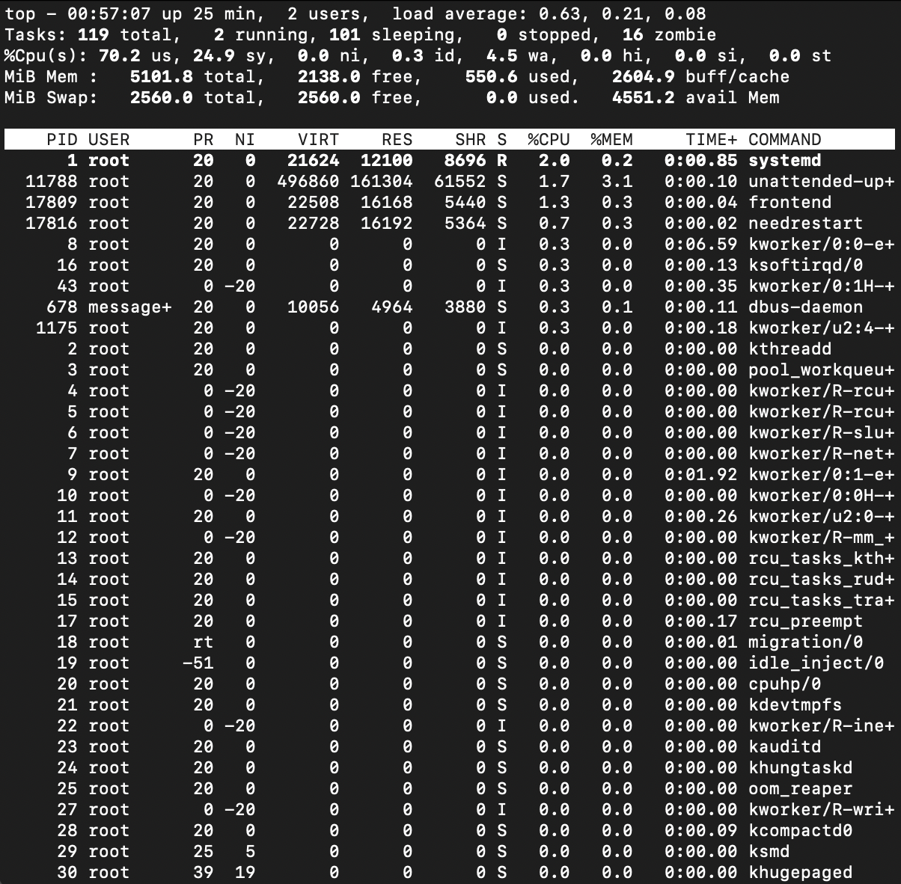
```
Analisis:
1. Proses apa yang berada di urutan pertama? Catat nilai %MEM dan RSS-nya.
2. Konversikan RSS dari KB ke MB (bagi 1024). Misalnya, RSS=524288 be-
rarti proses menggunakan 512 MB RAM. Apakah wajar untuk jenis program
tersebut?
3. Mengapa VSZ selalu lebih besar dari RSS pada proses yang sama?
4. Apakah urutan proses di ps konsisten dengan tampilan top saat diurutkan
berdasarkan %MEM?
```

### Jawaban:

1. Proses di urutan pertama = proses dengan RAM terbesar saat itu (biasanya browser atau database).
2. RSS ÷ 1024 = ukuran dalam MB. Wajar tidaknya tergantung jenis program.
3. VSZ selalu lebih besar dari RSS karena VSZ menghitung semua memori virtual yang dialokasikan termasuk bagian yang belum dimuat ke RAM.
4. Urutan ps dan top konsisten karena keduanya membaca data yang sama dari kernel.
### Praktikum 10.5 — Script Monitor Memori

#### Buat script:
```
cd ~/praktikum-os/week10-memory
nano monitor-memori.sh
```
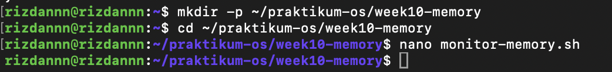

#### Ketik isi berikut:
```
#!/bin/bash
set -euo pipefail

THRESHOLD=20

echo "=== Monitor Memori ==="
date
echo

free -h
echo

AVAIL=$(free | awk '/Mem/ { printf "%d", $7/$2*100}')

if [ "$AVAIL" -lt "$THRESHOLD" ]; then
    echo "PERINGATAN: Memori tersedia hanya ${AVAIL}%!"
else
    echo "Status: Memori tersedia ${AVAIL}% (normal)"
fi

echo
echo "--- 5 Proses Memori Tertinggi ---"
ps aux --sort=-%mem | head -n 6 | tail -n 5
```
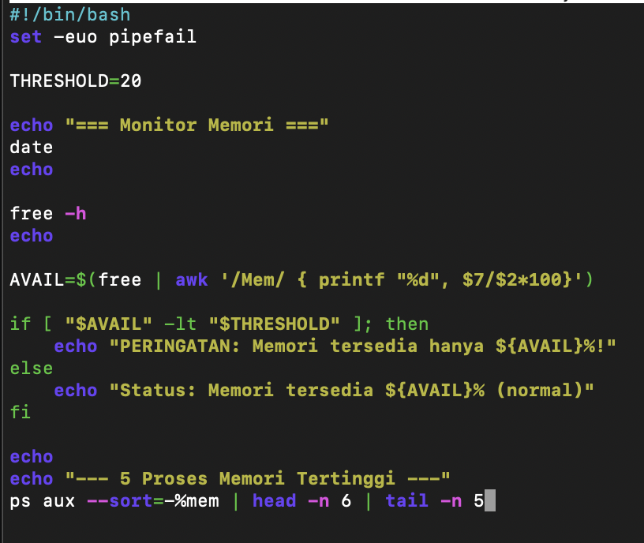

#### Jalankan:
```
chmod +x monitor-memori.sh
bash monitor-memori.sh
```
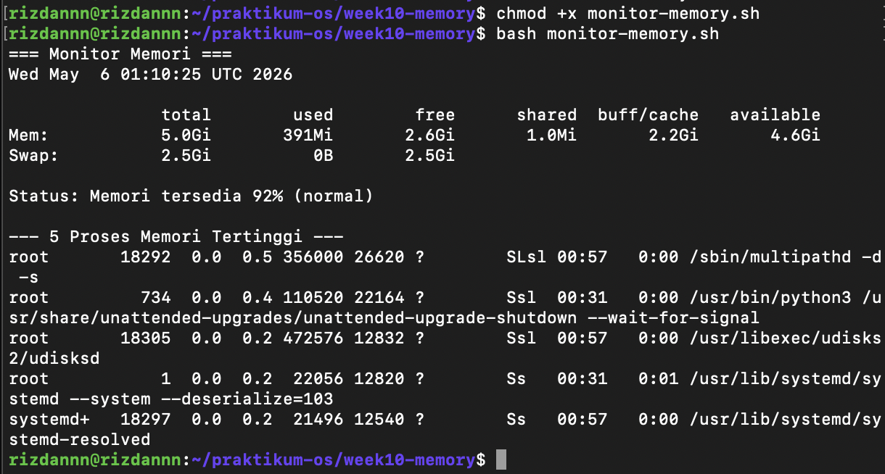
```
Analisis:
1. Variabel THRESHOLD=20 menetapkan batas persentase. Perintah free | awk
’/Mem/ {printf "%d", $7/$2*100}’mengambil kolom ke-7 (available) dibagi
kolom ke-2 (total) dari baris Mem, lalu dikalikan 100 untuk menghasilkan
persentase bilangan bulat.
2. Kondisi if [ "$AVAIL" -lt "$THRESHOLD" ] bernilai benar jika persentase
memori tersedia di bawah 20.
3. Ubah THRESHOLD menjadi 90 dan jalankan ulang. Apa yang berubah pada
output? Mengapa demikian?
```

### Jawaban 10.5 — Script Monitor Memori

1. free | awk '/Mem/ {printf "%d", $7/$2*100}' → ambil kolom available dibagi total × 100 = persentase memori tersedia.
2. if [ "$AVAIL" -lt "$THRESHOLD" ] → true jika memori tersedia di bawah 20%.
3. Saat THRESHOLD=90 dan dijalankan ulang → output berubah jadi PERINGATAN karena hampir pasti memori tersedia < 90%.


### Studi Kasus 10.2 Gagal Akses File

#### Langkah 1: Buat direktori dan file konfigurasi contoh.
```
mkdir -p ~/praktikum-os/week10-memory/syscall-case
cd ~/praktikum-os/week10-memory/syscall-case
echo "PORT=8080" > app.conf
ls -l app.conf
cat app.conf
```
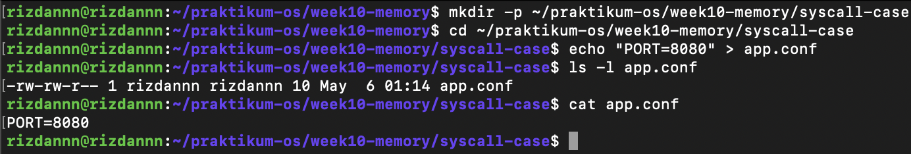

#### Langkah 2: Simulasikan permission bermasalah.
```
chmod 000 app.conf
cat app.conf
```
#### Langkah 3: Kembalikan permission dan verifikasi.
```
chmod 644 app.conf
cat app.conf
```
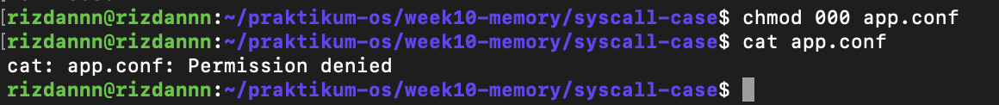
```
Analisis:
1. Mengapa cat menghasilkan Permission denied setelah chmod 000? System
call apa yang gagal?
2. ApaperbedaanpesanerrorPermission deniedvsNo such file or directory?
Coba rm app.conf lalu cat app.conf untuk melihat perbedaannya.
3. Permission 644 berarti apa untuk owner, group, dan others?
```

### Jawaban 10.2 Gagal Akses File

1. cat menghasilkan Permission denied setelah chmod 000 karena system call openat() gagal — tidak ada bit izin baca.
2. Perbedaan pesan error:
Permission denied = file ada tapi tidak boleh diakses.
No such file or directory = file tidak ada.
3. Permission 644 = owner bisa baca+tulis, group dan others hanya baca.


### Praktikum 10.6 — Mengamati System Call dengan strace

#### Langkah 1 — Lihat 30 baris pertama system call dari ls:
```
strace ls 2>&1 | head -n 30
```
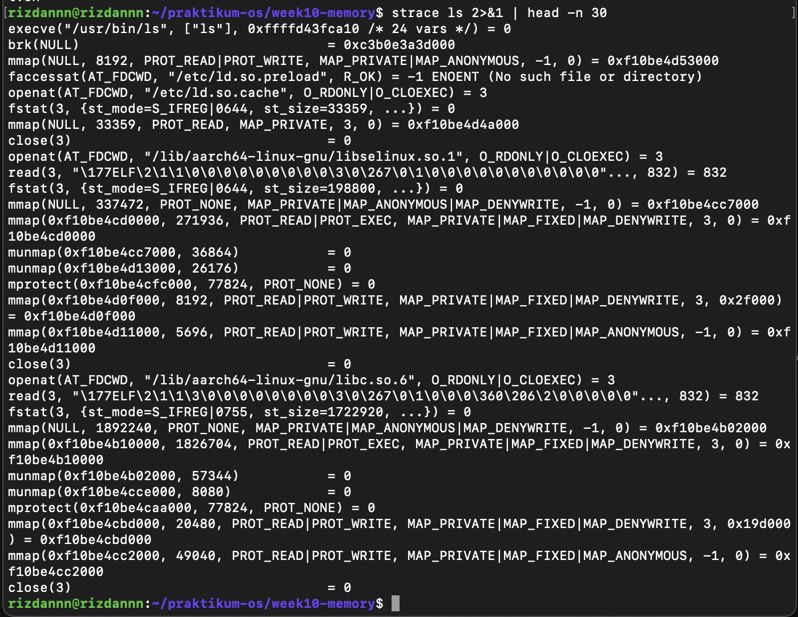

#### Langkah 2 — Ringkasan statistik dan perbandingan:
```
strace -c ls
strace -c ls /etc 2>&1 | tail -5
```
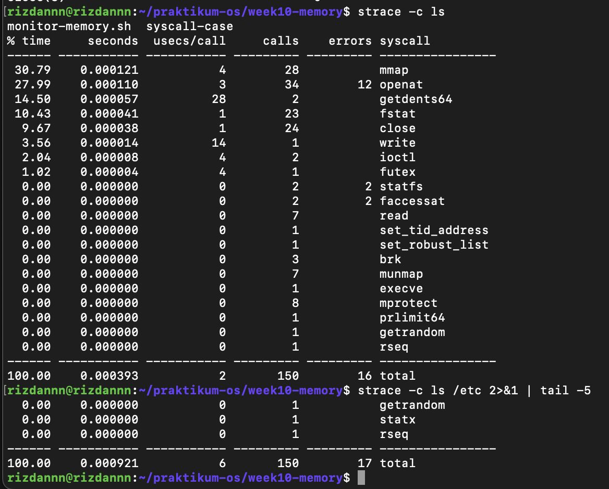
```
Analisis:
1. Dari output Langkah 1, identifikasi minimal 4 system call berbeda. Jelaskan
fungsi singkat masing-masing berdasarkan argumen yang terlihat.
2. Dari ringkasan strace -c, system call mana yang paling sering dipanggil?
Mengapa?
3. Apakah ada system call dengan errors lebih dari 0? Apakah itu berarti
program bermasalah, ataukah bagian normal dari logika program?
4. Apakah jumlah system call berbeda antara ls dan ls /etc? Faktor apa yang
menyebabkan perbedaan tersebut?
```

### Jawaban 10.6 — Mengamati System Call dengan strace

1. Minimal 4 system call dari ls:
openat = membuka file/direktori
read = membaca isi file
write = menampilkan output ke terminal
close = menutup file descriptor
2. System call paling sering = openat atau getdents64 karena ls harus membuka dan membaca banyak file.
3. Error > 0 bukan berarti program bermasalah — itu bagian normal dari logika program (misal mencoba buka file, gagal, lalu coba lokasi lain).
4. ls /etc punya lebih banyak system call karena lebih banyak file yang dibaca di direktori /etc.

### Tugas 10.1 — Audit Penggunaan Memori Sistem

```
nano ~/praktikum-os/week10-memory/memory-audit.sh
```
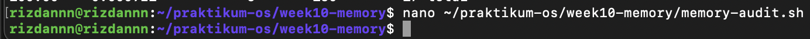

#### Ketik isi berikut:
```
#!/bin/bash
set -euo pipefail

LAPORAN="memory-report.txt"

{
    echo "=== LAPORAN MEMORI SISTEM ==="
    date
    echo

    echo "--- Ringkasan free -h ---"
    free -h
    echo

    echo "--- /proc/meminfo ---"
    cat /proc/meminfo | head -n 20
} > "$LAPORAN"

echo "Laporan disimpan ke: $LAPORAN"
cat "$LAPORAN"
```
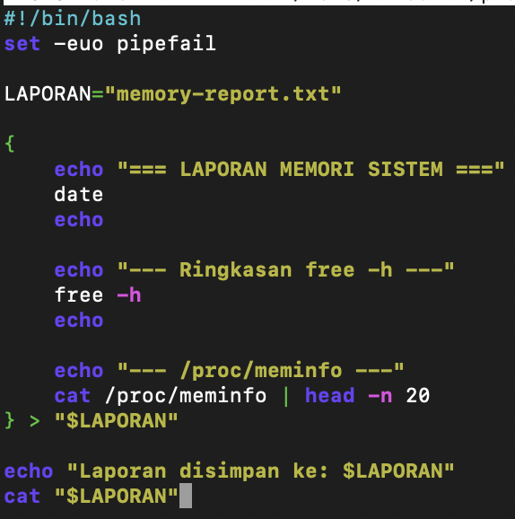

#### Jalankan:
```
chmod +x ~/praktikum-os/week10-memory/memory-audit.sh
cd ~/praktikum-os/week10-memory
bash memory-audit.sh
```
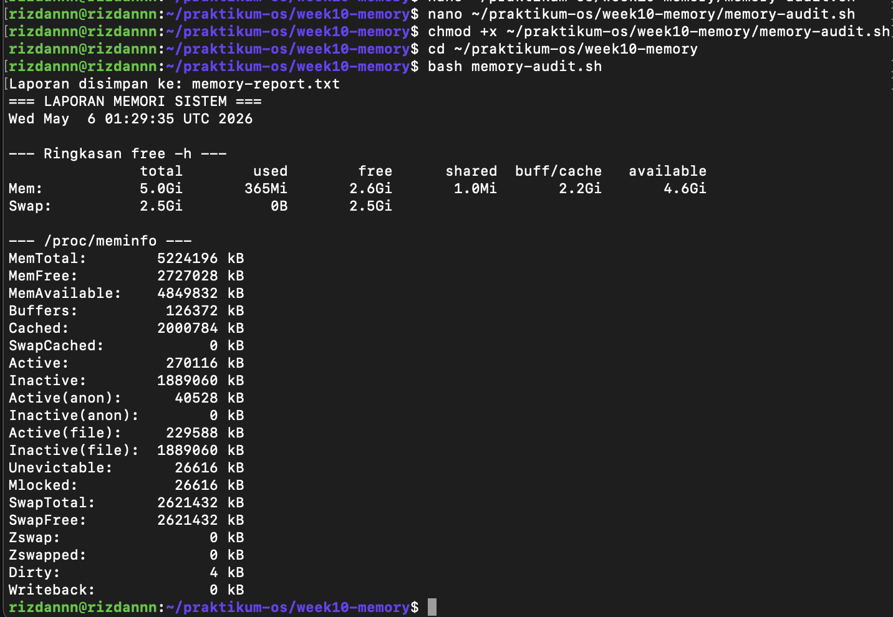
```
Analisis
1. Hitung persentase memori tersedia (available / total × 100%). Apakah
sistem dalam kondisi normal?
1 Manajemen Memori & System Call 15
1.6 Tugas Praktikum
2. Mengapa buff/cache tidak dihitung sebagai memori yang terpakai dari sudut
pandang ketersediaan untuk aplikasi?
3. Dari /proc/meminfo, apakah SwapTotal lebih besar dari 0? Berapa nilai
SwapFree?
```

### Jawaban 10.1 — Audit Penggunaan Memori Sistem

1.  persentase available > 10% → sistem normal.
2. buff/cache tidak dihitung terpakai karena Linux otomatis membebaskannya jika ada aplikasi yang butuh memori.
3. SwapTotal > 0 = ada swap terpasang. SwapFree = sisa swap yang belum dipakai.

### Tugas 10.2 — Identifikasi Proses dengan Memori Tertinggi
```
ps aux --sort=-%mem | head -n 10 > top-memory-process.txt
cat top-memory-process.txt
```
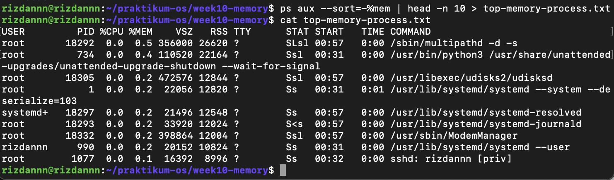
```
Analisis
1. Proses apa di urutan pertama? Catat nilai %MEM dan RSS.
2. Konversikan RSS ke MB (bagi 1024). Apakah wajar?
3. Jumlahkan %MEM dari 5 proses teratas. Berapa persen RAM yang mereka
gunakan bersama?
```

### Jawaban 10.2 — Identifikasi Proses dengan Memori Tertinggi

1. Proses urutan pertama biasanya browser atau database dengan %MEM dan RSS terbesar.
2. RSS ÷ 1024 = MB. Wajar jika sesuai fungsi program (browser wajar besar, proses kecil tidak wajar jika besar).
3. Jumlah %MEM 5 proses teratas menunjukkan berapa persen RAM dikuasai proses-proses dominan.

### Tugas 10.3 — Membuat dan Memverifikasi Swap File
```
sudo fallocate -l 256M /swapfile-tugas-week10
sudo chmod 600 /swapfile-tugas-week10
sudo mkswap /swapfile-tugas-week10
sudo swapon /swapfile-tugas-week10
```
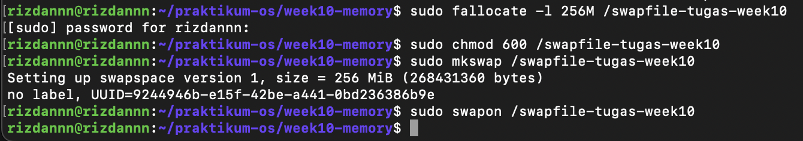

#### Verifikasi dan simpan:
```
{
    echo "=== VERIFIKASI SWAP ==="
    swapon --show
    echo
    free -h
} > swap-check.txt
cat swap-check.txt
```
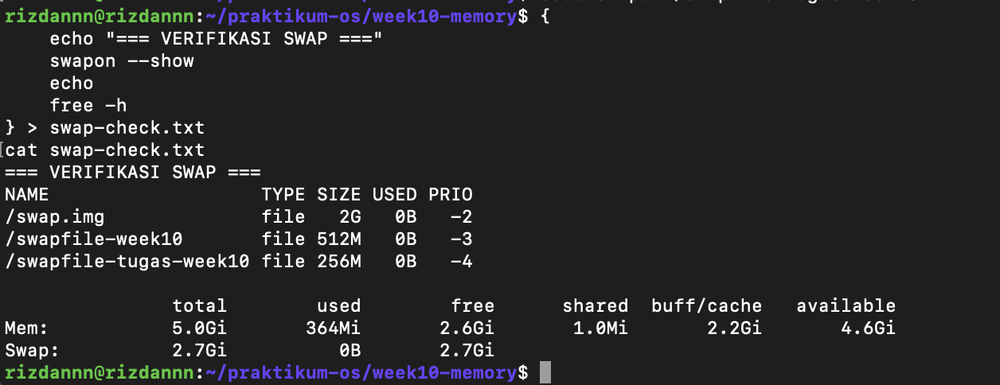

#### Bersihkan setelah selesai:
```
sudo swapoff /swapfile-tugas-week10 && sudo rm /swapfile-tugas-week10
```
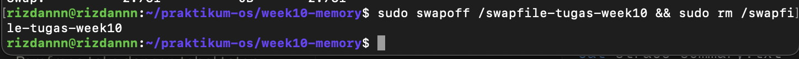
```
Analisis
1. Identifikasi kolom NAME, TYPE, SIZE, dan USED pada output swapon –show.
2. Apakah nilai total pada baris Swap di free -h bertambah 256 MB?
3. Mengapa permission 600 penting? Apa risiko jika diatur ke 644?
```

### Jawaban 10.3 — Membuat dan Memverifikasi Swap File

1. Kolom swapon --show:
NAME = lokasi file swap
TYPE = jenis (file/partition)
SIZE = ukuran swap
USED = swap yang sudah terpakai
2. Total baris Swap di free -h bertambah 256MB setelah swap diaktifkan.
3. Permission 600 penting karena swap bisa berisi data sensitif dari memori. Jika 644, user lain bisa membaca isi memori program.

### Tugas 10.4 — Analisis System Call dengan strace
```
strace -c ls 2> strace-summary.txt
strace ls /etc 2> strace-ls-etc.txt
cat strace-summary.txt
```
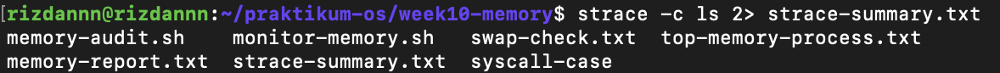
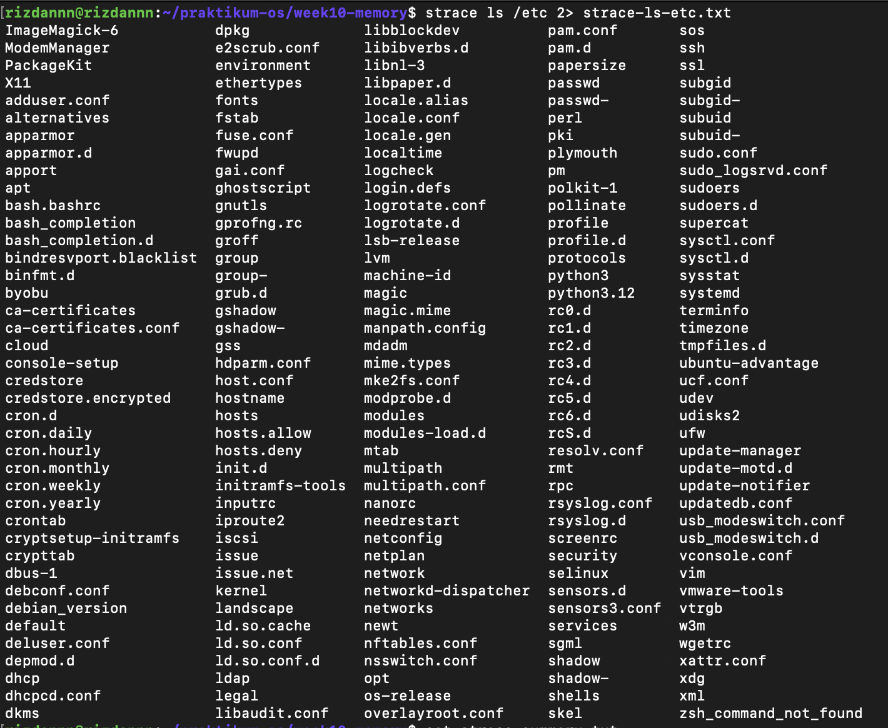
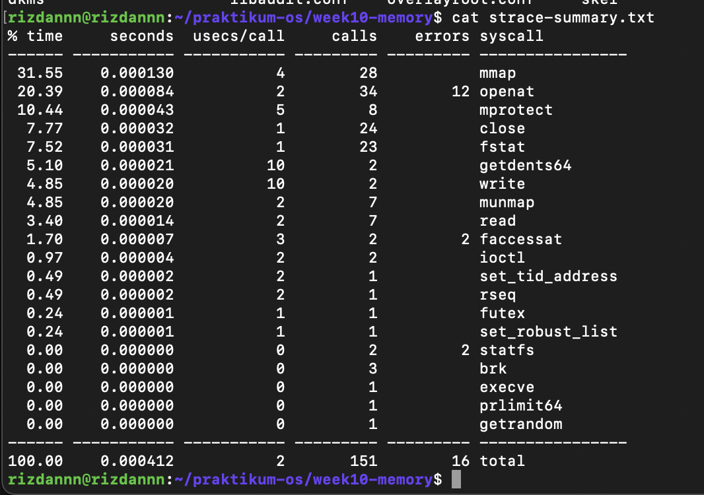
```
Analisis
1. Sebutkan minimal 5 system call dari strace-summary.txt beserta fungsi
singkatnya.
2. System call mana yang paling sering dipanggil? Mengapa?
3. Apakah ada errors lebih dari 0? Apakah program tetap berjalan normal
meskipun ada kegagalan tersebut?
```

### Jawaban 10.4 — Analisis System Call dengan strace

1. 5 system call dari strace-summary.txt:
execve = menjalankan program
openat = membuka file
read = membaca file
write = menulis output
close = menutup file descriptor
2. System call paling sering = openat karena ls membuka banyak file.
3. Error > 0 tapi program tetap jalan normal = wajar, itu bagian dari logika program mencoba beberapa path.

#### Tugas 10.5 — Script Diagnosa Server Lambat
```
nano ~/praktikum-os/week10-memory/diagnosa-server.sh
```
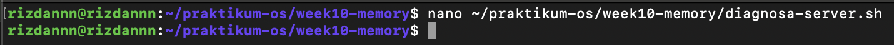

#### Ketik isi berikut:
```
#!/bin/bash
set -euo pipefail

LAPORAN="diagnosa-server-lambat.txt"
WARN_MEM=false
WARN_SWAP=0

cek_memori() {
    echo "--- Kondisi Memori ---"
    free -h
    echo
    AVAIL_PCT=$(free | awk '/Mem/ { printf "%d", $7/$2*100}')
    if [ "$AVAIL_PCT" -lt 20 ]; then
        echo "PERINGATAN: Memori tersedia hanya ${AVAIL_PCT}%"
        WARN_MEM=true
    fi
}

cek_swap() {
    echo "--- Penggunaan Swap ---"
    swapon --show 2>/dev/null || echo "Tidak ada swap aktif"
    echo
    WARN_SWAP=$(free | awk '/Swap/ { print $3}')
    if [ "$WARN_SWAP" -gt 0 ]; then
        echo "INFO: Swap digunakan (${WARN_SWAP} kB)"
    fi
}

cek_proses() {
    echo "--- 10 Proses Memori Tertinggi ---"
    ps aux --sort=-%mem | head -n 11
    echo
}

cek_paging() {
    echo "--- Aktivitas Paging (5 sampel) ---"
    vmstat 1 5
    echo
}

ringkasan() {
    echo "=== RINGKASAN ==="
    if [ "$WARN_MEM" = true ]; then
        echo "- Memori : KRITIS - perlu tindakan segera"
    else
        echo "- Memori : normal"
    fi

    if [ "$WARN_SWAP" -gt 0 ]; then
        echo "- Swap   : aktif - pantau aktivitas paging"
    else
        echo "- Swap   : tidak digunakan"
    fi
}

{
    echo "=== LAPORAN DIAGNOSA SERVER ==="
    date
    echo
    cek_memori
    cek_swap
    cek_proses
    cek_paging
    ringkasan
} | tee "$LAPORAN"

echo
echo "Laporan disimpan ke: $LAPORAN"
```
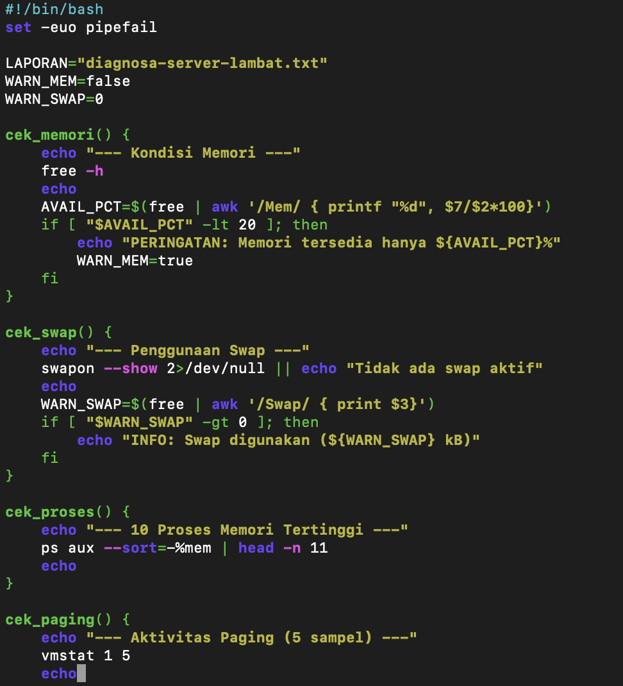

#### Jalankan:
```
chmod +x ~/praktikum-os/week10-memory/diagnosa-server.sh
cd ~/praktikum-os/week10-memory
bash diagnosa-server.sh
```
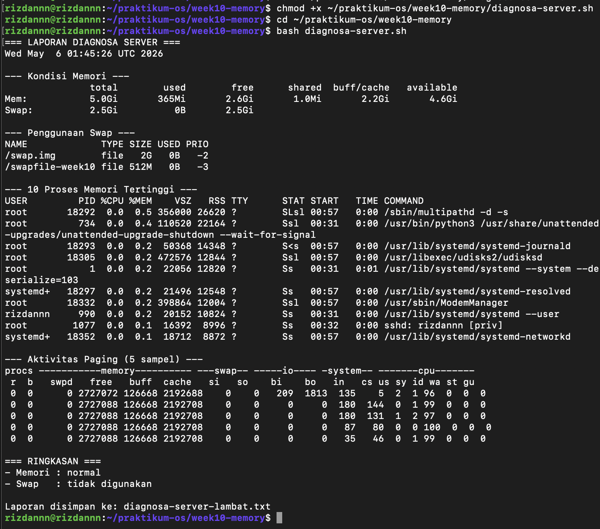
```
Analisis
1. Jelaskan peran masing-masing fungsi: cek_memori, cek_swap, cek_proses,
cek_paging, dan ringkasan. Mengapa diagnosa dipecah menjadi fungsi
terpisah?
2. Berdasarkan bagian RINGKASAN, apakah kondisi sistem normal atau kritis?
Jelaskan berdasarkan nilai threshold yang digunakan script.
3. Mengapa script menggunakan tee "$LAPORAN" bukan redirection biasa >
"$LAPORAN"? Apa keuntungannya?
4. Dari output cek_paging, apakah ada aktivitas si atau so? Jika ada, apa
implikasinya terhadap performa server?
```

### Jawaban 10.5 — Script Diagnosa Server Lambat

1. Peran masing-masing fungsi:
cek_memori = cek RAM tersedia, beri peringatan jika < 20%
cek_swap = cek swap aktif dan penggunaannya
cek_proses = tampilkan 10 proses dengan RAM terbesar
cek_paging = pantau aktivitas swap in/out selama 5 detik
ringkasan = kesimpulan kondisi sistem secara keseluruhan
Dipecah jadi fungsi agar mudah dibaca, dirawat, dan diuji per bagian.
2. Jika RINGKASAN menampilkan "normal" = memori tersedia ≥ 20% dan swap tidak digunakan.
3. tee digunakan agar output tampil di terminal sekaligus tersimpan ke file. Kalau pakai > saja, output tidak tampil di terminal.
4. Jika si atau so > 0 di cek_paging = ada aktivitas swap → performa server menurun karena akses disk jauh lebih lambat dari RAM.


