## Laporan Praktikum Sistem Operasi Jobsheet 

<h4>Nama  : Rafif Rizdan Prastana<h4>
<h4>NIM   : 254107020052<h4>
<h4>Kelas : TI 1H<h4>

# 1 Manajemen File & User/Group

## Praktikum 9.1 — Permissions
### Langkah 1 — Buat direktori kerja dan file uji:
```
mkdir ~/lab-permissions && cd ~/lab-permissions
echo "data rahasia" > secret.txt
echo '#!/bin/bash' > myscript.sh
echo 'echo Hello' >> myscript.sh
ls -la
```
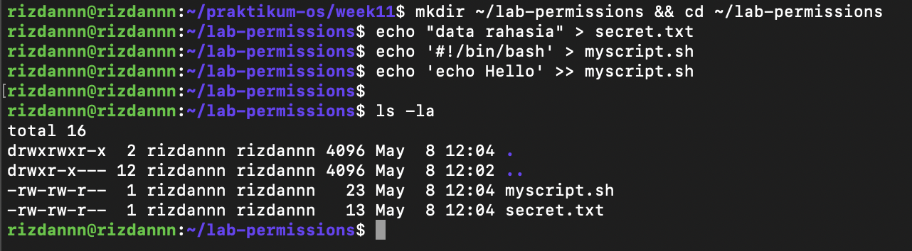

### Langkah 2 — Jadikan secret.txt privat:
```
chmod 600 secret.txt
ls -l secret.txt
```
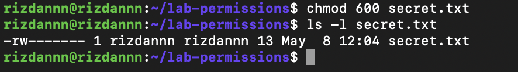

### Langkah 3 — Jadikan myscript.sh executable:
```
chmod 755 myscript.sh
ls -l myscript.sh
./myscript.sh
```
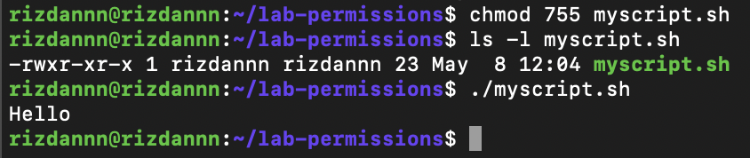

### Langkah 4 — Buat direktori bersama dengan SGID:
```
mkdir shared-dir
chmod g+s shared-dir
ls -ld shared-dir
```

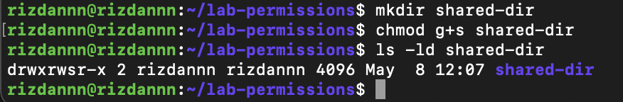

### Langkah 5 — Uji efek umask:
```
umask
umask 027
touch testfile-027
ls -l testfile-027
```

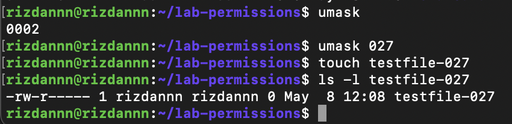

```
Analisis 9.1 — Permissions
1. Mengapa secret.txttidak dapat dibaca oleh group dan others setelah chmod 600?
2. Apa perbedaan arti 600dan 755terhadap file yang diuji?
3. Setelah umask 027, permission apa yang dihasilkan untuk file baru, dan mengapa bukan 777?
```

### Jawaban 9.1 — Permissions

1. chmod 600 hanya memberi hak baca+tulis ke owner saja, group dan others tidak dapat bit apapun (---) sehingga tidak bisa mengakses file.

2. 600 = hanya owner yang bisa akses (privat). 755 = owner penuh, group dan others bisa baca+eksekusi (publik).

3. File baru dapat permission 640 karena 666 - 027 = 640. Bukan 777 karena umask mengurangi permission default, dan file reguler tidak pernah otomatis dapat bit execute.


## Praktikum 9.2 — ACL
### Langkah 1 — Siapkan file dan lihat permission standar:
```
mkdir ~/lab-acl && cd ~/lab-acl
echo "Data penting" > confidential.txt
chmod 640 confidential.txt
ls -l confidential.txt
getfacl confidential.txt
```

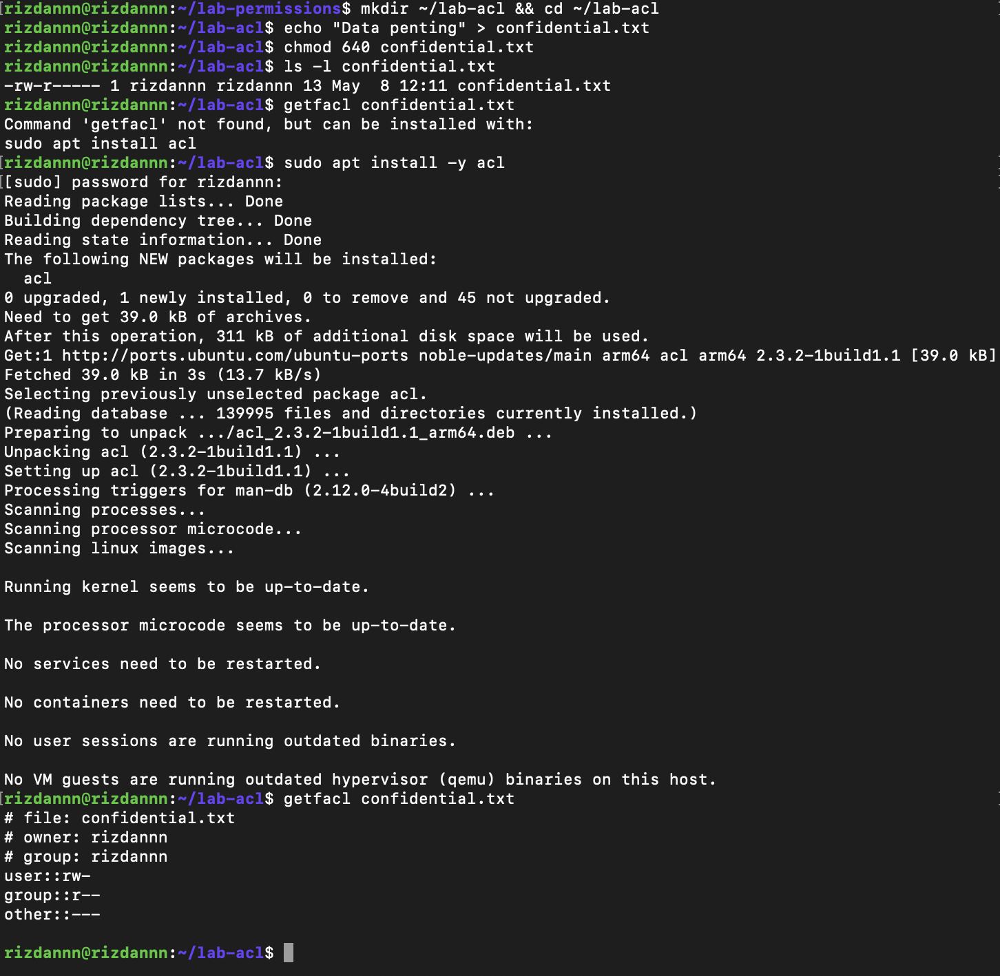

### Langkah 2 — Beri akses baca ke satu user:
```
setfacl -m u:userA:r confidential.txt
ls -l confidential.txt
getfacl confidential.txt
```

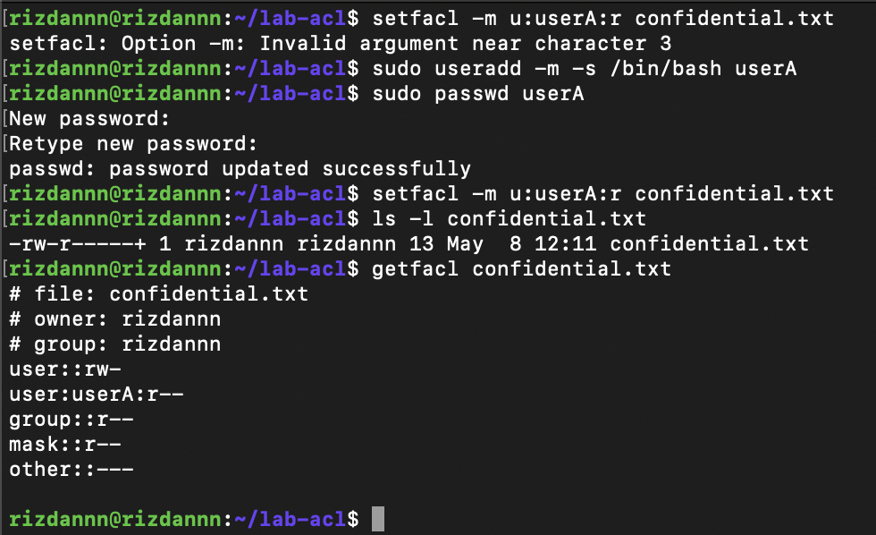

### Langkah 3 — Buat direktori dengan default ACL:
```
mkdir shared
setfacl -d -m u:userA:rwx shared
setfacl -d -m u:userB:r-x shared
getfacl shared
touch shared/inherited.txt
getfacl shared/inherited.txt
```

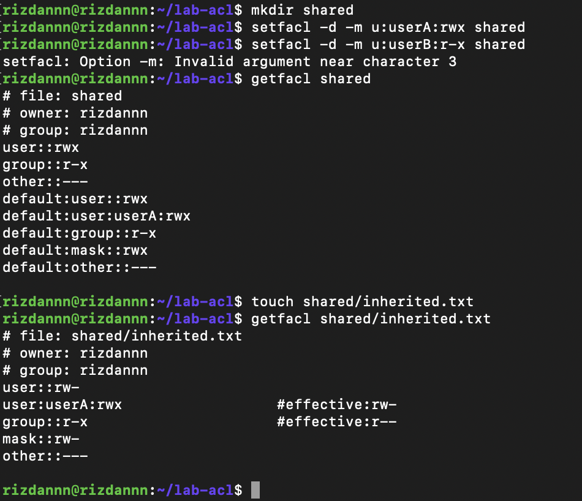

```
Analisis 9.2 — ACL

1. Mengapa getfacl confidential.txtawalnya tidak menampilkan user tertentu?
2. Setelah setfacl -m u:userA:r confidential.txt, apa perbedaan output ls -ldan getfacl?
3. Mengapa file inherited.txtmewarisi ACL dari direktori shared?
```

### Jawaban 9.2 — ACL

1. Karena belum ada ACL tambahan, hanya tiga entri dasar Unix biasa (owner, group, others).

2. ls -l menampilkan tanda + di akhir permission. getfacl menampilkan entri baru user:userA:r--.

3. Karena direktori shared sudah diset default ACL dengan opsi -d, sehingga setiap file baru di dalamnya otomatis mewarisi aturan ACL tersebut.


## Praktikum 9.3A — Membuat dan Mengelola User


### Buat dua user
```
sudo useradd -m -s /bin/bash userA
sudo useradd -m -s /bin/bash userB
sudo passwd userA
sudo passwd userB
```

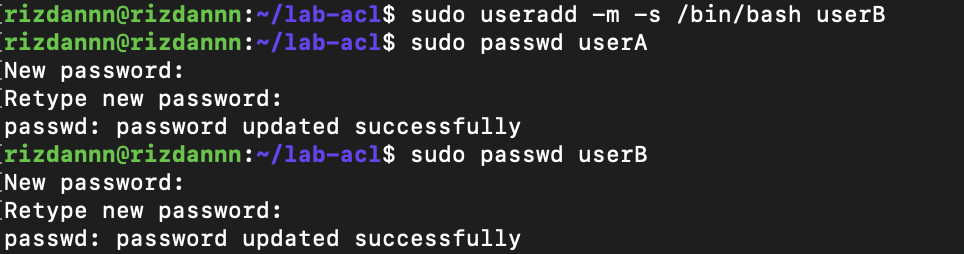


### Verifikasi
```
id userA
getent passwd userA
```
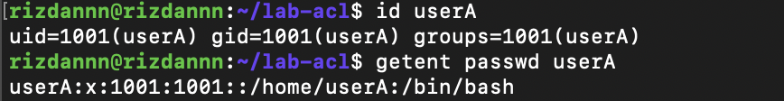


### Modifikasi shell userA
```
sudo usermod -s /bin/zsh userA
getent passwd userA
```
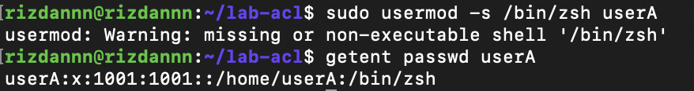


### Lock dan unlock userB
```
sudo usermod -L userB
sudo passwd -S userB
sudo usermod -U userB
sudo passwd -S userB
```

```
Pertanyaan 9.3A — Membuat dan Mengelola User:

1. Apa perbedaan output id userAsebelum dan sesudah menambah group?
2. Bagaimana status passwd -S userBberubah saat akun di-lock?
```

### Jawaban 9.3A — Membuat dan Mengelola User

1. Sebelum tambah group, hanya tampil primary group. Sesudah, muncul supplementary group tambahan.

2. Saat di-lock status jadi L (Locked), setelah di-unlock kembali menjadi P (active).

## Jawaban 

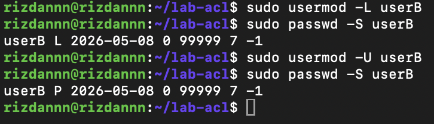

## Praktikum 9.3B — Group Management
```
# Buat dua group
sudo groupadd labgroup
sudo groupadd readonly-group

# Tambahkan userA ke kedua group
sudo usermod -aG labgroup,readonly-group userA

# Tambahkan userB hanya ke readonly-group
sudo usermod -aG readonly-group userB

# Verifikasi
id userA
id userB
getent group labgroup
getent group readonly-group
```

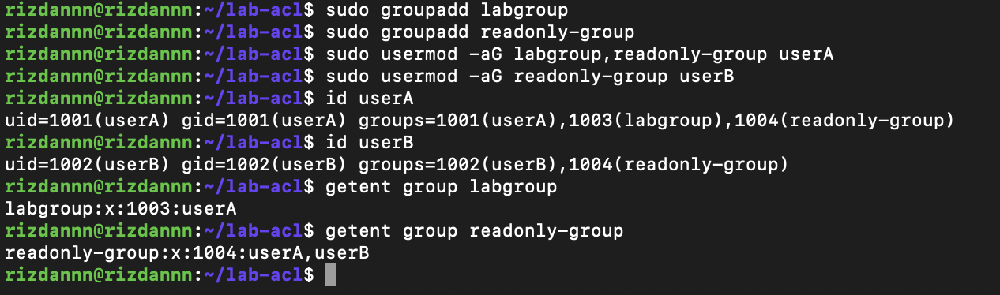

```
Pertanyaan 9.3B — Group Management

1. Apa yang ditampilkan id userAvs groups userA?
2. Mengapa -apada usermod -aGpenting?
```

### Jawaban 9.3B — Group Management

1. id userA menampilkan UID, GID, dan semua group. groups userA hanya tampilkan nama group saja.

2. -a penting agar group baru ditambahkan tanpa menghapus group lama. Tanpa -a, semua group lama akan terganti.

## Praktikum 9.3C — Password Aging Policy

### Set aging policy untuk userA
```
sudo chage -M 60 -W 7 -m 1 userA
sudo chage -l userA
```

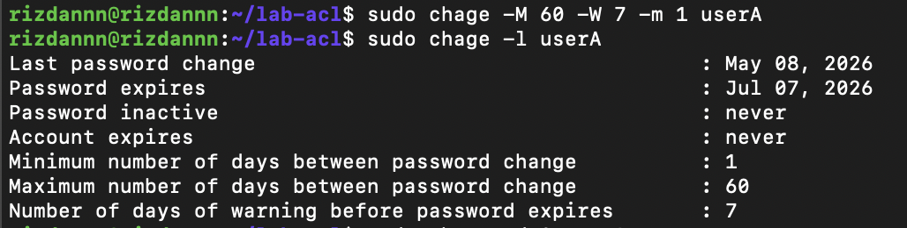

### Paksa userA ganti password saat login pertama
```
sudo chage -d 0 userA
```
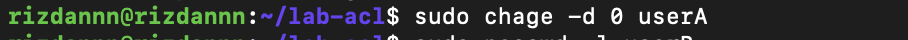

### Kunci password userB
```
sudo passwd -l userB
sudo passwd -S userB
```

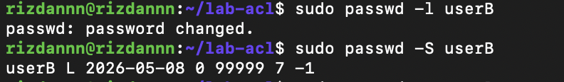

### Unlock kembali
```
sudo passwd -u userB
sudo passwd -S userB
```

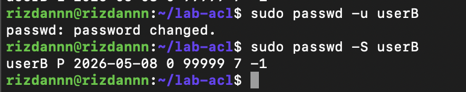

```
Pertanyaan 9.3C — Password Aging Policy

1. Apa arti nilai yang ditampilkan chage -l userA?
2. Bagaimana cara membuktikan userB terkunci dari output passwd 
3. Kapan sebaiknya menggunakan chage -d 0vs passwd -e?
```

### Jawaban 9.3C — Password Aging Policy

1. chage -l userA menampilkan: tanggal terakhir ganti password, kapan expired, kapan akun dikunci, dan batas hari warning.

2. Status passwd -S userB menampilkan L = akun terkunci.

3. chage -d 0 = set tanggal password ke epoch sehingga dianggap expired. passwd -e = langsung expire password sekarang. Efeknya sama, tapi passwd -e lebih eksplisit.

## Praktikum 9.4 — Konfigurasi sudo

### Langkah 1 — Buat file sudoers untuk userA:
```
sudo visudo -f /etc/sudoers.d/lab-userA
```

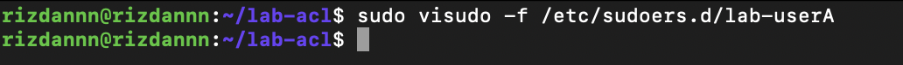

### Ketik isi berikut di dalam editor:
```
userA ALL=(root) NOPASSWD: /usr/bin/apt update, /usr/bin/apt upgrade
userA ALL=(root) /bin/systemctl status *
```

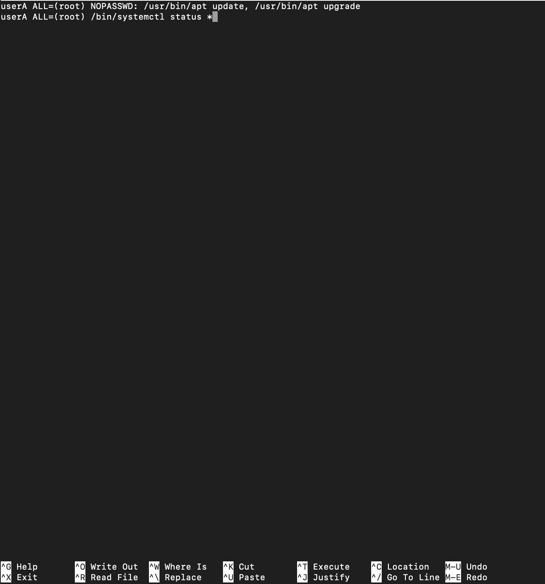

### Langkah 2 — Verifikasi:
```
sudo -l -U userA
sudo grep "userA" /var/log/auth.log | tail -10
```

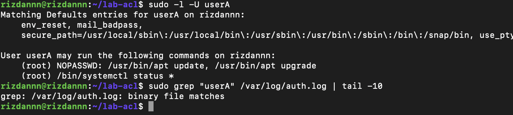

```
Analisis 9.4 — Konfigurasi sudo

1. Mengapa aturan disimpan di /etc/sudoers.d//, bukan langsung di /etc/sudoers?
2. Mana perintah yang bisa dijalankan tanpa password, dan mana yang masih perlu autentikasi?
3. Informasi apa saja yang dicatat di log sudo?
```

### Jawaban 9.4 — Konfigurasi sudo

1. Disimpan di /etc/sudoers.d/ agar lebih terorganisir, tidak berisiko merusak file sudoers utama, dan mudah dihapus per user.

2. Tanpa password: apt update dan apt upgrade. Perlu autentikasi: systemctl status *.

3. Log mencatat: waktu, user, perintah yang dijalankan, dan status berhasil/gagal.

## Praktikum 9.5 — Disk Quota

### Langkah 1 — Buat image filesystem:
```
sudo dd if=/dev/zero of=/tmp/quota-test.img bs=1M count=100
sudo mkfs.ext4 /tmp/quota-test.img
sudo mkdir -p /mnt/quota-test
sudo mount -o loop,usrquota,grpquota /tmp/quota-test.img /mnt/quota-test
```

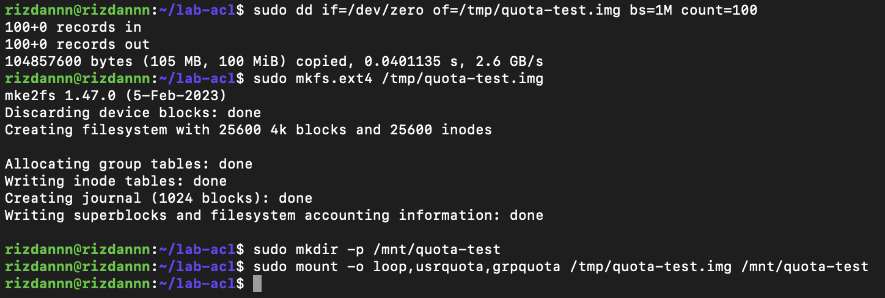

### Langkah 2 — Inisialisasi dan aktifkan quota:
```
sudo quotacheck -cug /mnt/quota-test
sudo quotaon -v /mnt/quota-test
sudo repquota /mnt/quota-test
```

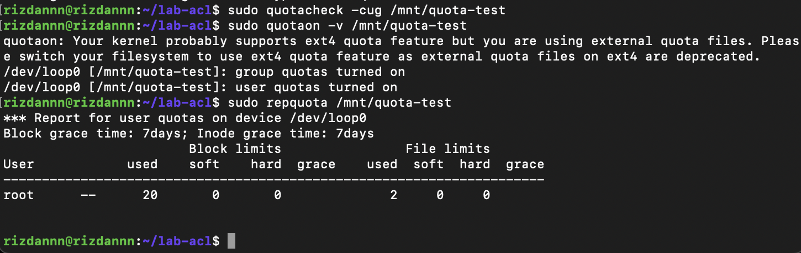

### Langkah 3 — Tetapkan quota untuk userA:
```
sudo edquota -u userA
# Di dalam editor: isi soft block 5120, hard block 10240
sudo repquota /mnt/quota-test
```

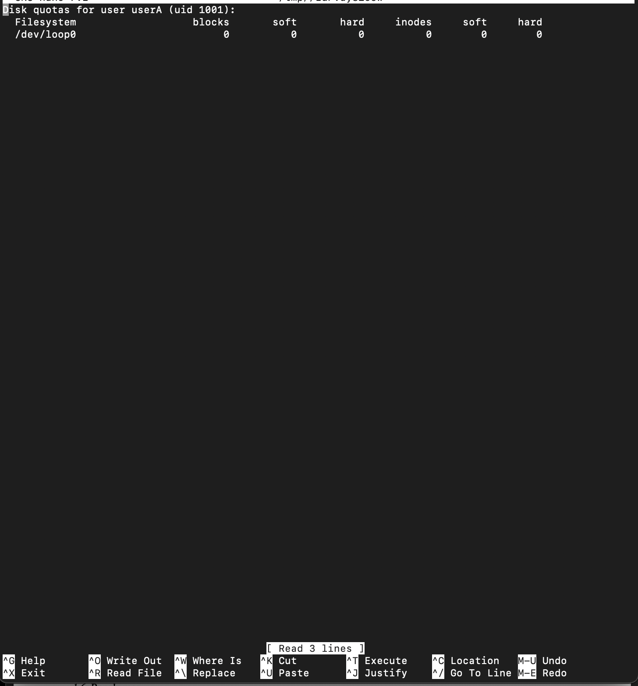
![namafile](images/5tigaa.png

### Langkah 4 — Bersihkan setelah selesai:
```
sudo quotaoff /mnt/quota-test
sudo umount /mnt/quota-test
sudo rm /tmp/quota-test.img
```

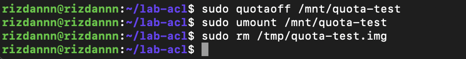

```
Analisis 9.5 — Disk Quota

1. Apa perbedaan soft limit dan hard limit saat quota mulai terlampaui?
2. Mengapa praktikum ini memakai loopback filesystem, bukan langsung /home/?
3. Dari output repquota, informasi apa yang menunjukkan quota sudah aktif?
```

### Jawaban 9.5 — Disk Quota

1. Soft limit = boleh dilampaui sementara selama grace period. Hard limit = batas absolut, tidak boleh dilampaui sama sekali.

2. Pakai loopback filesystem agar lebih aman, tidak perlu memodifikasi /home langsung. Jika salah, cukup hapus image file.

3. Quota aktif ditunjukkan dengan munculnya kolom blocks dan inodes beserta nilai soft/hard limit di output repquota.

## Latihan 9.A — Audit dan Kolaborasi 

### 1. Temukan file SUID aktif:
```
find / -perm -4000 -type f 2>/dev/null
```
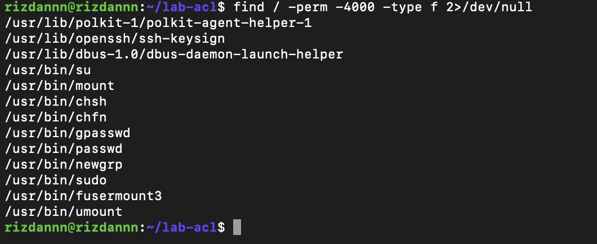

### 2. Cari direktori world-writable:
```
find / -type d -perm -0002 2>/dev/null
```

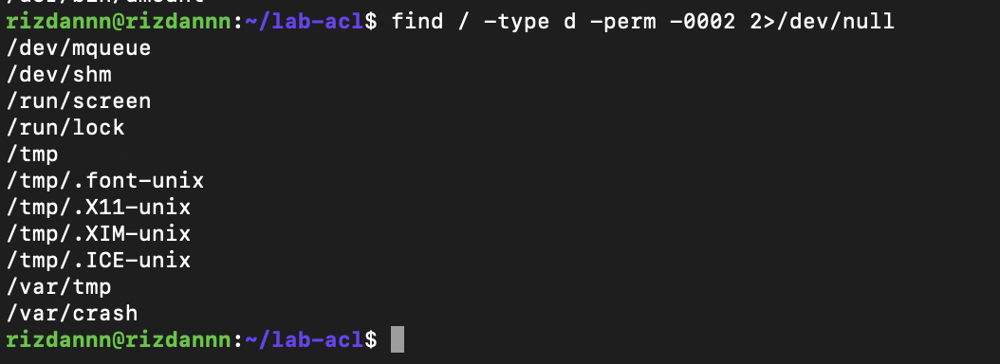

### 3. Konfigurasi direktori proyek /srv/webapp/:
```
sudo mkdir -p /srv/webapp
sudo groupadd webapp-team
sudo chown root:webapp-team /srv/webapp
sudo chmod 2775 /srv/webapp

# ACL untuk user deploy (hanya baca)
sudo setfacl -m u:deploy:r-x /srv/webapp

# Default ACL agar file baru mewarisi group
sudo setfacl -d -m g:webapp-team:rwx /srv/webapp
sudo setfacl -d -m u:deploy:r-x /srv/webapp

# Verifikasi
getfacl /srv/webapp
```

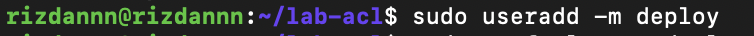
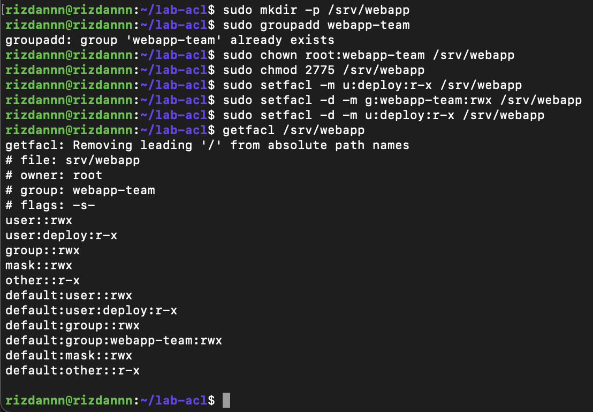

## Latihan 9.B — Kebijakan Akun dan Quota
```
# 1. Buat user intern
sudo useradd -m -s /bin/bash intern

# 2. Tambahkan ke labgroup
sudo usermod -aG labgroup intern

# 3. Set password dan paksa ganti saat login pertama
sudo passwd intern
sudo chage -d 0 intern

# 4. Kebijakan password: expire 45 hari, warning 7 hari
sudo chage -M 45 -W 7 intern
sudo chage -l intern

# 5. Beri izin sudo hanya untuk systemctl status
sudo visudo -f /etc/sudoers.d/intern
```

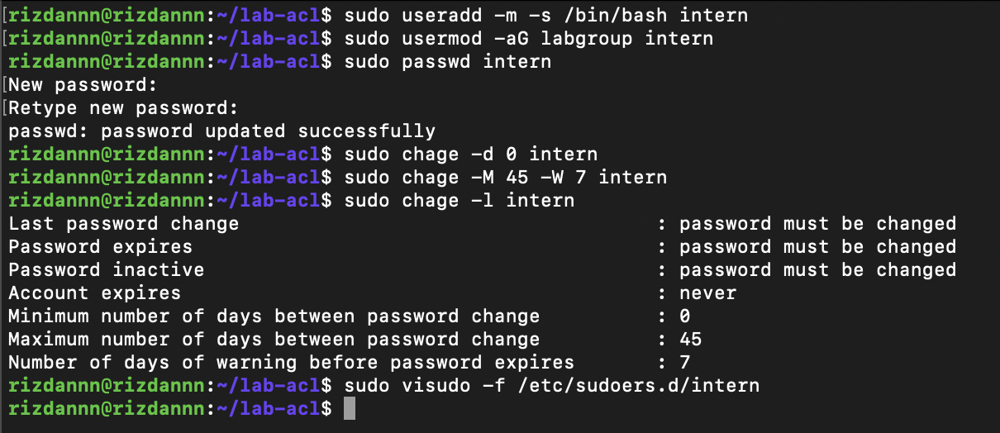

### Isi file sudoers intern:
```
intern ALL=(root) /bin/systemctl status *
```
```
# 6. Aktifkan quota di /home (jika belum aktif)
sudo apt install -y quota
sudo quotacheck -cugm /home
sudo quotaon -v /home

# 7. Set quota untuk intern
sudo setquota -u intern 512000 1024000 5000 10000 /home

# Verifikasi
sudo quota -u intern
sudo repquota -s /home
```


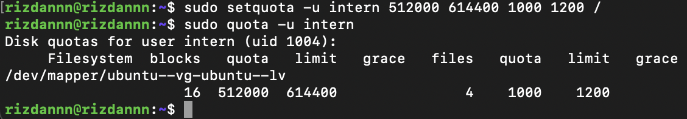


