## Laporan Praktikum Sistem Operasi Jobsheet 

<h4>Nama  : Rafif Rizdan Prastana<h4>
<h4>NIM   : 254107020052<h4>
<h4>Kelas : TI 1H<h4>

## Praktikum 10.1 — Amati Layanan Aktif Saat Boot 

### Langkah 1 — Lihat semua layanan yang sedang berjalan:
```
systemctl list-units --type=service --state=running
```
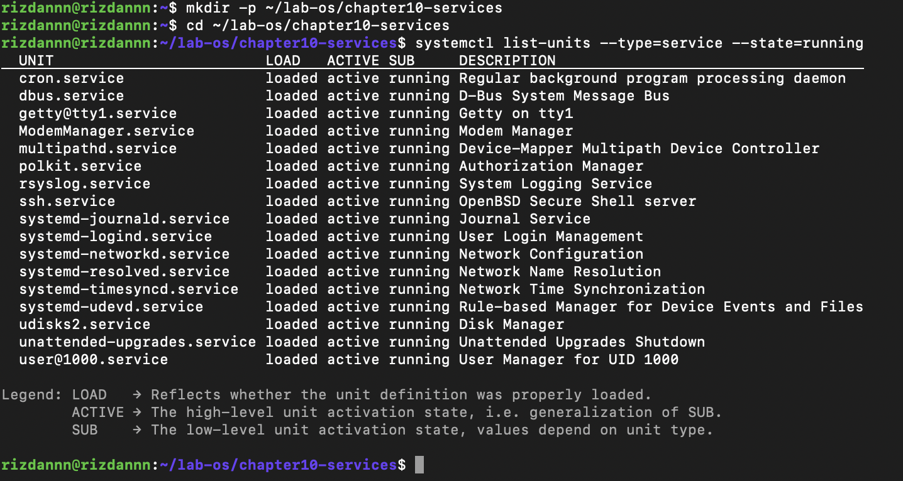

### Langkah 2 — Lihat semua unit service:
```
systemctl list-unit-files --type=service | head -30
```
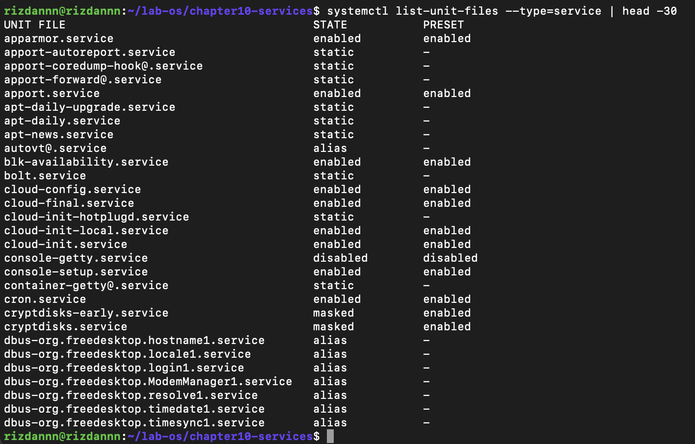

### Langkah 3 — Analisis waktu boot:
```
systemd-analyze
systemd-analyze blame | head -15
```
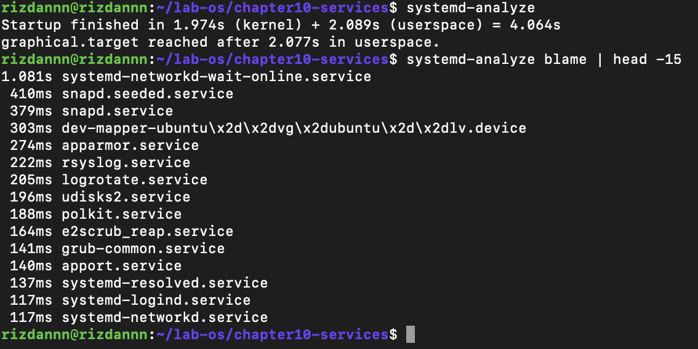

## Tantangan 10.1 — Tiga Layanan Terlama Saat Boot
```
systemd-analyze blame | sort -rh | head -3
```
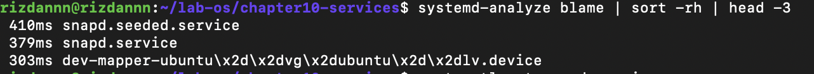

### Untuk setiap layanan yang muncul, cek fungsinya:
```
systemctl cat nama-layanan
```
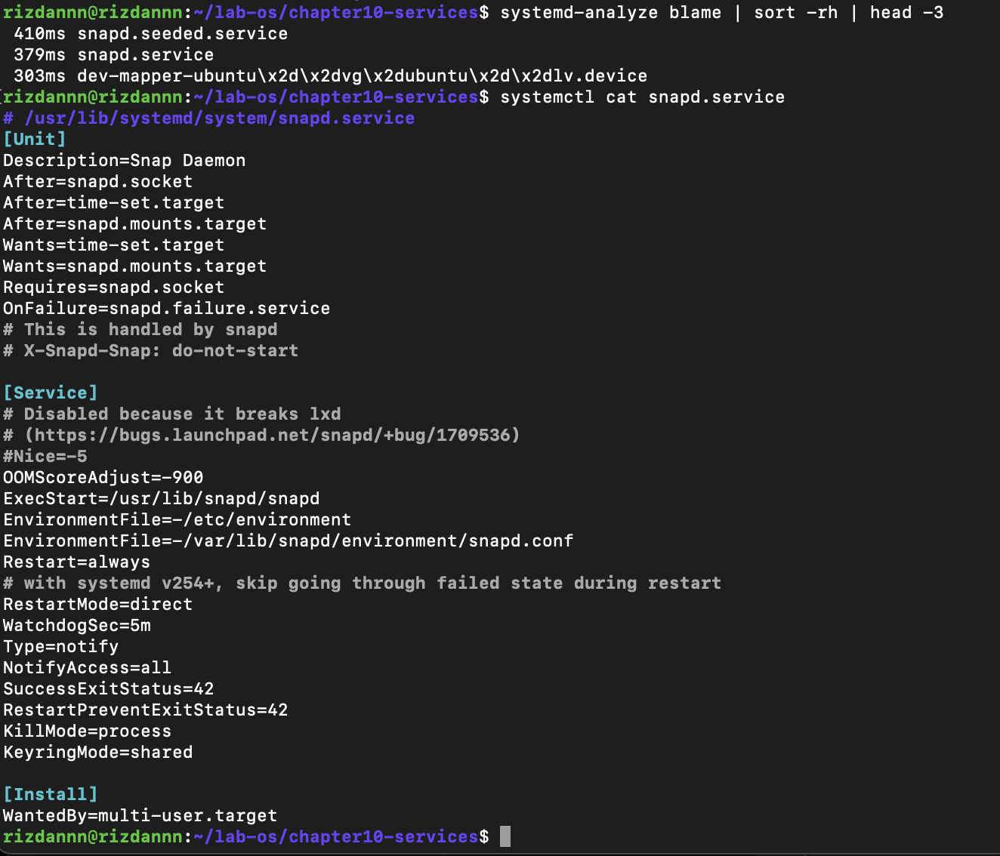


## Praktikum 10.2 — Kelola Layanan SSH

### Langkah 1 — Periksa status SSH:
```
systemctl status ssh
systemctl is-active ssh
systemctl is-enabled ssh
```
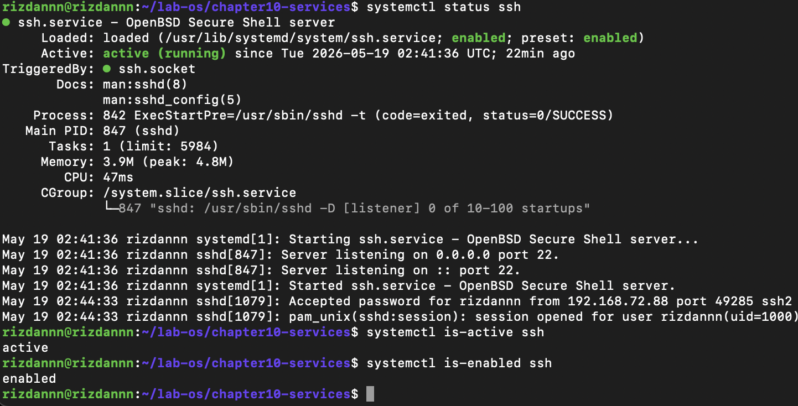

### Langkah 2 — Restart dan pantau:
```
sudo systemctl restart ssh
systemctl status ssh
```
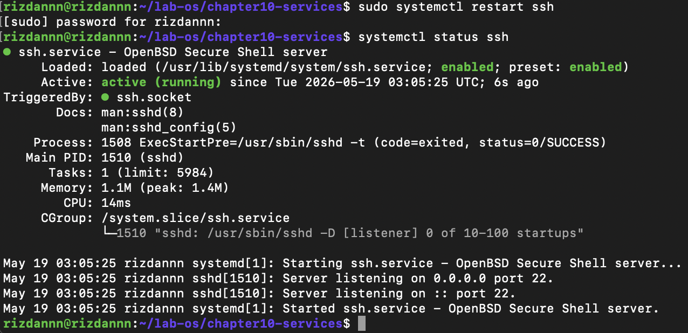

### Langkah 3 — Lihat dependensi SSH:
```
systemctl status ssh
```
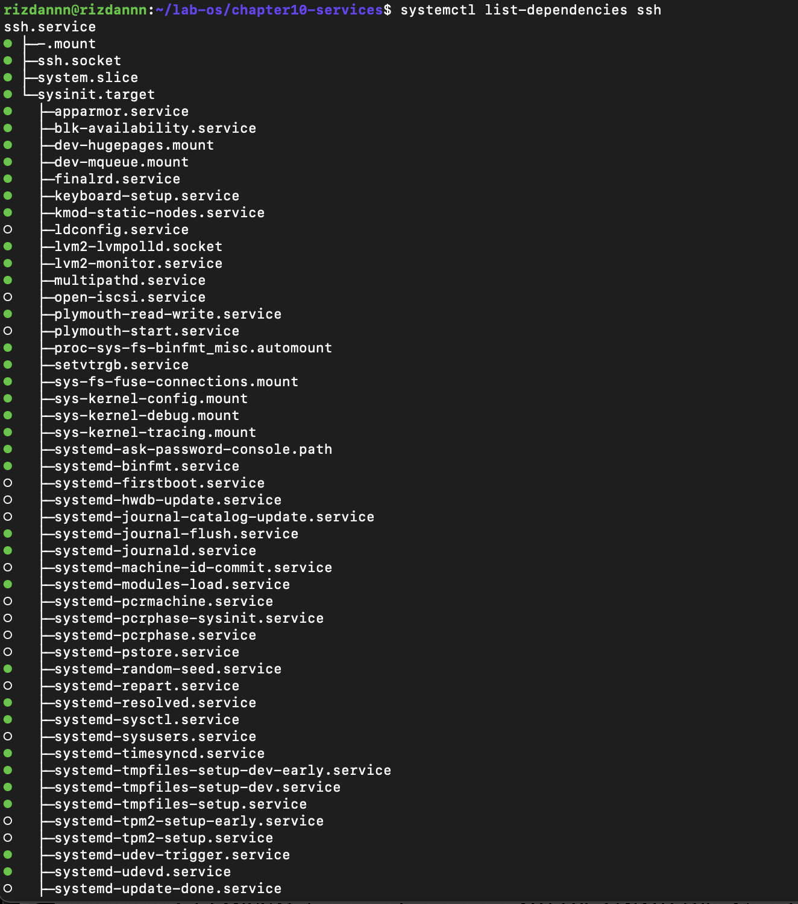

### Langkah 4 — Cek unit yang gagal:
```
systemctl --failed
```
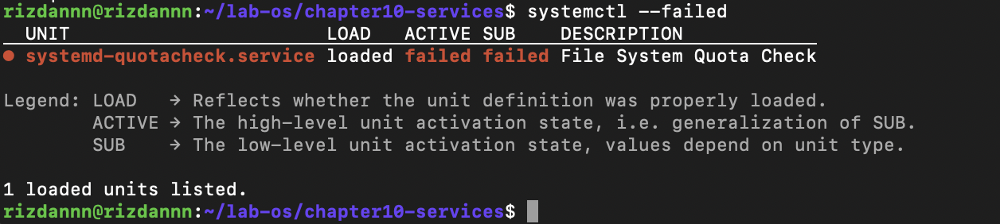

## Tantangan 10.2 — Script cek-layanan.sh

### Langkah 1 — Buat file daftar layanan:
```
nano ~/lab-os/chapter10-services/daftar-layanan.txt
```
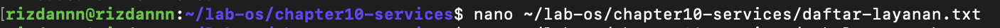

### Ketik isi berikut:
```
ssh
cron
rsyslog
```
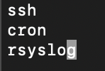

### Langkah 2 — Buat script:
```
nano ~/lab-os/chapter10-services/cek-layanan.sh
```
```
#!/bin/bash
# Script: cek-layanan.sh
# Fungsi: cek status layanan dari file daftar-layanan.txt

DAFTAR="$HOME/lab-os/chapter10-services/daftar-layanan.txt"
LAPORAN="$HOME/lab-os/chapter10-services/laporan-layanan.log"

# Validasi file daftar ada
if [ ! -f "$DAFTAR" ]; then
    echo "ERROR: File $DAFTAR tidak ditemukan."
    exit 1
fi

# Bersihkan laporan lama
> "$LAPORAN"

# Baca setiap layanan dan cek statusnya
while read -r LAYANAN; do
    # skip baris kosong
    [ -z "$LAYANAN" ] && continue

    STATUS=$(systemctl is-active "$LAYANAN" 2>/dev/null)

    if [ "$STATUS" = "active" ]; then
        LABEL="ACTIVE"
    else
        LABEL="INACTIVE"
    fi

    TANGGAL=$(date '+%Y-%m-%d %H:%M:%S')
    echo "[$TANGGAL] $LAYANAN: $LABEL" | tee -a "$LAPORAN"

done < "$DAFTAR"

echo ""
echo "Laporan disimpan ke: $LAPORAN"
```
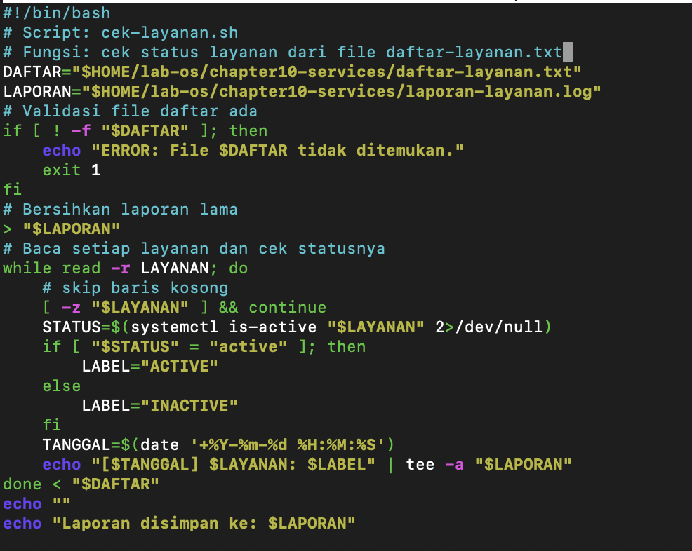

### Langkah 3 — Jalankan:
```
chmod +x ~/lab-os/chapter10-services/cek-layanan.sh
bash ~/lab-os/chapter10-services/cek-layanan.sh
```
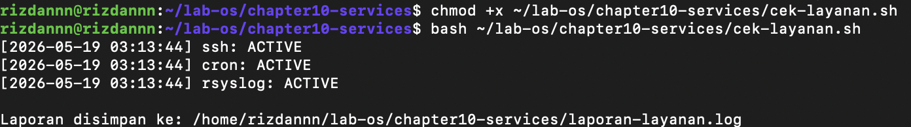

### Langkah 4 — Lihat hasil laporan:
```
cat ~/lab-os/chapter10-services/laporan-layanan.log
```
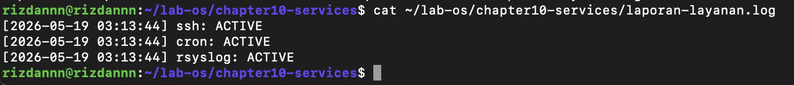


## Praktikum 10.3 — Buat Layanan Sederhana

### Langkah 1 — Siapkan konten:
```
cd ~/lab-os/chapter10-services
mkdir -p situs-demo
nano situs-demo/index.html
```
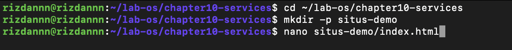

### Ketik isi berikut:
```
<!DOCTYPE html>
<html>
<body>
<h1>Halo dari layanan systemd kustom!</h1>
<p>Layanan ini dibuat pada praktek Bab 10.</p>
</body>
</html>
```
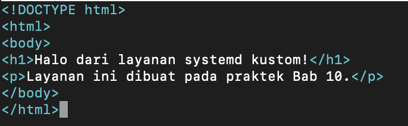

### Langkah 2 — Buat skrip wrapper:
```
nano ~/lab-os/chapter10-services/jalankan-server.sh
```
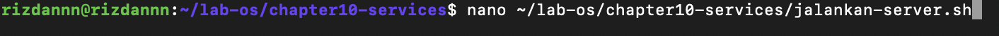

### Ketik isi berikut:
```
#!/bin/bash
DIREKTORI="$HOME/lab-os/chapter10-services/situs-demo"
PORT=9090
echo "Memulai server di port $PORT..."
exec python3 -m http.server $PORT --directory "$DIREKTORI"
```
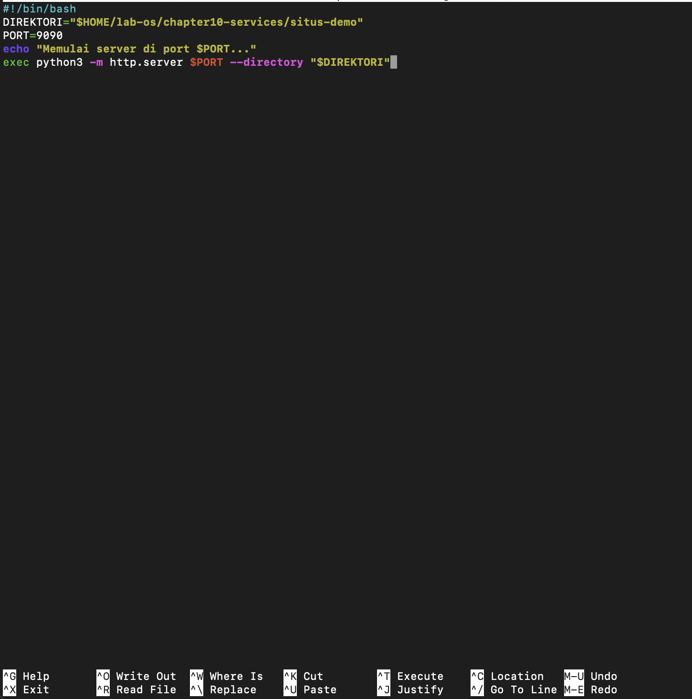

### Langkah 3 — Buat berkas unit:
```
nano ~/lab-os/chapter10-services/demo-web.service
```


### Ketik isi berikut (ganti nama-pengguna-kamu dengan username kamu):
```
[Unit]
Description=Demo Web Server Praktek Bab 10
After=network.target

[Service]
Type=simple
User=nama-pengguna-kamu
WorkingDirectory=/home/nama-pengguna-kamu/lab-os/chapter10-services/situs-demo
ExecStart=/usr/bin/python3 -m http.server 9090
Restart=on-failure
RestartSec=3s

[Install]
WantedBy=multi-user.target
```
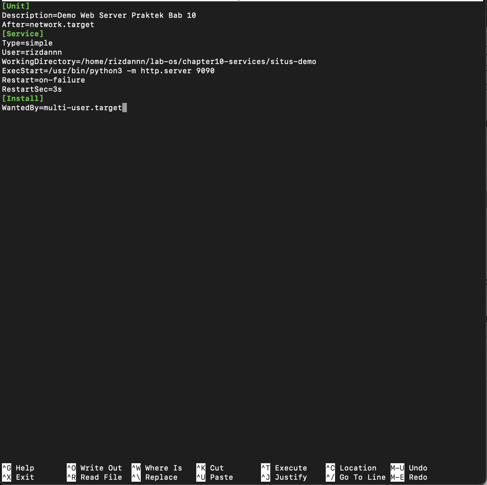
```
sudo cp ~/lab-os/chapter10-services/demo-web.service /etc/systemd/system/demo-web.service
sudo systemctl daemon-reload
```
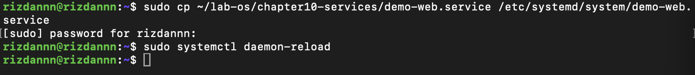

### Langkah 4 — Jalankan dan verifikasi:
```
sudo systemctl start demo-web
systemctl status demo-web
curl http://localhost:9090
```
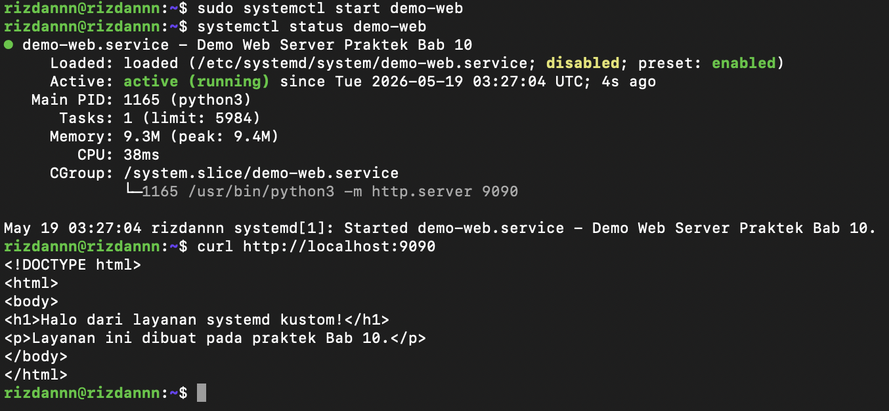

### Langkah 5 — Uji restart otomatis:
```
systemctl status demo-web | grep "Main PID"
sudo kill -9 $(systemctl show demo-web --property=MainPID --value)
sleep 5
systemctl status demo-web
```
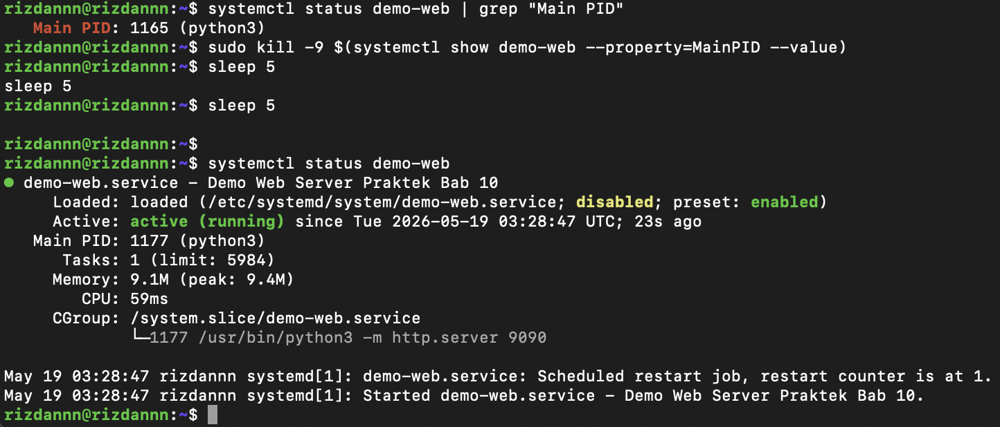

### Langkah 6 — Bersihkan:
```
sudo systemctl disable --now demo-web
sudo rm /etc/systemd/system/demo-web.service
sudo systemctl daemon-reload
```
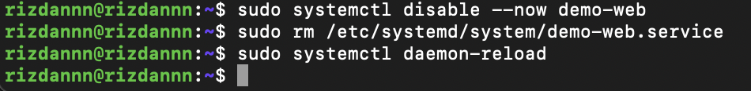


## Tantangan 10.3 — Modifikasi demo-web.service

### Langkah 1 — Edit berkas unit:
```
nano ~/lab-os/chapter10-services/demo-web.service
```

```
[Unit]
Description=Demo Web Server Praktek Bab 10
After=network.target

[Service]
Type=simple
User=nama-pengguna-kamu
WorkingDirectory=/home/nama-pengguna-kamu/lab-os/chapter10-services/situs-demo
Environment="PORT=9091"
ExecStart=/usr/bin/python3 -m http.server ${PORT}
Restart=on-failure
RestartSec=10s

[Install]
WantedBy=multi-user.target
```
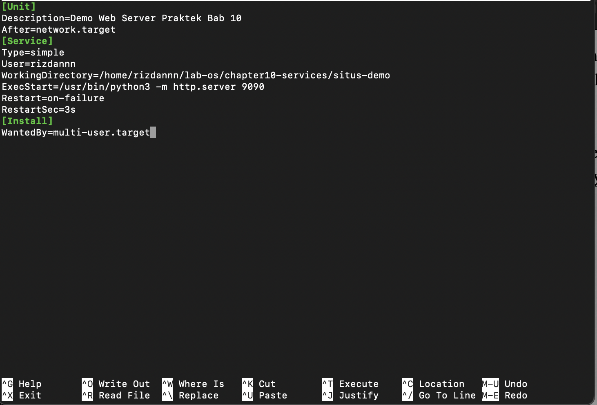

### Langkah 2 — Salin dan reload:
```
sudo cp ~/lab-os/chapter10-services/demo-web.service /etc/systemd/system/demo-web.service
sudo systemctl daemon-reload
```
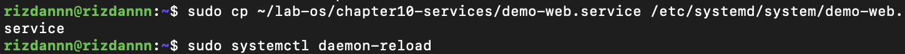

### Langkah 3 — Aktifkan dan jalankan:
```
sudo systemctl enable --now demo-web
systemctl status demo-web
```
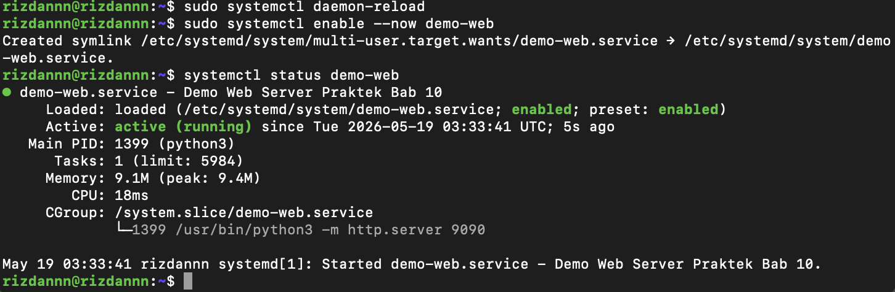

### Langkah 4 — Verifikasi port baru:
```
curl http://localhost:9091
ss -tlnp | grep 9091
```


### Langkah 5 — Uji restart otomatis dengan RestartSec=10s:
```
# Catat PID sebelum kill
systemctl status demo-web | grep "Main PID"

# Kill paksa
sudo kill -9 $(systemctl show demo-web --property=MainPID --value)

# Tunggu 10 detik (sesuai RestartSec=10s)
sleep 12
systemctl status demo-web
# PID berubah = layanan berhasil restart otomatis
```
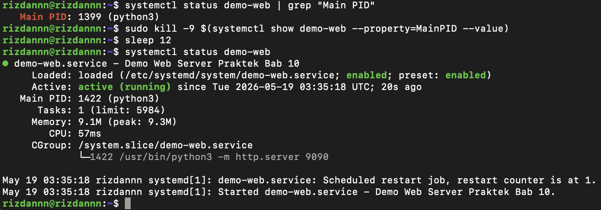

### Langkah 6 — Bersihkan:
```
sudo systemctl disable --now demo-web
sudo rm /etc/systemd/system/demo-web.service
sudo systemctl daemon-reload
```
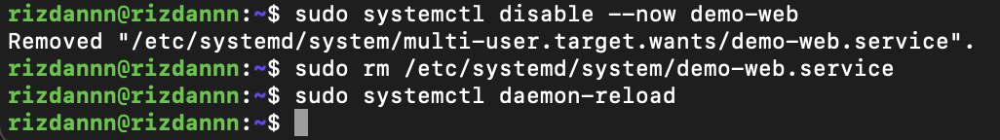


## Praktikum 10.4 — Filter dan Analisis Log

### Langkah 1 — Log SSH satu jam terakhir:
```
journalctl -u ssh --since "1 hour ago" --no-pager
```
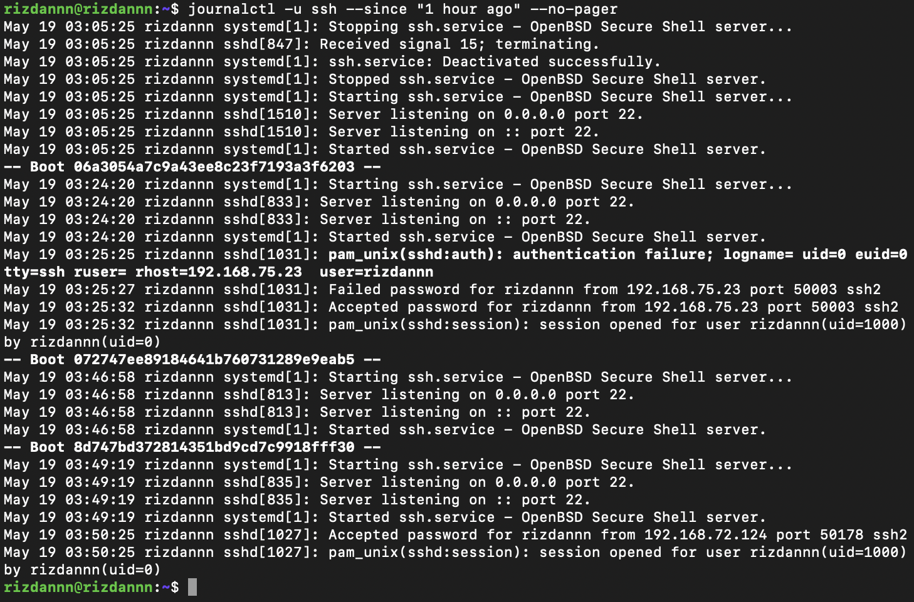

### Langkah 2 — Log prioritas error:
```
journalctl -b -p err --no-pager
```
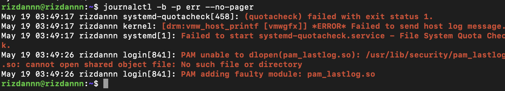

### Langkah 3 — Ikuti log real-time:
```
journalctl -u ssh -f
```
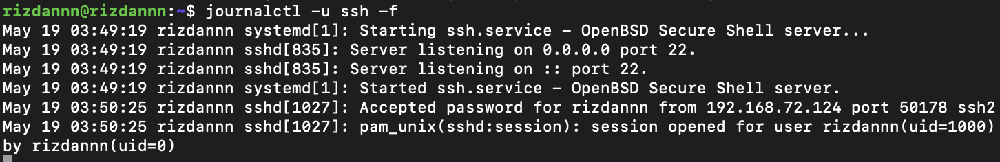

### Langkah 4 — Simpan log ke file:
```
cd ~/lab-os/chapter10-services
journalctl -u ssh --since today --no-pager > log-ssh-hari-ini.txt
wc -l log-ssh-hari-ini.txt
grep -i "error\|failed" log-ssh-hari-ini.txt | head -20
```
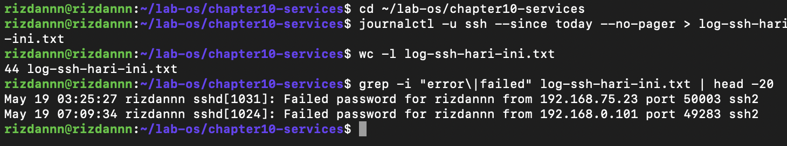

## Tantangan 10.4 — Analisis Error SSH 24 Jam
```
### Simpan error SSH 24 jam terakhir
journalctl -u ssh -p err --since "24 hours ago" --no-pager > error-ssh-24jam.txt

### Hitung total baris error
wc -l error-ssh-24jam.txt

### Tampilkan 10 pesan paling sering muncul
cat error-ssh-24jam.txt | sort | uniq -c | sort -rn | head -10
```
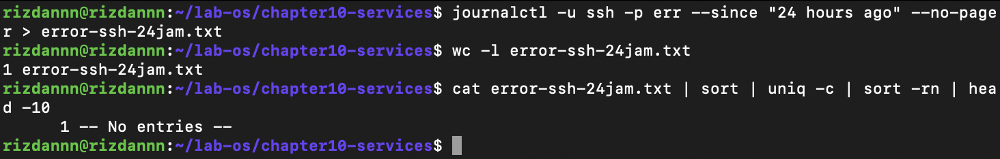

## Praktikum 10.5 — Konfigurasi SSH Server

### Langkah 1 — Periksa konfigurasi awal:
```
sudo grep -n "^Port\|^#Port" /etc/ssh/sshd_config
ss -tlnp | grep ssh
```
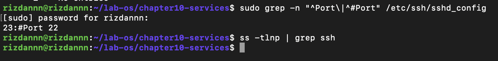

### Langkah 2 — Backup dan ubah port:
```
sudo cp /etc/ssh/sshd_config /etc/ssh/sshd_config.backup.lab12
sudo sed -i 's/^#Port 22/Port 2222/' /etc/ssh/sshd_config
grep "^Port" /etc/ssh/sshd_config
```
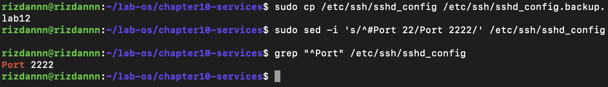

### Langkah 3 — Validasi dan restart:
```
sudo sshd -t
echo "Kode keluar sshd -t: $?"
sudo systemctl restart ssh
systemctl status ssh
```
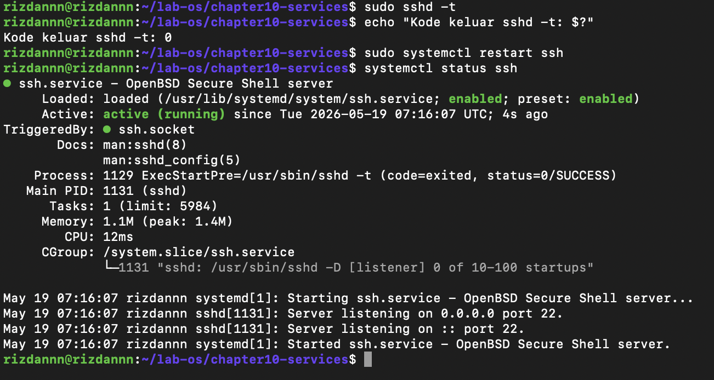

### Langkah 4 — Verifikasi port baru:
```
ss -tlnp | grep ssh
ss -tlnp | grep ssh > ~/lab-os/chapter10-services/bukti-port-ssh.txt
cat ~/lab-os/chapter10-services/bukti-port-ssh.txt
```
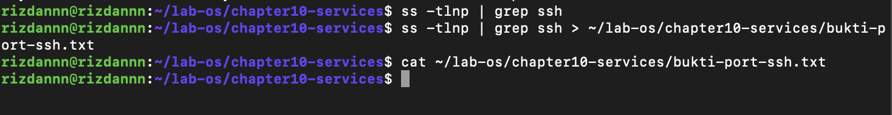

### Langkah 5 — Kembalikan ke port 22:
```
sudo cp /etc/ssh/sshd_config.backup.lab12 /etc/ssh/sshd_config
sudo sshd -t
sudo systemctl restart ssh
ss -tlnp | grep ssh
```
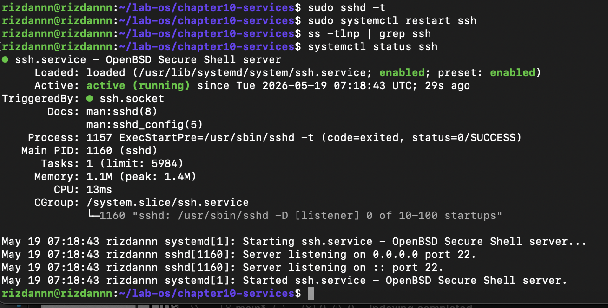

## Tantangan 10.5 — Hardening SSH

### Langkah 1 — Backup:
```
sudo cp /etc/ssh/sshd_config /etc/ssh/sshd_config.backup.tantangan
```
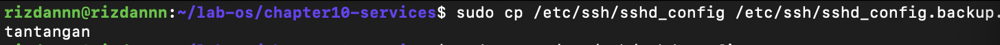

### Langkah 2 — Edit konfigurasi:
```
sudo nano /etc/ssh/sshd_config

### Tambahkan atau ubah baris berikut:
PermitRootLogin no
MaxAuthTries 3
```
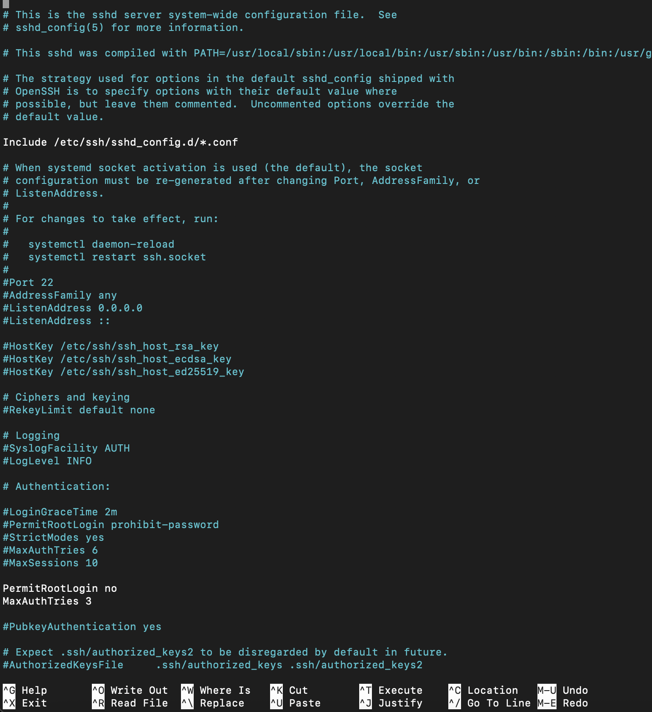

### Langkah 3 — Validasi sintaks:
```
sudo sshd -t
echo "Kode keluar: $?"
```
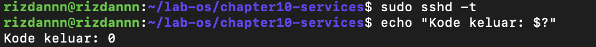

### Langkah 4 — Reload:
```
sudo systemctl reload ssh
```


### Langkah 5 — Verifikasi:
```
grep -E "PermitRoot|MaxAuth" /etc/ssh/sshd_config
journalctl -u ssh -n 20
```
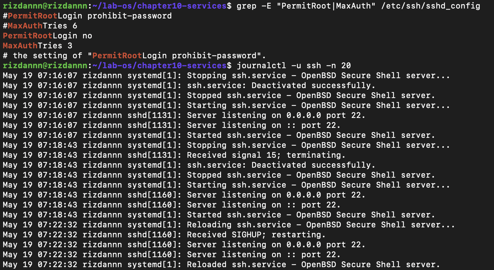

### Langkah 6 — Kembalikan konfigurasi:
```
sudo cp /etc/ssh/sshd_config.backup.tantangan /etc/ssh/sshd_config
sudo sshd -t
sudo systemctl restart ssh
```
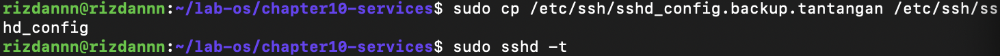

## Latihan 10.1 — Audit Layanan dan Analisis Boot

#### 1. Lihat layanan aktif
```
systemctl list-units --type=service --state=running
```
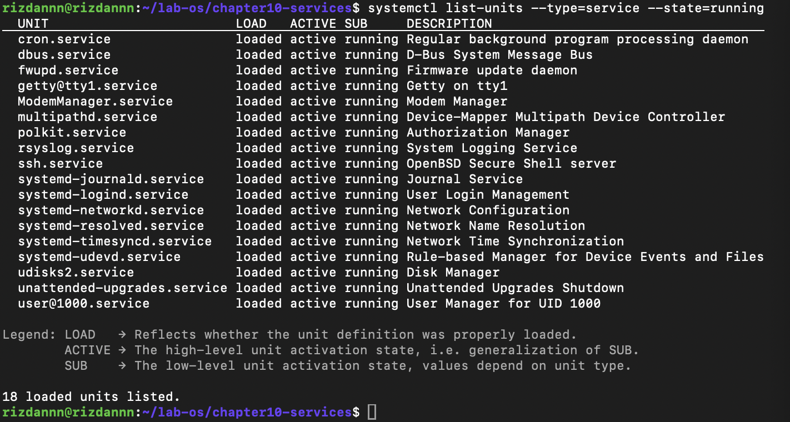

### Periksa 3 layanan yang dikenal
```
systemctl status ssh
systemctl status cron
systemctl status rsyslog
```
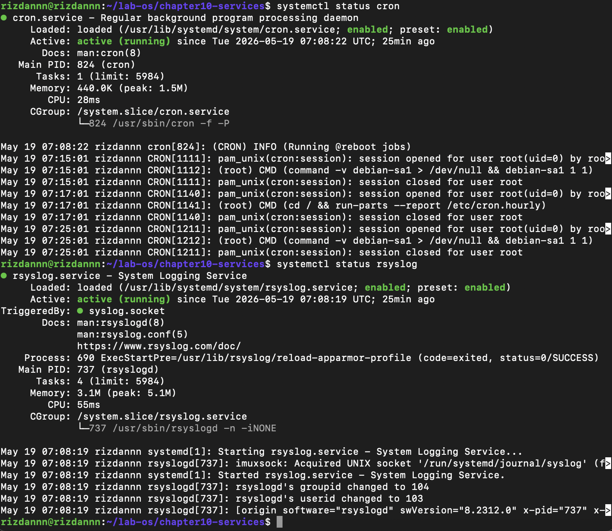

### 2. Lima layanan terlama saat boot
```
systemd-analyze blame | head -5
```
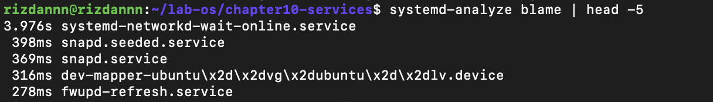

### 3. Cek layanan yang gagal
```
systemctl --failed
```
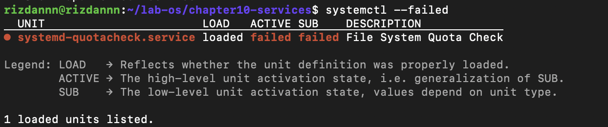

### Jika ada yang gagal, cek lognya
```
journalctl -u nama-layanan -n 30
```
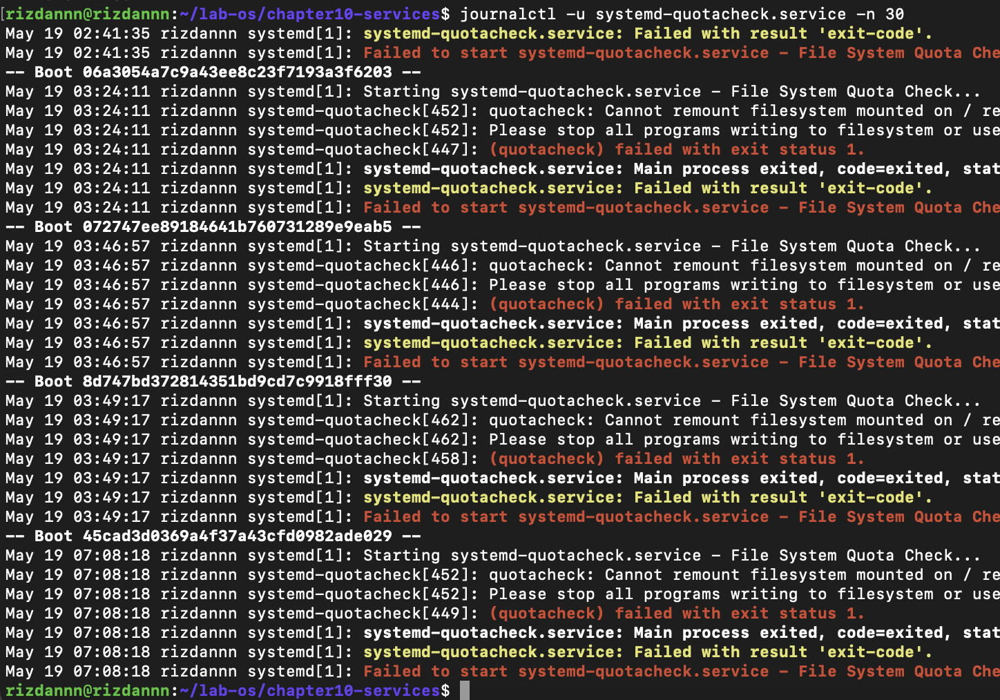

## Latihan 10.2 — Layanan Kustom dengan Restart Otomatis

### Langkah 1 — Buat skrip monitor-disk.sh:
```
nano ~/lab-os/chapter10-services/monitor-disk.sh
```
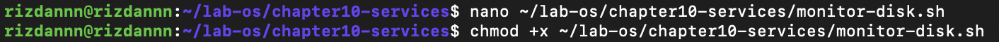

### Ketik isi berikut:
```
#!/bin/bash
LOG="$HOME/lab-os/chapter10-services/disk-usage.log"
while true; do
    echo "[$(date '+%Y-%m-%d %H:%M:%S')]" >> "$LOG"
    df -h >> "$LOG"
    echo "---" >> "$LOG"
    sleep 30
done
```
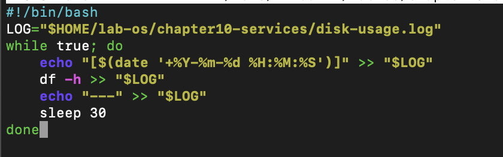

### Langkah 2 — Buat berkas unit:
```
sudo nano /etc/systemd/system/monitor-disk.service
```
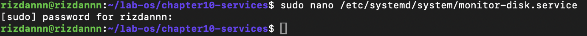

### Ketik isi berikut 
```
[Unit]
Description=Monitor Penggunaan Disk
After=network.target

[Service]
Type=simple
User=rizdannn
ExecStart=/rizdannn/lab-os/chapter10-services/monitor-disk.sh
Restart=always
RestartSec=5s

[Install]
WantedBy=multi-user.target
```
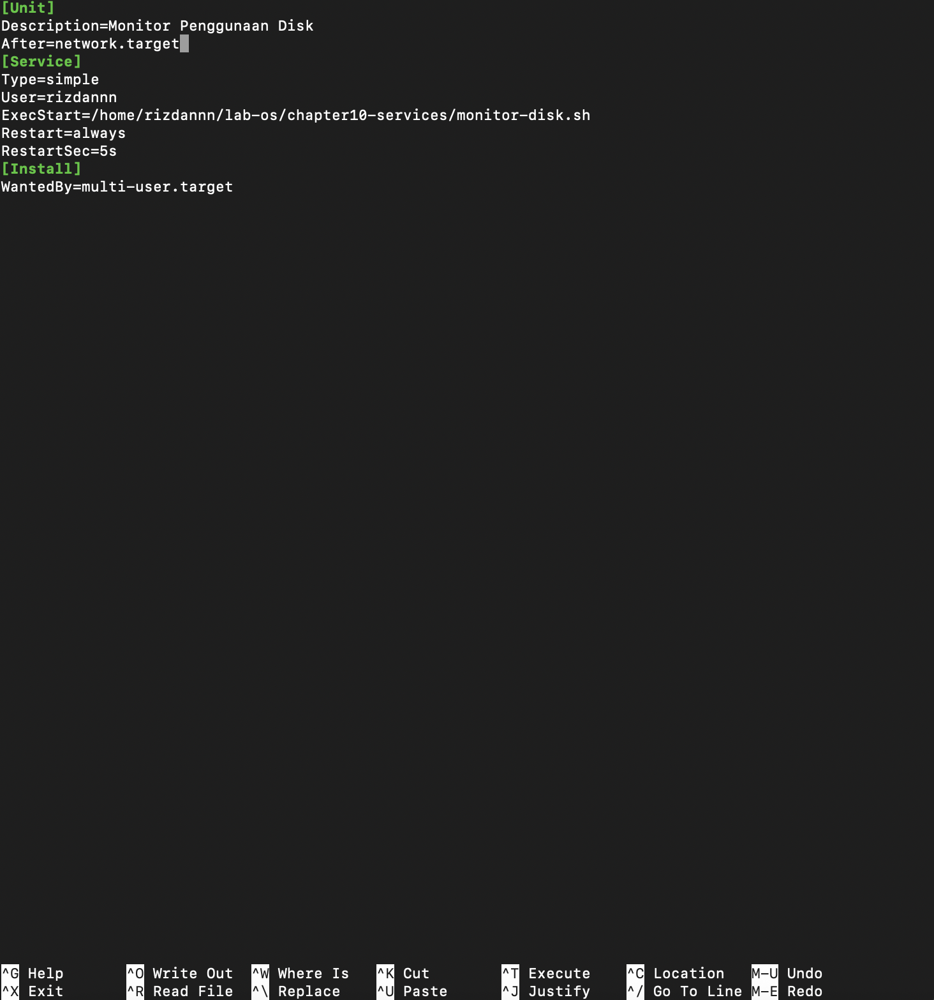

### Langkah 3 — Aktifkan dan jalankan:
```
sudo systemctl daemon-reload
sudo systemctl enable --now monitor-disk
systemctl status monitor-disk
journalctl -u monitor-disk -f
```
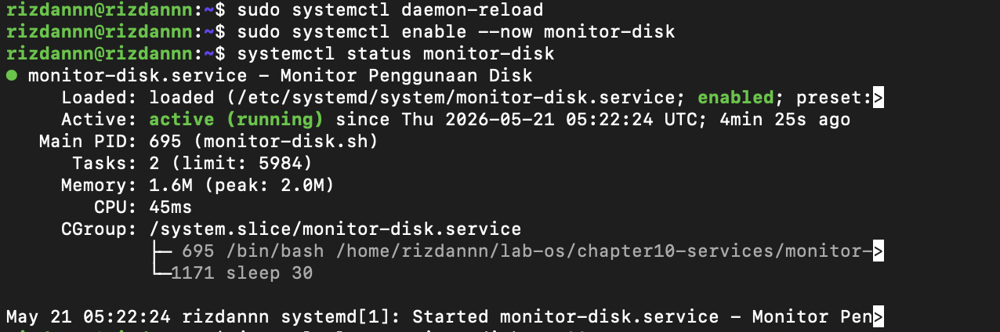

### Langkah 4 — Simulasi crash:
```
sudo kill -9 $(systemctl show monitor-disk --property=MainPID --value)
sleep 10
systemctl status monitor-disk
```

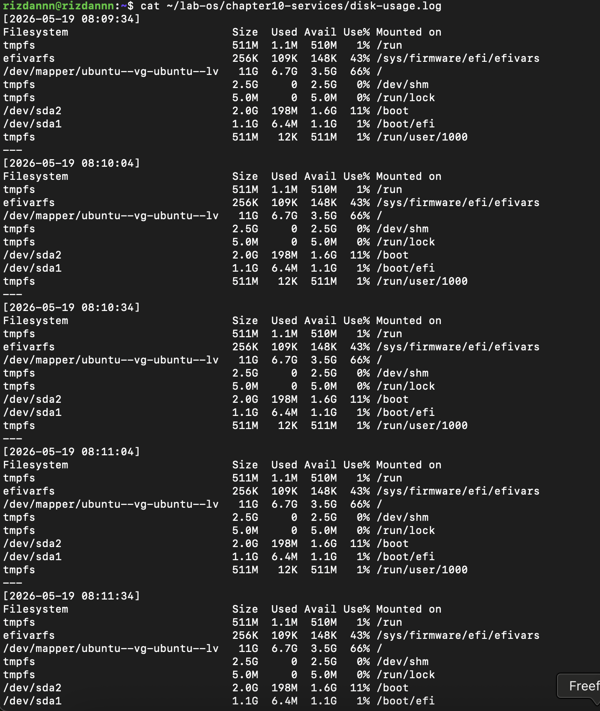
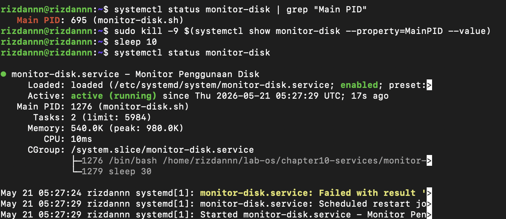

### Langkah 5 — Bersihkan:
```
sudo systemctl disable --now monitor-disk
sudo rm /etc/systemd/system/monitor-disk.service
sudo systemctl daemon-reload
```
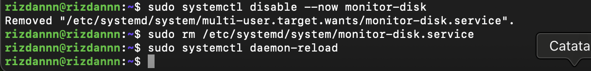


